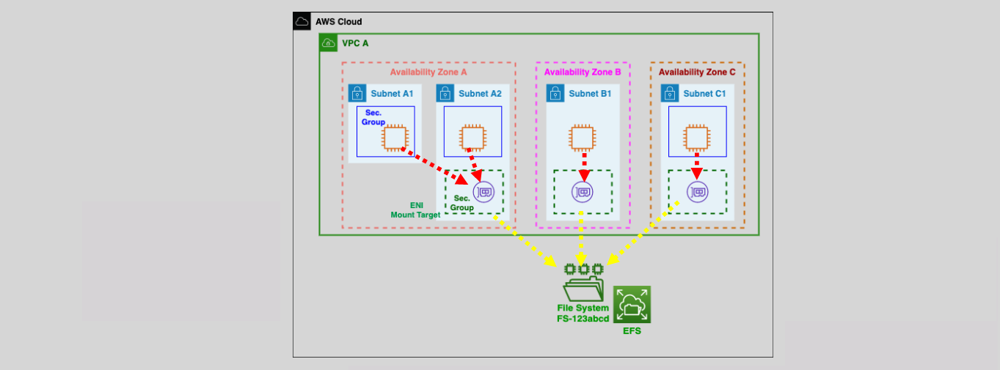
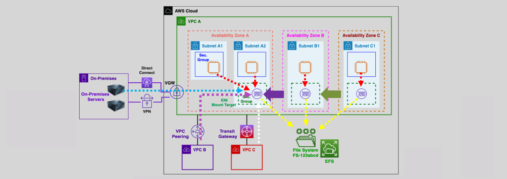

# Elastic File System (EFS)

EFS is a fully managed, `serverless`, `highly available`, highly durable, and `scalable` elastic file system in the cloud.

- Customers do not need to create and manage their own file systems.
- EFS can be accessed by EC2 instances, ECS, Lambda, and on-premises servers (Unlike S3).
- It supports `Linux` instances `only` (`POSIX`) Portable Operating System Interface.
- EFS uses TCP port `2049`

- An EFS file system is Elastic, its storage grows and shrinks automatically without disruptions as files are added/removed.
- Can scale to petabytes.
- It supports NFS 4.0/4.1 Protocol.
- EFS stores data/metadata across multiple AZ’s

## EFS File System Access

EFS file systems are accessed using ENIs (Mount Targets)

- One ENI per AZ is recommended.
- Security groups can be associated with the mount targets.
- The file system can be **mounted from:**
  - EC2 instances in AWS
  - On-premises servers
  - Across peered VPCs (Transit Gateway and VPC peering)

## Features

- Shared, concurrent file access from a large number of EC2 instances (Same region).
- Durability (stores multiple instances of the data in one or more AZs).
- `Low latency file operations (sub-millisencond to low single digit millisecond).`
- 10 GB/s+ throughput and 500,000 IOPS.
- Automatic scaling and consistent performance.
- Supports hierarchical directory structures (S3 does not).
- High throughput to EC2 instances.
- Read-after-write (strong) data consistency.
- IAM and POSIX file/directory permissions for users/groups access control.
- `File locking.`
- It integrates with CloudWatch and CloudTrail.

## Use Cases

- Big data analytics.
- Media processing workflows.
- Content management and web serving.
- Home directories.
- Cloud bursting.

---
