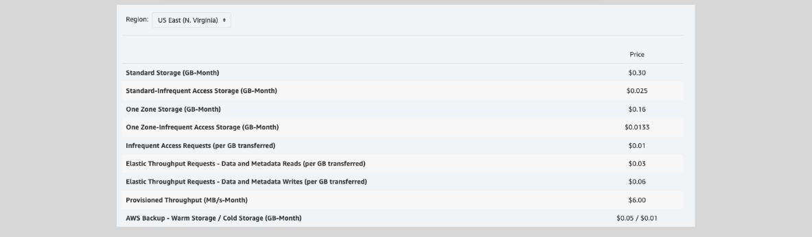

# Elastic File System (EFS)

EFS is a fully managed, `serverless`, `highly available`, highly durable, and `scalable` elastic file system in the cloud.

- Customers do not need to create and manage their own file systems.
- EFS can be accessed by EC2 instances, ECS, Lambda, and on-premises servers (Unlike S3).
- It supports `Linux` instances `only` (`POSIX`) Portable Operating System Interface.
- EFS uses TCP port `2049`

- An EFS file system is Elastic, its storage grows and shrinks automatically without disruptions as files are added/removed.
- Can scale to petabytes.
- It supports NFS 4.0/4.1 Protocol.
- EFS stores data/metadata across multiple AZ’s

## EFS File System Access

EFS file systems are accessed using ENIs (Mount Targets)

- One ENI per AZ is recommended.
- Security groups can be associated with the mount targets.
- The file system can be **mounted from:**
  - EC2 instances in AWS
  - On-premises servers
  - Across peered VPCs (Transit Gateway and VPC peering)

## Features

- Shared, concurrent file access from a large number of EC2 instances (Same region).
- Durability (stores multiple instances of the data in one or more AZs).
- `Low latency file operations (sub-millisencond to low single digit millisecond).`
- 10 GB/s+ throughput and 500,000 IOPS.
- Automatic scaling and consistent performance.
- Supports hierarchical directory structures (S3 does not).
- High throughput to EC2 instances.
- Read-after-write (strong) data consistency.
- IAM and POSIX file/directory permissions for users/groups access control.
- `File locking.`
- It integrates with CloudWatch and CloudTrail.

## Use Cases

- Big data analytics.
- Media processing workflows.
- Content management and web serving.
- Home directories.
- Cloud bursting.

---

# EFS Storage Classes

## 1. Standard Class (Multi-AZ)

### **EFS Standard**

- Default storage class when a file is stored in Standard EFS.
- Used for frequently accessed files

### **EFS Standard-IA**

- Same features as EFS
- For data that is not accessed every day
- **Use cases:** include audit data, historical analysis data, backup and recovery.
- `Lesser storage cost`.
- `Per GB data retrieval fee`

## 2. One Zone Class (Single AZ)

### **EFS One Zone**

- Default storage class when data is written into this EFS class.
- Used for frequently accessed files within one zone

### **EFS One Zone-IA**

- Same features as EFS
- For data that is not accessed every day
- **Use cases:** include audit data, historical analysis data, backup and recovery.
- `Lesser storage cost`.
- `Per GB data retrieval fee`.

### One zone class Notes

- For added protection, AWS Automatically backs up file systems using One Zone storage class using AWS backup.
- EFS file system backups that are created and managed using AWS Backup are replicated to three Availability Zones.
- Backups can be used to restore a file system in a different AZ or in a different AWS region.

## 3. EFS Intelligent-Tiering

- EFS Intelligent-Tiering uses Lifecycle Management to automatically achieve the right price and performance blend for your application by moving your files between the Standard and Standard-Infrequent Access storage classes.
- It is achieved when both Transition Into IA and Transition Out of IA are enabled.
- Default is 30 days with no access moves the file into IA class.
- First access moves the file from the IA class into the Standard class.

## EFS Lifecycle Management

- When enabled, EFS lifecycle policies automatically move files between standard and Infrequent access classes
- If lifecycle policies are not enabled, files do not transition between Standard and IA classes, they will be stored and remain in Standard.
- We can enable, stop, or modify lifecycle policies on an existing EFS file system.

**There are two types of EFS lifecycle policies:**

1. `Transition into IA`

   - Transition files into IA class.
   - This type of lifecycle policy can be configured to transition files into IA class if not accessed for none, 7, 14, 30 (default), 60, or 90 days.

2. `Transition out of IA`

   - Transition files from IA class to Standard class.
   - This type of lifecycle policy can be configured to transition files from IA class into Standard on first access.
   - Options are None, on first access

## Pricing

5 GB/month free in EFS Standard class for 12 months.

---

# EFS Features

## **Data Encryption**

- EFS supports encryption in-transit.
- EFS encrypts data at rest at rest using KMS keys (default – can be disabled)

## **Backup & Restore**

### **1. AWS Backup:**

- A comprehensive backup solution that simplifies backup creation, scheduling, restoration, deletion, and reporting.
- We can restore the EFS file system from these backups to the same or a new EFS file system.

### **2. EFS to EFS backup**

- Can be used to copy data between EFS file systems in the same or different AWS Regions.
- Use it only when AWS backup is not available in the intended region(s)

## **Performance Modes**

You can select the mode at file system creation time. It cannot be changed after that.

### **1. General Purpose (AWS Recommended):**

- Fits most use cases.
- Idea in latency sensitive use cases such as web serving, content management, home directories and general file serving.
- Up to 35,000 IOPS

### **2. Max I/O:**

- Can scale to higher levels of aggregate throughput with slightly higher latencies for file operations.
- Suitable for highly parallelized applications and workloads such as big data, media processing and genomics analysis.
- 500,000+ IOPS

## **Throughput Modes**

You can switch between throughput modes (only once in any 24 hours period)

### **1. Bursting Mode:**

- Default & AWS Recommended for most use cases.
- EFS throughput scales as the file system size increases.
- The throughput is allowed to burst,
  - If burst credits exist, up to 100MBps per TB of data.
  - When no burst credits are available, up to 50MBps per TB.
- Use it if not sure which mode to choose

### **Enhanced Mode:**

#### **2. Provisioned Mode:**

- Use it for spiky or unpredictable workloads.
- EFS automatically scales the throughput up and down to meet the workload needs

#### **3. Elastic Mode:**

- Decide and instantly provision the throughput of the file system (in MiB/s) independent of the amount of file system data size.
- Use for applications with constant throughput

## **EFS Replication**

- Amazon EFS replication is used to create a replica of an Amazon EFS file system in another AWS Region.
- When enabled, Amazon EFS automatically creates the destination (new) file system and replicates the data and metadata on the source file system to the new destination (read only) EFS file system.
- A replication configuration is used to manage the process of creating the destination file system and keeping it synced with the source file system.
- Amazon EFS replication is continual and designed to provide a recovery point objective (RPO) and a recovery time objective (RTO) of minutes.

## **File System Policy**

EFS File System Policy is a resource-based policy that can be
configured at the file system level to determine who can do
what (actions that are allowed on this file system)
