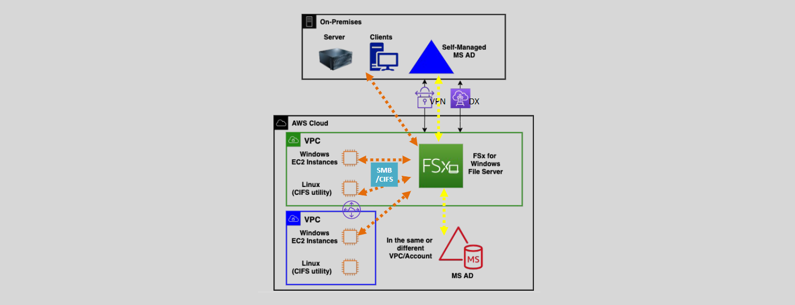

# 🖥️ **Amazon FSx for Windows File Server**

**Amazon FSx for Windows File Server** is a fully managed, highly reliable, and scalable file storage service built on Windows Server. It provides shared file storage with full Server Message Block (SMB) protocol support, making it ideal for Windows-based applications that require file storage.

---

## 🔍 **What is a Windows File Server?**

A **Windows File Server** provides a centralized location for shared disk access to store and manage files such as documents, images, videos, and other data.

### **Key Components:**

- **Microsoft Active Directory (AD):** Used for authentication, authorization, and management of user permissions.
- **Server Message Block (SMB) Protocol:** A network communication protocol used for providing shared access to files and printers in Windows environments.
- **Common Internet File System (CIFS):** An early version of SMB used by Linux and other operating systems to mount Windows file shares.

---

## 🔗 **What is Amazon FSx for Windows File Server?**

**Amazon FSx for Windows File Server** is a fully managed, highly available, and durable Windows-native shared file storage service.

### **Key Benefits:**

- **Fully Managed Service:** Simplifies the setup and management of Windows file systems in AWS.
- **High Performance:** Provides hundreds of thousands of IOPS and consistent sub-millisecond latency.
- **Scalable Storage:** Supports file systems up to 64 TB (scalable manually).
- **Integration with Windows Features:** Supports SMB protocol, NTFS file system, and Windows ACLs for file permissions.
- **Flexible Deployment:** Accessible from on-premises environments, within the same VPC, or across VPC peering connections.

---

## ⚙️ **Key Features**

### **1. Windows Compatibility**

- **SMB and NTFS Support:** Full support for SMB protocol versions and NTFS file system features.
- **Active Directory Integration:** Requires integration with a Microsoft AD for authentication and authorization.

### **2. Storage Options**

- **SSD and HDD Storage:** Offers both SSD for low-latency access and HDD for cost-effective storage of large amounts of data.
- **Scalable Capacity:** Manually scale storage capacity up to 64 TB per file system.

### **3. High Availability**

- **Single-AZ and Multi-AZ Deployments:** Choose between cost-effective single-AZ or highly available multi-AZ configurations.
- **Automatic Failover:** In multi-AZ deployments, failover between primary and standby file systems is automatic and transparent.

### **4. Performance**

- **High Throughput and IOPS:** Delivers the performance needed for a wide range of workloads.
- **Low Latency:** Consistent sub-millisecond latency ensures quick access to data.

### **5. Integration and Access**

- **Access from Multiple Clients:**
  - **AWS Services:** EC2 instances, Amazon WorkSpaces, AppStream 2.0, ECS, EKS.
  - **On-Premises Servers:** Via AWS Direct Connect or VPN connections.
- **Supports 1,000s of Concurrent Connections:** Ideal for environments with many users and applications.

### **6. AWS Service Integration**

- **Amazon S3 Integration:** Allows data transfer between FSx and S3.
- **AWS KMS Encryption:** Encrypts data at rest using AWS Key Management Service.
- **Monitoring with CloudWatch:** Provides metrics and logs for monitoring file system health and performance.

---

## 🛡️ **Backups and Security**

### **Backups**

- **Automated Backups:** FSx automatically takes daily backups of your file systems.
- **Incremental Backups:** Only the changes since the last backup are saved, reducing storage costs.
- **File-System-Consistent:** Ensures data integrity by capturing a consistent view of the file system.

### **Security**

- **Data Encryption:**
  - **At Rest:** Data is encrypted using AWS KMS-managed keys.
  - **In Transit:** Supports SMB encryption to secure data as it moves between clients and the file system.
- **Access Control:**
  - **Windows ACLs:** Manage file and folder permissions using standard Windows Access Control Lists.
  - **Security Groups:** Control network access to your FSx file systems by configuring security group rules.
- **Integration with Active Directory:**
  - **Authentication and Authorization:** Leverages AD users and groups for managing access.
  - **Domain Join:** FSx file systems are joined to your AD domain, whether it's AWS Managed AD, self-managed in AWS, or on-premises.

---

## 💼 **Use Cases**

- **Business Applications:** Support enterprise applications like Microsoft SQL Server, SharePoint, and IIS web servers.
- **Home Directories:** Centralize user files and profiles for ease of access and management.
- **Web Serving and Content Management:** Host and serve web content efficiently.
- **Data Analytics:** Provide high-performance shared storage for analytics workloads.
- **Software Development:** Store and manage build files and artifacts.
- **Media Processing:** Handle large media files for editing and processing workflows.

---

## 🌐 **Single-AZ and Multi-AZ Deployments**

### **Single-AZ Deployment**

- **Cost-Effective:** Ideal for workloads where high availability across multiple AZs is not required.
- **Data Replication:** Automatically replicates data within the Availability Zone.
- **Network Access:** An Elastic Network Interface (ENI) with a security group is deployed in the AZ to allow access.

### **Multi-AZ Deployment**

- **High Availability:** Provides redundancy across two Availability Zones.
- **Standby File System:** A secondary, standby file system is maintained synchronously.
- **Automatic Failover:** In the event of an AZ outage, failover to the standby is automatic and seamless.
- **Network Access:** ENIs are deployed in both AZs, and security groups must be configured accordingly.

---

## 🚀 **Migration Strategies**

To migrate from an on-premises Windows file system to Amazon FSx for Windows File Server, consider the following strategies:

### **1. AWS DataSync**

- **Automated Data Transfer:** Simplifies and accelerates the migration process.
- **Security:** Encrypts data in transit and integrates with AWS security services.
- **Monitoring:** Provides detailed monitoring and logging capabilities.

### **2. Robocopy**

- **Traditional Tool:** Use Windows-native Robocopy utility for copying files over network connections.
- **Manual Process:** Requires manual setup and monitoring.
- **Considerations:** May be suitable for smaller datasets or less complex migrations.

### **3. Third-Party Tools**

- **Migration Software:** Utilize specialized data migration tools from AWS Partners.
- **Features:** Advanced options for data validation, scheduling, and incremental syncs.

---

## 🏁 **Conclusion**

**Amazon FSx for Windows File Server** provides a robust, fully managed file storage solution for Windows-based applications and workloads. By leveraging FSx, organizations can benefit from:

- **Simplified Management:** Reduce administrative overhead with a managed service.
- **Scalability:** Easily scale storage capacity and performance as needed.
- **High Performance:** Meet demanding application requirements with low latency and high throughput.
- **Seamless Integration:** Integrate with existing Windows environments and AWS services.
- **Enhanced Security:** Protect data with encryption and fine-grained access controls.

**Final Thought:** By adopting Amazon FSx for Windows File Server, businesses can modernize their storage infrastructure, improve operational efficiency, and focus on their core competencies without the burden of managing complex file storage systems.
