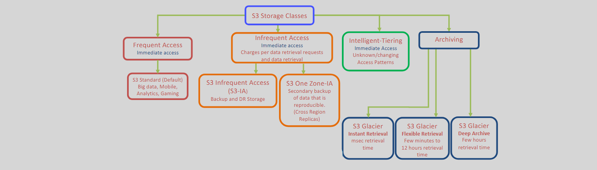
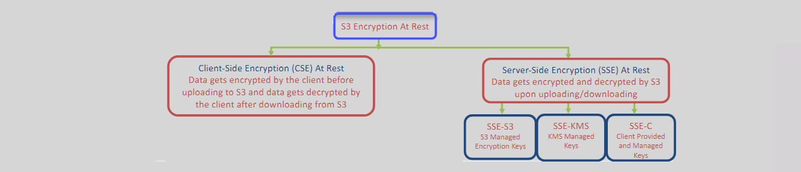
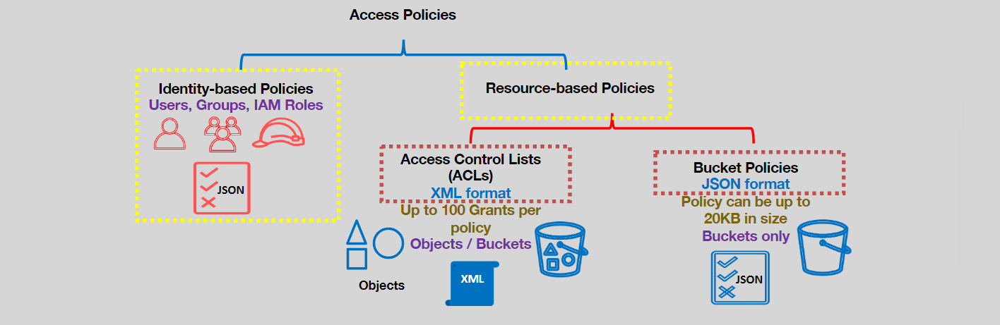

# S3

## Object Storage

- S3 is a simple Key-Value object store.
- An Object is a file and any metadata that describes it.
- An S3 Bucket is a container for objects.
- Each object has a key (name) and a value which is the data stored.
- Each object cannot exceed `5TB in size`.
- Buckets and Objects are `private by default`, you need to grant permissions, so they become accessible.
- We use `HTTP requests` when dealing with S3.
- S3 supports HTTP and HTTPS endpoints.

## Data Consistency Model

- GET, PUT, UPDATE, and DELETE are HTTP requests (or HTTP Verbs or Method options) used when dealing with S3 buckets.
- S3 offers Read after write (immediate or strong) consistency for all requests of S3 objects.
- Updates to an object in S3 are atomic (we never get partial or corrupt data).
- To access an object in a bucket, the URI format is

  - `https://[bucket-name].s3.[Region].amazonaws.com/[key-name]`

## Region Selection

- Choosing an AWS region for your S3 buckets can be based on:

  - Optimizing latency,
  - Minimizing costs,
  - Addressing regulatory requirements.

- Objects stored in an AWS Region will never leave the Region unless the object owner explicitly transfers or replicates them to another Region

---

# S3 Tiered Storage Classes



## Notes

---

### Infrequent Access

- Both IA classes are for real-time instant access.
- One-Zone IA (single AZ) has the same durability as S3-IA.
- One-Zone IA has less availability and is less resilient compared to S3-IA.
- Minimum storage duration of 30 days.
- If an object is deleted before 30 days, a 30 days charge will apply.
- AWS charges for requests and for data retrieval (per GB).

### Archiving Classes

- All archive classes have eleven 9’s durability.
- S3 Glacier Instant Retrieval: for rarely accessed data that requires msec retrieval time.
  - Higher data access charges compared to S3-IA class.
- S3 Glacier Flexible Retrieval: Use for archives where data may need to be retrieved in minutes.
  - 90 days minimum storage charge.
- S3 Glacier Deep Archive: Use for archives that rarely need to be accessed.
  - 180 days minimum storage charge.
- Both Glacier Flexible Retrieval and Glacier Deep Archive are for cold storage (data access is asynchronous)

#### Glacier Flexible Retrieval & Glacier Deep Archive retrieval options

- Are designed to sustain data loss in two facilities (They replicate data in 3+ AZs).
- Glacier archives are visible and available only through AWS S3 dashboard.
- To guarantee access for expedited retrieval, customers can purchase provisioned `retrieval capacity`.
- Deep_Archive & Bulk Retrieval is the cheapest of all S3 classes

| **Storage Class**                 | **Expedited**    | **Standard**    | **Bulk**        |
| --------------------------------- | ---------------- | --------------- | --------------- |
| **S3 Glacier Flexible Retrieval** | 1-5 minutes (\$) | 3-5 hours       | 5-12 hours      |
| **S3 Glacier Deep Archive**       | N/A              | Within 12 hours | Within 48 hours |

#### Glacier Deep Archive –Archives and Vaults

- An archive is the base storage unit in Glacier (40TB max size).
- An archive can be any data such as a file, a photo, or a document.

---

- A vault is a container to store archives.
- A vault is confined to an AWS region.
- A vault can store an unlimited number of archives.
- Maximum 1000 vaults per AWS region. We can get archives uploaded to vaults using:
- CLI, SDKs (not the AWS console).

### Intelligent Tiering

- S3 Intelligent-Tiering is a storage class intended to optimize storage costs.
- Use it when data access pattern is unknown, changing, or unpredictable (data lakes, data analytics, and new applications).
- It monitors data access patterns and automatically moves data (at the object level) to the most cost effective S3 access tier.
- There is no retrieval fees for Intelligent-Tiering.
- AWS charges a small monthly monitoring fee.
- If the data is accessed again, it gets moved back to the Frequent Access Tier.

---

- Activating the Archive Access Tier will bypass the Archive Instant Access Tier.
  - It is like S3 Glacier Flexible Retrieval storage class.
- Deep Archive Access Tier, when enabled, objects not accessed for 180 days (configurable to 730 days) will be moved in this class.
  - It like S3 Glacier Deep Archive tier.
- For both Archive and Deep Archive access tiers retrieval time is required.


---

# S3 Encryption

- Encryption in-transit means, encrypting data as it moves.
- Encryption at rest means, encrypting data while it is stored.
- Encryption at rest can be client-side or S3 (server-side) encryption

## **S3 Object Encryption At Transit**

S3 Provides HTTP and HTTPS endpoints.

<div align="center" style="padding: 0 20px;">
  
</div>

- For encryption in-transit, we must use the HTTPS endpoint provided by S3. This can be enforced in the bucket policy
- Objects do not have to be encrypted at the client side if we choose not to.

## **S3 Object Encryption At Rest**

<div align="center" style="padding: 0 20px;">
  
</div>

- Encryption at rest can be client-side or S3 (server-side) encryption.
- In client-side Encryption, the client is responsible for encrypting/decrypting the data. S3 has nothing to do with the encryption/decryption process or keys.
- In server-side Encryption, S3 manages the encryption/decryption and optionally the keys.
- We have three SSE encryption choices under S3, they are SSE-S3, SSE-KMS, and SSE-C

## Client-Side Encryption At Rest (CSE)

<div align="center" style="padding: 0 20px;">
  
</div>

- The client is responsible for the entire encryption/decryption and keys. AWS is not part of the encryption/decryption process.
- Each object is encrypted at the client side before it is moved to S3.
- Objects are encrypted in-transit automatically.

## Server-Side Encryption At Rest (SSE)

- Encryption/Decryption is done by S3 before the object is stored to disks
- Server-Side Encryption does not encrypt the object metadata.
- Depending on who provides the encryption keys, there are three SSE types:
  - **SSE-S3**
  - **SSE-KMS**
  - **SSE-C**

### 1. **SSE-S3**

<div align="center" style="padding: 0 20px;">
  
</div>

- Encryption Using S3-Managed Encryption Keys
- Each object will be encrypted with a separate data key created and managed by S3.
- **The Least customer overhead:** the customer has nothing to do with key creation or rotation

### 2. **SSE-KMS**

<div align="center" style="padding: 0 20px;">
<h3>
  It uses the AWS S3 default KMS key or a customer created/managed KMS key in AWS KMS.
</h3>
  
</div>

- The KMS key used must be in the same regions as the S3 bucket.
- The KMS key used can be created in KMS or imported to KMS by the customer
- Each object will be encrypted with a separate data key.
- Audit trail is provided for the KMS key usage.
- SSE-KMS with customer managed keys is chargeable (KMS key charge , plus data key request charges)

#### ⚠️ Potential Issues

Given that each object is encrypted with a separate data key. If we are using SSE-KMS extensively, this will add a lot of request charges and
may reach the KMS API operations (requests) per second limit in the account. This can lead to throttling of the additional requests.

#### ✅ Solution using bucket key

<div align="center" style="padding: 0 20px;">
<h3>
An S3 bucket key can be created by AWS KMS then used to generate the data
keys at the bucket level. It reduces the cost and the load on KMS.
</h3>
  
</div>

### 3. **SSE-C**

<div align="center" style="padding: 0 20px;">
<h3>
Encryption and decryption are done by S3 using a key provided by the customer.
</h3>
  
</div>

- The customer must supply the data key with each encryption/decryption request.
- HTTPS must be used in-transit to protect the customer provided data keys
- SSE-C can only be done through SDKs.

## Bucket Default Encryption

This is a `bucket level` configuration.

<div align="center" style="padding: 0 20px;">
  
</div>

- When enabled, all new object uploads without encryption information will be encrypted using the default encryption.
- If the request includes encryption information, the default encryption is not used.
- Pre-existing unencrypted data in the bucket before enabling this feature will not be encrypted automatically.
- We can choose between SSE-S3 or SSE-KMS

- S3 Glacier `Automatically` encrypts data at rest using AES-256-bit symmetric keys maintained by AWS.
- It supports secure data transfer in-transit over Secure Sockets Layer (SSL)

---

# S3 Access Policies

<div align="center" style="padding: 0 20px;">
<h3>
</h3>
  
</div>

- Access policies for bucket or its objects can be identity based policy or resource based policy
- Both S3 buckets and Glacier vaults support
  IAM resource-based policies. For Glacier vault, it is called Vault access policies

**Resource-Based Policies can be defined using:**

- Access Control Lists (ACLs)

  - XML format
  - up to 100 grants per policy
  - Policy can be applied on bucket or object level

- Bucket Policies
  - JSON format
  - Policy can be up to 20KB in size
  - Policy can be applied on bucket level only

## **Understanding Object Ownership in S3:**

**Object Ownership Option mean that:**


- Objects and buckets are private by default.
- Every resource in AWS is owned by an account.
- The resource owner of the bucket is the account of the IAM entity (IAM user, IAM Role or Root account) that created the bucket.

## Using ACLs (Not Recommended)

- Each bucket and object has an ACL attached to it as a sub-resource.
  - The ACL defines which AWS accounts or groups are granted access and the type of access.
- Using `Object Ownership`, we can disable ACLs;
  - The bucket owner automatically owns every object in the bucket.
  - Access control for the data in the bucket will be based on policies only, such as IAM policies, S3 bucket policies, virtual private cloud (VPC) endpoint policies, and AWS Organizations service control policies (SCPs).
- If you do not use Object Ownership, then the account that uploads the object is the object owner.
- AWS recommends disabling ACLs and using Object Ownership unless absolutely required otherwise.

## Using Resource Policy

its ....etc

### Examples

#### Granting Public Read Access

This example gives permissions to everyone (**public read access**) via the GetObject permission, on all objects in the S3 bucket `hw-bucket-01`.

```json
{
  "Version": "2012-10-17",
  "Statement": [
    {
      "Sid": "PublicRead",
      "Effect": "Allow",
      "Principal": "*",
      "Action": "s3:GetObject",
      "Resource": ["arn:aws:s3:::hw-bucket-01/*"]
    }
  ]
}
```

#### Cross-Account Uploads

Using the `s3:x-amz-storage-class` condition key, cross account access can be provided to allow other accounts to upload objects in a bucket and **restrict them to upload only to a specific S3 storage class**.

```json
{
  "Version": "2012-10-17",
  "Statement": [
    {
      "Sid": "statement1",
      "Effect": "Allow",
      "Principal": {
        "AWS": "arn:aws:iam::AccountB-ID:user/Ahmed"
      },
      "Action": "s3:PutObject",
      "Resource": ["arn:aws:s3:::hw-bucket-01/*"],
      "Condition": {
        "StringEquals": {
          "s3:x-amz-storage-class": ["STANDARD_IA"]
        }
      }
    }
  ]
}
```

#### Cross-Account Object Uploads - Public-Read Access

Using the `s3:x-amz-acl` Condition key, we can allow other accounts to upload objects conditionally upon granting public read access to their objects.

```json
{
  "Version": "2012-10-17",
  "Statement": [
    {
      "Sid": "AddCannedAcl",
      "Effect": "Allow",
      "Principal": {
        "AWS": ["arn:aws:iam::accountA-ID:root", "arn:aws:iam::accountB-ID:root"]
      },
      "Action": "s3:PutObject",
      "Resource": "arn:aws:s3:::hw-bucket-01/*",
      "Condition": {
        "StringEquals": {
          "s3:x-amz-acl": "public-read"
        }
      }
    }
  ]
}
```

#### Object Uploads - Enforcing Encryption

Using the `s3:x-amz-server-side-encryption` condition key, we can enforce a specific server-side encryption for S3 object uploads.

- If the correct encryption is not specified in the upload request, the request will fail.
- Use AWS:KMS this means KMS encryption and use AES256 for SSE-S3

```json
{
  "Version": "2012-10-17",
  "Id": "PutObjectPolicy",
  "Statement": [
    {
      "Sid": "DenyUnEncryptedObjectUploads",
      "Effect": "Deny",
      "Principal": "*",
      "Action": "s3:PutObject",
      "Resource": "arn:aws:s3:::hw-bucket-01/*",
      "Condition": {
        "StringNotEquals": {
          "s3:x-amz-server-side-encryption": "aws:kms"
        }
      }
    }
  ]
}
```

---

# S3 Bucket Replication

<div align="center" style="padding: 0 20px;">
  
</div>

- Is an `asynchronous replication` at the bucket level from a source bucket to a destination bucket.
- TLS/SSL is used to encrypt replication data in-transit.
- Source and destination buckets can be in the same or different AWS accounts.
- Source and destination buckets can be in the same (SRR) or different (CRR) AWS Regions.
- `Both buckets must have versioning enabled.`
- We can replicate all objects, or a subset based on a prefix.

---

- We can configure the source bucket to replicate to more than one destination bucket (requires multiple replication rules).
- You can choose to copy the pre -existing objects in the bucket (one time batch operation).
- S3 requires an IAM role to replicate objects between buckets.
- We can choose to enable replication metrics and notifications (sent to CloudWatch).
- We can choose to replicate DELETE markers

**Replication Time Control (RTC):**

- We can enable S3 Replication Time Control (S3 RTC) in the replication configuration.
- S3 RTC replicates most objects in seconds and 99.99 percent of objects within 15 minutes (backed by a service-level agreement).

**Replication Encryption:**

- For encrypted objects in the source bucket, the following applies:
  - Objects encrypted with SSE-S3 are replicated.
  - You can optionally replicate objects encrypted with SSE-KMS.
  - Objects encrypted with SSE-C are not replicated.
- For un-encrypted objects in the source bucket, if the destination bucket has default encrypted enabled, the replicated objects will be encrypted following that.

**Use Cases:**

- **SRR:**
  - Use for aggregating log data into a single bucket (from the same or different account buckets).
  - Use to replicate between different environments that work on the same data (ex. production and testing).
  - Use to replicate critical data within the same region for data sovereignty laws.
- **CRR:**
  - Use to meet compliance requirements by storing a copy a distance away.
  - Use to minimize latency to users/customers by making the data available in other AWS Regions closer to them.
  - Use if availing the data for processing by clusters in two different regions.

---

# S3 Object Lock

S3's Object Lock feature provides a `Write Once Read Many (WORM)` data storage model and compliance in S3

- It protects objects from being deleted for a period of time or indefinitely.
- Can be configured at the `object or bucket level`.
  - `Bucket Versioning` must be enabled.
- It can be combined with CRR or SRR to replicate protected objects to a destination bucket

---

**We can use two different ways to enable Object Lock:**

- `Retention Period:` Can be used to specify a lock duration at the object and object version level.
- `Legal Hold`: Lock has no expiration until the hold is removed.
  - An object can have either, both, or none.
- 📒 It’s very important to note that protected object versions remain safe from being deleted or overwritten by a lifecycle configuration

## Retention modes

**There are two Retention modes in S3 Object Lock:**

- **Governance mode:** Protects against object or object version overwrites/deletes/altering-lock-settings by most users, except those with permissions to do so.
- **Compliance mode:** No one, not even the root user, can overwrite/delete a protected object for the duration of the retention period.

## Glacier Vault Lock Policies

By default, Glacier archives are immutable. However, they can be deleted.

S3 Glacier Vault Lock policies can be configured to enforce compliance control for
individual Glacier vaults.

- Write Once Read Many (WORM) compliance requirements can be met.
- Vault locks are used to prevent future changes.

**Example use cases:**

- Retain archives for one year before they can be deleted.
- Deny deleting archives based on a specific tag during an investigation

---

# S3 Select

## S3 Select (Query At The Source)

S3 Select provides the ability to run simple SQL statements to filter the contents of an Amazon S3 object to retrieve the required subset of data.

- It supports objects in CSV, JSON, and Apache Parquet formats and works on GZIP or Snappy compressed objects
- It supports queries on SSE encrypted objects.
- Query output can be in CSV or JSON.
- It reduces data transfer costs and enhances application performance by reducing latency and CPU cycles

### How it works

<div align="center" style="padding: 0 20px">
  
</div>

## S3 Glacier Select

S3 Glacier Select feature allows simple SQL statements to run directly (query in
place) on an archive without having to first restore the archive.

- Query results are saved to an S3 bucket.
- Glacier can now be considered part of your data lake

### How it works

<div align="center" style="padding: 0 20px">
  
</div>
