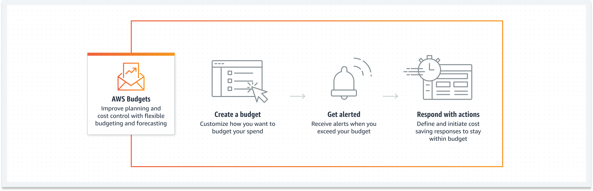

# 💰 AWS Budgets: Manage Your Costs Effectively

AWS Budgets is a cost management tool that helps you **plan, monitor, and control your AWS spending**. It enables you to set custom cost and usage budgets and provides notifications to help you stay within your financial goals.

---

    

---

## 🌟 Key Features

### 📊 Custom Budgeting

- Set budgets for **costs**, **usage**, **RI (Reserved Instance) coverage**, and **Savings Plans coverage**.
- Monitor spending across AWS accounts, services, and regions.

### 🔔 Alerts and Notifications

- Receive alerts when your actual or forecasted costs exceed the budget.
- Notifications can be sent via **email** or **Amazon SNS**.

### 🔄 Integration with AWS Tools

- Integrates with **AWS Cost Explorer** for detailed spending analysis.
- Works with **AWS Organizations** for centralized budget management.

---

## 🎯 Use Cases

- **Cost Control:** Set budgets to track and limit AWS expenses.
- **Usage Monitoring:** Monitor service usage to avoid unexpected charges.
- **Savings Optimization:** Track RI and Savings Plans coverage for better cost management.

---

## ✅ Benefits

- **Visibility:** Gain insights into your AWS spending and usage patterns.
- **Proactive Alerts:** Stay informed about potential overspending.
- **Scalability:** Manage budgets for individual accounts or entire organizations.

---

AWS Budgets is a simple yet powerful tool for managing your AWS costs effectively. By setting budgets and receiving alerts, you can ensure your cloud expenses align with your financial goals.
