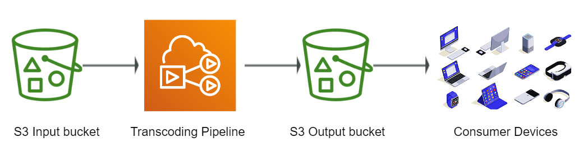
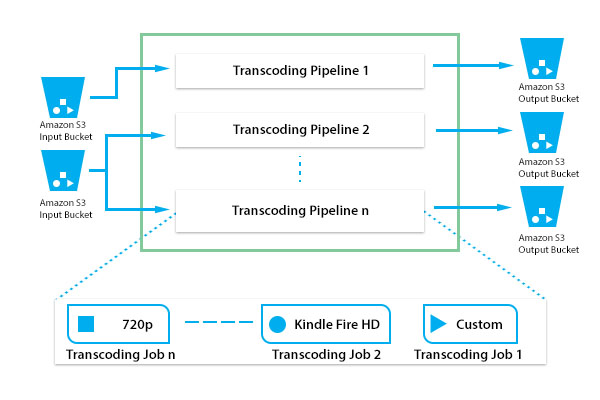

# 🎥 AWS Elastic Transcoder: Simplify Media Conversion

AWS Elastic Transcoder is a managed service that handles the complexity of media transcoding at scale. It allows you to convert video and audio files stored in **Amazon S3** into formats compatible with a wide range of devices.

---

    
    

---

## 🌟 Key Features

### 🔄 Format Conversion

- Supports **video** and **audio** transcoding for various devices.
- Offers a wide range of **output formats**, resolutions, bit rates, and frame rates.

### 🎯 Simplified Scalability

- Automatically scales to handle workloads of any size.
- No need for manual server setup or management.

### 💰 Cost-Efficient

- Operates on a **pay-as-you-go model**, with a free tier available for small-scale usage.

---

## 🛠️ How It Works

1. **Input:** Upload media files to an Amazon S3 bucket.
2. **Configuration:** Use Elastic Transcoder to specify output settings (format, resolution, etc.).
3. **Processing:** The service processes the media files and saves the converted versions in the specified S3 bucket.
4. **Playback:** Deliver media to users, optimized for their devices.

---

AWS Elastic Transcoder is an ideal solution for businesses looking to streamline media processing while ensuring compatibility and scalability. Whether you're serving video-on-demand or audio streaming, Elastic Transcoder makes media conversion simple and efficient.
