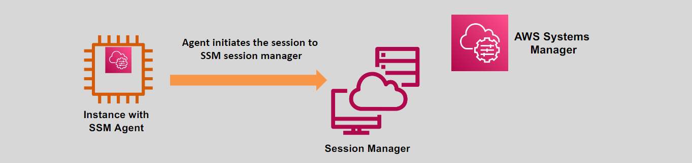

# 🔧 AWS SSM Session Manager: Secure and Simplified Instance Management

AWS SSM Session Manager is a fully managed capability of AWS Systems Manager (SSM) that allows secure and seamless management of **EC2 instances**, **on-premises servers**, and **virtual machines (VMs)** without the need to open inbound ports like SSH or RDP.

---

    

---

## 🌟 Key Features

### ✅ Multi-Platform Support

- Works with **Windows**, **Linux**, and **MacOS** systems.
- Supports both AWS and on-premises environments.

### 🔐 Secure Management

- Eliminates the need to open SSH or RDP ports on managed nodes.
- All sessions are initiated through the **SSM agent**, ensuring secure communication.

### ⚙️ Easy Setup

- Requires installation of the **SSM agent** on managed instances.
- Once set up, nodes can be accessed directly through the AWS Management Console or CLI.

---

## 🎯 Benefits

1. **Enhanced Security:** No need to manage SSH keys or expose ports.
2. **Centralized Management:** Access and manage multiple instances from a single interface.
3. **Auditability:** Maintain logs of all session activity for compliance and troubleshooting.

---

AWS SSM Session Manager simplifies instance management, making it secure, efficient, and ideal for organizations looking to enhance their operational efficiency and security posture.
