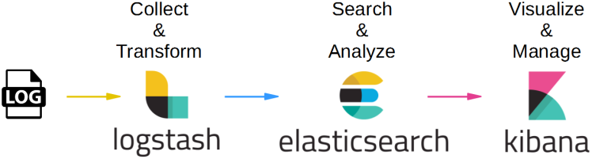
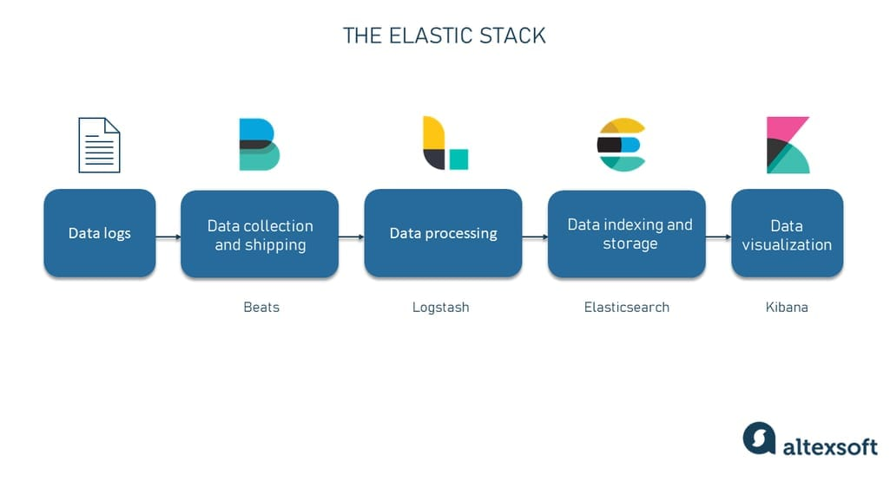
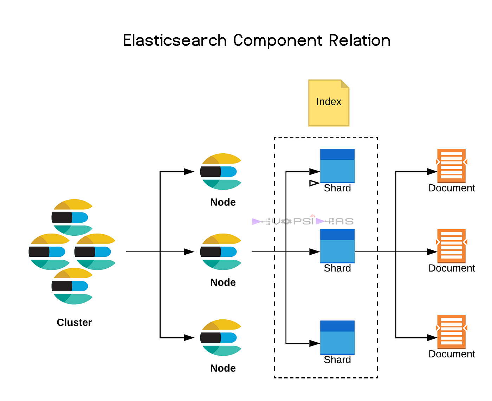

# **🔍 Elasticsearch**

---

---

## **📋 What is Elasticsearch?**

**Elasticsearch** is an open-source, distributed search and analytics engine. It is widely used for **full-text search**, **log analysis**, **real-time application monitoring**, and **data visualization**. It is part of the **Elastic Stack (ELK Stack)**, which includes:

1. **Elasticsearch:** The search and analytics engine.
2. **Logstash:** For data ingestion and transformation.
3. **Kibana:** For data visualization and dashboards.

💡 **Key Idea:** Elasticsearch makes it easy to search, analyze, and visualize large amounts of data quickly.

---

## **⚙️ Key Features of Elasticsearch**

1. **Full-Text Search:**

   - Perform advanced searches, including fuzzy and proximity searches.

2. **Scalability:**

   - Handles massive amounts of data by distributing it across multiple nodes.

3. **Real-Time Analytics:**

   - Processes data as it arrives, enabling instant insights.

4. **RESTful API:**

   - Interact with Elasticsearch using simple HTTP methods like GET, POST, and DELETE.

5. **Fault Tolerance:**
   - Replicates data across nodes to ensure reliability and availability.

---

## **🌟 Use Cases for Elasticsearch**

1. **Log and Event Monitoring:**

   - Analyze server logs, application logs, and network events for troubleshooting.

2. **E-Commerce:**

   - Provide fast and accurate product search functionality.

3. **Real-Time Analytics:**

   - Track user activity on websites or applications.

4. **Security and Threat Detection:**

   - Monitor systems for potential threats using log analysis.

5. **Geo-spatial Data:**
   - Analyze and visualize location-based data.

---

## **⚡ Why Did AWS Create OpenSearch?**

### **The Problem with Elasticsearch and AWS**

1. **Elastic License Changes:**

   - In 2021, Elastic NV (the company behind Elasticsearch) changed the licensing model for Elasticsearch and Kibana from an open-source **Apache 2.0 license** to a more restrictive **SSPL (Server Side Public License)**.
   - The change restricted how cloud providers like AWS could offer Elasticsearch as a managed service.

2. **AWS and Elastic Disagreement:**
   - Elastic claimed AWS was using Elasticsearch for its managed service without contributing to the open-source community.
   - AWS disagreed and wanted to keep offering an open-source alternative.

### **AWS's Response: OpenSearch**

To address these issues, AWS forked the last **Apache 2.0-licensed version** of Elasticsearch and Kibana to create **OpenSearch**, a fully open-source, community-driven project.

---

## **🌍 What is AWS OpenSearch Service?**

AWS OpenSearch Service is a **managed service** provided by AWS that allows you to deploy and manage OpenSearch (or older versions of Elasticsearch) in the cloud. It retains all the key features of Elasticsearch while ensuring an open-source future.

---

## **📊 Comparison: Elasticsearch vs. OpenSearch**

| **Feature**         | **Elasticsearch**                           | **OpenSearch**                                             |
| ------------------- | ------------------------------------------- | ---------------------------------------------------------- |
| **Licensing**       | SSPL (proprietary for Elastic NV versions). | Open-source under Apache 2.0.                              |
| **Development**     | Controlled by Elastic NV.                   | Community-driven, supported by AWS.                        |
| **Compatibility**   | Fully compatible with Elastic's ecosystem.  | Forked from Elasticsearch 7.10 (last open-source version). |
| **AWS Integration** | Requires manual setup or Elastic Cloud.     | Fully managed by AWS OpenSearch Service.                   |

---

## **🛠️ Key Features of AWS OpenSearch Service**

1. **Fully Managed:**

   - AWS handles infrastructure setup, maintenance, and scaling.

2. **Data Security:**

   - Built-in support for encryption, IAM policies, and fine-grained access control.

3. **Scalable Architecture:**

   - Automatically scales to handle growing workloads.

4. **Dashboards with OpenSearch Dashboards (Forked Kibana):**

   - Visualize data using the built-in OpenSearch Dashboards tool.

5. **Backward Compatibility:**
   - Supports older versions of Elasticsearch (up to 7.10).

---

## **🌟 Why Choose OpenSearch Over Elasticsearch?**

1. **Open-Source Commitment:**

   - OpenSearch is fully open-source with no licensing restrictions.

2. **Cost-Effective on AWS:**

   - Built specifically for seamless AWS integration, saving setup and maintenance time.

3. **Community-Driven Development:**

   - OpenSearch is backed by a growing open-source community, ensuring transparency and innovation.

4. **No Vendor Lock-In:**
   - Unlike Elastic NV’s proprietary model, OpenSearch ensures flexibility for users.

---

## **🧠 Simple Analogy**

Think of OpenSearch as a fork of Elasticsearch that AWS and the community maintain as **truly open-source software**, ensuring you’re not locked into Elastic NV’s licensing changes.

---

## **📦 Real-Life Use Case: OpenSearch on AWS**

**Scenario:**  
A company wants to monitor application logs in real time to detect errors and performance issues.

**Solution with OpenSearch Service:**

1. **Ingest Logs:** Use Amazon Kinesis or Logstash to send logs to OpenSearch.
2. **Index Data:** OpenSearch stores the logs in a distributed manner, enabling fast searches.
3. **Analyze Data:** Use OpenSearch Dashboards to visualize errors, response times, and trends.

**Result:**  
The company gains real-time visibility into application performance, reducing downtime and improving user satisfaction.
