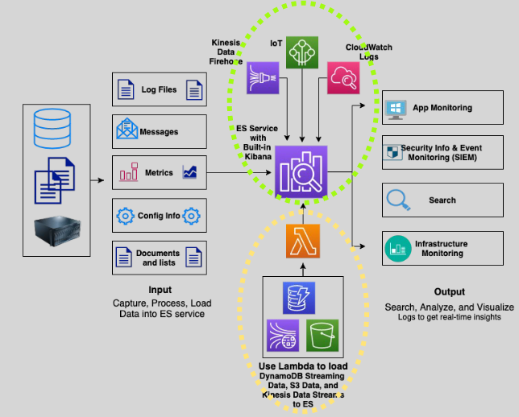

# Amazon OpenSearch Service 🆓🔍

Amazon OpenSearch Service is a **fully managed service** that simplifies deploying, operating, and scaling OpenSearch clusters on AWS. It serves as a powerful, scalable engine for **search** and **real-time analytics**, enabling businesses to gain insights and search through large datasets efficiently.

---

  

---

## 🌟 **Key Features**

### 1. **Real-Time Search and Analytics**

- Enables near real-time searching and analytics for a variety of data types, such as:
  - Application logs.
  - Infrastructure metrics.
  - Clickstream data.
  - Security events.

### 2. **Integrated Analytics and Visualization**

- **OpenSearch Dashboards**:
  - A visualization and analytics tool for creating interactive dashboards and charts from your data.

### 3. **Broad Integration with AWS Services**

- Direct integration with:

  - **Kinesis Data Firehose**
  - **CloudWatch Logs**
  - **AWS IoT**
  - **Amazon S3**
  - **DynamoDB**

- Use **AWS Lambda** for custom data loading into OpenSearch from sources like **S3**, **DynamoDB**, and **Kinesis Data Streams**.

### 4. **Flexible Querying**

- Multiple search options:
  - URI searches (query strings).
  - Request body searches (JSON format).
  - **Dashboard Query Language (DQL)** for structured searches.
  - SQL queries for familiar database-like querying.
  - **Asynchronous Search**: Processes queries in the background for large datasets.

---

## 🔐 **Security and Compliance**

- **Data Encryption**:

  - **At Rest**: Using AWS Key Management Service (KMS).
  - **In Transit**: Encrypted connections with TLS.

- **Access Control**:

  - **IAM Policies**: Fine-grained access control for users and roles.
  - **Cognito Integration**: Authentication for OpenSearch Dashboards.

- **VPC Integration**:

  - Supports VPC endpoints for secure communication.
  - Use security groups to control traffic to your OpenSearch clusters.

- **Alerting**:
  - Integrates with **SNS** to send notifications for custom alerts.

---

## 🛠️ **How OpenSearch Works**

1. **Data Ingestion**:

   - Stream data directly from **Kinesis**, **CloudWatch Logs**, or **IoT**.
   - Use **Lambda** for custom ingestion workflows.

2. **Data Indexing**:

   - Data is stored as searchable **documents**.
   - Indexed data is distributed across the cluster for scalability.

3. **Data Querying and Analytics**:
   - Use **DQL** or **SQL** to query and analyze data.
   - Visualize results in **OpenSearch Dashboards**.

---

## 🔄 **Use Cases**

  

1. **Log Analytics**:

   - Centralize and analyze application or infrastructure logs for troubleshooting and insights.

2. **Real-Time Monitoring**:

   - Monitor application performance, user behavior, or security events in near real-time.

3. **Clickstream Analytics**:

   - Analyze user interactions on websites and apps to optimize the user experience.

4. **Search Engine**:
   - Build powerful, scalable search functionality for websites or applications.

---

## 💡 **Benefits**

1. **Managed Service**:

   - AWS handles infrastructure, scaling, patching, and backups, reducing operational overhead.

2. **Cost-Effective**:

   - Pay-as-you-go pricing model with no upfront costs.

3. **Scalability**:

   - Easily scale your OpenSearch clusters to handle growing data volumes and query workloads.

4. **Ease of Use**:
   - Integrates seamlessly with AWS services for data ingestion and management.

---

## 🖥️ **Data Visualization with OpenSearch Dashboards**

  

- Build interactive dashboards and charts for a visual representation of your data.
- Monitor key metrics and trends with real-time updates.

---

## 📚 **Conclusion**

Amazon OpenSearch Service provides a robust, scalable, and easy-to-use platform for searching and analyzing large datasets. Its deep integration with AWS services, flexible querying options, and powerful visualization tools make it an ideal choice for use cases like log analytics, monitoring, and search engines. Whether you're dealing with application logs, user behavior data, or security monitoring, OpenSearch simplifies data insights at scale.
