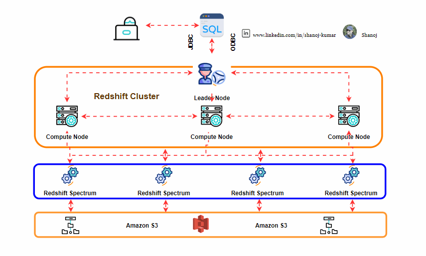

# 🌟 What is Redshift Spectrum?

**Amazon Redshift Spectrum** allows you to run SQL queries against massive amounts of data (exabytes) in S3 without loading it into Redshift tables.

    

## Key Features

- **Serverless:**
  - No need to manage servers. It's all handled by AWS.
- **Querying Data:**
  - Use SQL or BI tools to query the in-VPC Redshift cluster, which points to external data in S3.
- **Processing:**
  - Redshift Spectrum nodes outside the VPC handle the request, query data in S3, and return results to the in-VPC clusters for final merge and join operations.
- **Encryption:**
  - Data is encrypted in transit and at rest using SSE (Server-Side Encryption).
- **Pricing:**
  - Costs are based on the number of bytes scanned.

---

By using Redshift Spectrum, you can efficiently query vast amounts of data stored in S3, taking advantage of Redshift's powerful SQL capabilities without having to move data into the data warehouse. It's a flexible, secure, and cost-effective solution for data analysis at scale.
