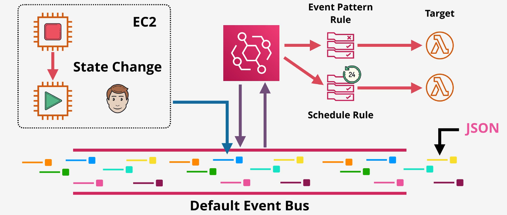

# 🔗 **Mastering Amazon EventBridge: Bridging Events and Architecting Solutions**

Amazon **EventBridge** is a powerful serverless event bus service that facilitates seamless connections between applications using data from various sources. For solution architects, understanding EventBridge's capabilities, its relationship with **CloudWatch Events**, and how it compares to **Amazon SNS** is essential for designing scalable, event-driven architectures. This comprehensive guide provides an organized and easy-to-understand overview to help you leverage EventBridge effectively.

---

## 🧐 **What is Amazon EventBridge?**

Amazon EventBridge is a **serverless event bus** that enables you to build event-driven applications by connecting different software-as-a-service (SaaS) applications, AWS services, and your own custom applications. It simplifies the process of building scalable and loosely coupled systems by routing events from various sources to designated targets based on defined rules.

### 🌟 **Key Features of EventBridge:**

- **🛠️ Serverless Architecture:** No infrastructure management required. EventBridge scales automatically with your event volume.

- **🔗 Integrations:** Connects seamlessly with over 90 AWS services, popular SaaS applications, and custom applications.

- **📜 Event Routing:** Uses rules to determine how events are routed to targets like AWS Lambda, SNS, SQS, Step Functions, and more.

- **🔒 Security and Compliance:** Integrates with AWS Identity and Access Management (IAM) for secure access control.

- **📈 Schema Registry:** Automatically discovers and catalogs event schemas, simplifying application integration and development.

---

## 🔍 **Relationship Between EventBridge and CloudWatch Events**

Amazon **CloudWatch Events** was the precursor to EventBridge, providing event routing capabilities for AWS services. In 2019, AWS enhanced CloudWatch Events and rebranded it as **Amazon EventBridge**, introducing additional features and broader integrations.

### 🔄 **Evolution from CloudWatch Events to EventBridge:**

- **Extended Integrations:** EventBridge supports more AWS services, SaaS partners, and custom applications compared to CloudWatch Events.

- **Schema Registry:** Introduced in EventBridge to automatically detect and catalog event schemas, aiding in application development.

- **Enhanced Event Routing:** Offers more sophisticated filtering and routing capabilities, enabling complex event-driven architectures.

- **Partner Event Sources:** Allows seamless integration with third-party SaaS providers, expanding the scope of event sources.

### 📌 **Key Takeaway:**

**EventBridge** is the evolution of **CloudWatch Events**, offering enhanced features, broader integrations, and improved capabilities for building event-driven architectures.

---

## 📊 **Comparing Amazon EventBridge and Amazon SNS**

While both **Amazon EventBridge** and **Amazon Simple Notification Service (SNS)** are AWS services designed for event handling and messaging, they serve different purposes and excel in distinct use cases. Understanding their differences is crucial for selecting the right service for your architectural needs.

### 🤔 **When to Use EventBridge vs. SNS:**

| **Aspect**                                 | **Amazon EventBridge**                                                                  | **Amazon SNS**                                                               |
| ------------------------------------------ | --------------------------------------------------------------------------------------- | ---------------------------------------------------------------------------- |
| **🔗 Purpose**                             | Event bus for building event-driven architectures with complex routing.                 | Pub/Sub messaging service for sending notifications to multiple subscribers. |
| **🛠️ Event Sources**                       | AWS services, SaaS applications, custom applications.                                   | Primarily AWS services and applications.                                     |
| **📜 Event Routing**                       | Advanced filtering and routing based on event content and patterns.                     | Simple topic-based publish/subscribe model.                                  |
| **📈 Use Cases**                           | Integrating multiple services, building microservices architectures, SaaS integrations. | Sending notifications, broadcasting messages to multiple endpoints.          |
| **📚 Schema Management**                   | Includes a schema registry for managing event schemas.                                  | Does not manage schemas; messages are typically simpler.                     |
| **🔄 Event Transformation**                | Supports event transformation and enrichment using input transformers.                  | Limited to message formatting; no built-in transformation capabilities.      |
| **🚀 Scalability**                         | Automatically scales with event volume; designed for high-throughput scenarios.         | Highly scalable for sending notifications to numerous subscribers.           |
| **💰 Pricing Model**                       | Charged based on the number of events published and matched by rules.                   | Charged based on the number of messages published and delivered.             |
| **🔒 Security**                            | Integrates with AWS IAM for fine-grained access control.                                | Integrates with AWS IAM; supports encryption and access policies.            |
| **🛠️ Integration with Other AWS Services** | Extensive integrations with AWS services, Step Functions, Lambda, etc.                  | Integrates with AWS services like Lambda, SQS, HTTP endpoints, etc.          |

### 🌟 **Choosing the Right Service:**

- **Use **EventBridge** when you need:**

  - Complex event routing and filtering based on event content.
  - Integration with a wide range of AWS services and third-party SaaS applications.
  - Schema management and event transformation capabilities.
  - Building scalable, event-driven microservices architectures.

- **Use **SNS** when you need:**
  - Simple publish/subscribe messaging for notifications.
  - Broadcasting messages to multiple subscribers simultaneously.
  - Quick setup for sending alerts, notifications, or simple messages to endpoints like email, SMS, or HTTP.

---

## 🛠️ **Core Components of Amazon EventBridge**

Understanding the core components of EventBridge is essential for effectively utilizing its capabilities in your architectures.

### 🔹 **Event Bus**

An **event bus** is the central hub where events are received and routed to targets. EventBridge provides three types of event buses:

1. **Default Event Bus:** Receives events from AWS services.
2. **Partner Event Buses:** Receives events from SaaS applications integrated with EventBridge.
3. **Custom Event Buses:** Receives events from your own applications or custom event sources.

### 🔹 **Events**

Events are JSON-formatted data structures that carry information about changes or actions in your applications or AWS services. Each event contains details such as the source, type, and relevant data.

### 🔹 **Rules**

**Rules** define the criteria for matching incoming events and specify the targets to which the events should be sent. Rules can filter events based on specific attributes or patterns.

### 🔹 **Targets**

**Targets** are AWS services or resources that process the events, such as AWS Lambda functions, Step Functions, SNS topics, SQS queues, Kinesis streams, and more.

### 🔹 **Schema Registry**

The **schema registry** automatically discovers and catalogs event schemas, making it easier to integrate applications by providing a central repository of event definitions.

---

## 🛠️ **Key Features and Benefits of EventBridge**

### 🏆 **Advantages for Solution Architects:**

- **🧩 Loose Coupling:** Facilitates decoupled architectures, enhancing scalability and maintainability.

- **⚡ Real-Time Processing:** Enables immediate reaction to events, supporting real-time analytics and automation.

- **🌐 Wide Integration:** Connects seamlessly with a vast array of AWS services and external SaaS applications.

- **🔍 Enhanced Observability:** Integrates with CloudWatch for monitoring and logging, providing visibility into event flows.

- **📈 Scalability:** Automatically scales to handle varying event volumes without manual intervention.

- **🔒 Secure and Compliant:** Ensures secure event transmission and complies with industry standards through AWS security practices.

---

## 🎯 **Use Cases for Amazon EventBridge**

### 🔍 **Common Scenarios:**

1. **🛒 E-Commerce Order Processing:**

   - Trigger workflows when orders are placed, payments are processed, or shipments are updated.

2. **📱 Application Integration:**

   - Connect microservices by routing events between them without tight coupling.

3. **📈 Real-Time Analytics:**

   - Stream events to analytics services or data lakes for real-time insights.

4. **🚀 DevOps Automation:**

   - Automate infrastructure changes in response to events like code deployments or configuration updates.

5. **🔔 SaaS Application Integration:**
   - Integrate with third-party SaaS applications to trigger AWS workflows based on external events.

---

## 🛠️ **Best Practices for Using EventBridge**

### ✅ **Design Recommendations:**

- **🔗 Use Custom Event Buses Wisely:**

  - Organize events logically by creating separate event buses for different applications or domains.

- **🧹 Implement Clear Naming Conventions:**

  - Adopt consistent naming for event buses, rules, and targets to enhance clarity and manageability.

- **🔍 Leverage Schema Registry:**

  - Utilize the schema registry to maintain and share event definitions across teams, reducing integration errors.

- **📏 Define Precise Rules:**

  - Create specific rules to filter events accurately, minimizing unnecessary event processing and reducing costs.

- **🛡️ Secure Event Access:**

  - Implement fine-grained IAM policies to control who can publish, subscribe, and manage events on each event bus.

- **📈 Monitor and Audit Events:**
  - Use CloudWatch metrics and logs to monitor event flow, rule performance, and target invocation statuses.

### 💡 **Optimization Tips:**

- **⚖️ Balance Granularity:**

  - Avoid overly granular events that can lead to increased costs and complexity. Design events that encapsulate meaningful information.

- **🗄️ Archive Important Events:**

  - Store critical events in durable storage solutions like S3 or DynamoDB for future reference and compliance.

- **🤖 Automate Rule Management:**
  - Use infrastructure as code (IaC) tools like AWS CloudFormation or Terraform to manage EventBridge configurations consistently.

---

## 📈 **Integration with Other AWS Services**

Amazon EventBridge integrates seamlessly with numerous AWS services, enhancing its versatility in building comprehensive solutions.

### 🔗 **Common Integrations:**

- **🔄 AWS Lambda:** Invoke serverless functions in response to events for processing or automation.

- **📦 Amazon SQS:** Queue events for asynchronous processing and decoupled workflows.

- **📊 Amazon SNS:** Forward events to SNS topics for broad message dissemination.

- **📈 Amazon Kinesis:** Stream events for real-time data analytics and processing.

- **🛠️ AWS Step Functions:** Orchestrate complex workflows triggered by events.

- **🗃️ Amazon DynamoDB:** Update databases based on incoming events for state management.

- **📜 AWS CloudTrail:** Monitor API calls and user activity by routing CloudTrail events through EventBridge.

### 🌐 **Third-Party SaaS Integrations:**

EventBridge connects with numerous SaaS applications, enabling seamless event-driven interactions. Examples include:

- **🚀 Shopify:** Trigger events based on e-commerce activities.

- **🛠️ Datadog:** Respond to monitoring alerts and metrics.

- **🔧 Zendesk:** Automate customer support workflows based on ticket events.

---

## 📚 **Additional Resources**

To deepen your understanding and effectively utilize Amazon EventBridge, explore the following resources:

- **📄 AWS Documentation:**

  - [Amazon EventBridge User Guide](https://docs.aws.amazon.com/eventbridge/latest/userguide/what-is-amazon-eventbridge.html)
  - [EventBridge API Reference](https://docs.aws.amazon.com/eventbridge/latest/APIReference/Welcome.html)

- **📘 Tutorials and Guides:**

  - [Getting Started with Amazon EventBridge](https://docs.aws.amazon.com/eventbridge/latest/userguide/getting-started.html)
  - [Building Event-Driven Applications](https://aws.amazon.com/eventbridge/building-event-driven-applications/)

- **🎓 AWS Training and Certification:**

  - [AWS EventBridge Training](https://aws.amazon.com/training/)
  - [AWS Certified Solutions Architect – Associate](https://aws.amazon.com/certification/certified-solutions-architect-associate/)

- **📝 Blogs and Articles:**
  - [Introducing Amazon EventBridge](https://aws.amazon.com/blogs/aws/amazon-eventbridge/)
  - [Best Practices for EventBridge](https://aws.amazon.com/blogs/compute/best-practices-for-amazon-eventbridge/)
