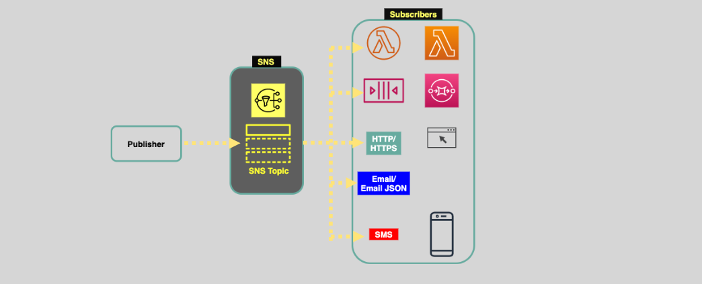
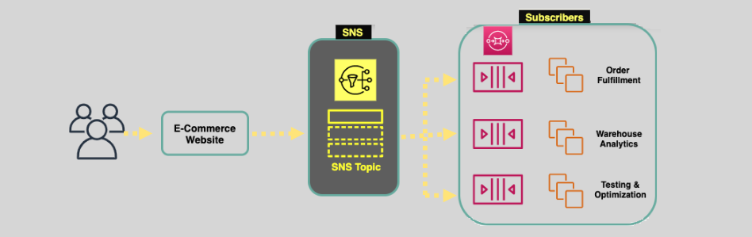

# 📢 **Amazon SNS: Fast and Flexible Push Notification Service**

Amazon Simple Notification Service (SNS) is a powerful, fully managed pub/sub (publish/subscribe) messaging service that enables you to decouple and scale microservices, distributed systems, and serverless applications. SNS allows publishers to send messages to multiple subscribers, ensuring timely and reliable delivery of notifications across various channels.

---

## 🔍 **What is Amazon SNS?**

**Amazon SNS** is a fast, flexible, and fully managed service for sending notifications from the cloud. It supports various messaging patterns, enabling seamless communication between publishers (producers) and subscribers (consumers).

### 📌 **Key Features:**

- **Pub/Sub Messaging:** Facilitates one-to-many communication by allowing publishers to send messages to multiple subscribers simultaneously.
- **Durable Messaging:** Stores messages across multiple Availability Zones (AZs) within an AWS region, ensuring high availability and reliability.
- **Secure Communication:** Supports encryption in transit using HTTPS and encryption at rest using AWS Key Management Service (KMS) keys.
- **Multiple Protocols:** Delivers messages through various protocols, including HTTP/S, Email, SMS, Lambda functions, and Amazon SQS queues.

---

## 🔗 **Core Components**

### 1. **Publishers (Producers)**

- **Role:** Send messages to an SNS topic.
- **Function:** Producers can be any application, service, or device that generates notifications or events.

### 2. **Subscribers (Consumers)**

- **Role:** Receive messages from SNS topics.
- **Function:** Subscribers can be applications, services, or devices that consume and process the notifications sent by publishers.

---

## 🛠️ **Features**

### 📤 **SNS Fanout & Message Filtering**

#### **Fanout Pattern:**

- **Definition:** The ability to send identical copies of an SNS message to multiple Amazon SQS queues or other subscribers in parallel.
- **Benefits:**

  - **Parallel Processing:** Enables concurrent processing of messages by different services.
  - **Simplified Architecture:** Eliminates the need to replicate messages at the application level.

**Example Use Case:**

- An application publishes a notification about a new user registration. SNS fanouts the message to multiple SQS queues for different processing tasks, such as sending a welcome email, updating analytics, and provisioning resources.

#### **Message Filtering:**

- **Definition:** Allows subscribers to receive only the messages that match specific criteria, reducing unnecessary processing.
- **Configuration:** Apply filter policies at the topic level or per subscriber to determine which messages should be delivered.

**Example Use Case:**

- A news service publishes various categories of news articles. Subscribers can filter messages based on categories like sports, technology, or health to receive only relevant updates.

### 📮 **Dead Letter Queues (DLQs)**

**Dead Letter Queues** are Amazon SQS queues used by SNS to capture messages that failed to be delivered to subscribers after a configurable number of retry attempts.

#### **How DLQs Work:**

1. **Message Delivery Failure:** If SNS cannot deliver a message to a subscriber after the specified number of retries, the message is moved to the DLQ.
2. **Troubleshooting:** DLQs allow you to analyze and troubleshoot failed messages without affecting the main message flow.
3. **Re-drive Mechanism:** You can configure a redrive policy to move messages from the DLQ back to the source queue for reprocessing once the underlying issue is resolved.

**Example Use Case:**

- If an email service fails to send a notification after three attempts, the message is moved to a DLQ for manual review and corrective action.

### 🔄 **Grouping Messages in FIFO Queues**

**FIFO (First-In-First-Out) Topics** in SNS ensure that messages are delivered in the exact order they are sent and that each message is delivered only once.

#### **Key Features:**

- **Message Group ID:**

  - **Definition:** An identifier that groups messages to ensure they are processed in order.
  - **Usage:** Specify the `MessageGroupId` when publishing messages. Messages with the same `MessageGroupId` are processed sequentially.

- **Strict Ordering:** Guarantees that messages within the same group are delivered and processed in the order they were sent.

- **Deduplication:** Ensures that each message is delivered only once to subscribers, preventing duplicates.

**Example Use Case:**

- In a financial application, transactions related to the same account are grouped using `MessageGroupId` to ensure they are processed in the correct sequence.

## 🛡️ **Security & Access Management**

### 🔐 **Access Control Mechanisms**

#### 1. **IAM Policies**

- **Purpose:** Define who can publish or subscribe to SNS topics.
- **Usage:** Attach IAM policies to users, groups, or roles to grant specific permissions.

**Example Use Case:**

- Allowing only certain AWS users or roles to publish messages to a specific SNS topic.

#### 2. **Resource-Based Policies (Access Policies)**

- **Purpose:** Control access to SNS topics at the resource level.
- **Usage:** Attach policies directly to SNS topics to specify which principals can perform actions like `Publish` or `Subscribe`.

**Example Use Case:**

- Allowing an S3 bucket to publish notifications to an SNS topic when objects are created.

### 🔒 **Encryption**

#### 1. **Encryption In-Transit**

- **Method:** Uses TLS/HTTPS to encrypt data as it moves between publishers, SNS, and subscribers.
- **Benefit:** Protects data from interception and tampering during transmission.

#### 2. **Encryption At-Rest**

- **Method:** Utilizes AWS Key Management Service (KMS) to encrypt messages stored in SNS.
- **Configuration:**

  - **Default Encryption:** Managed by AWS using default KMS keys.
  - **Customer-Managed Keys:** Allows you to use your own KMS keys for enhanced control and compliance.

**Example Use Case:**

- Ensuring that sensitive data sent through SNS topics is encrypted both in transit and at rest to meet regulatory requirements.

---

## 🎯 **Use Cases**

Amazon SNS is versatile and can be applied to various scenarios requiring reliable and scalable notification services.

1. **Event Notification:**

   - **Description:** Automatically notify services or users about events like system changes, deployments, or status updates.
   - **Example:** Sending alerts when a new instance is launched or when an application experiences an error.

2. **Monitoring Applications:**

   - **Description:** Integrate SNS with monitoring tools to send real-time alerts based on performance metrics or logs.
   - **Example:** Triggering an SNS notification when CPU usage exceeds a certain threshold.

3. **Workflow Systems:**

   - **Description:** Orchestrate complex workflows by sending messages between different microservices or application components.
   - **Example:** Initiating a multi-step data processing pipeline upon receiving a new data file.

4. **Time-Sensitive Information Updates:**

   - **Description:** Deliver timely updates to users or systems, ensuring they receive the latest information promptly.
   - **Example:** Sending real-time stock price updates to subscribed applications.

5. **Mobile Applications:**

   - **Description:** Push notifications to mobile devices to enhance user engagement and experience.
   - **Example:** Sending promotional offers or account activity alerts to users' smartphones.

6. **SNS Fanout Pattern:**

   - **Description:** Distribute identical messages to multiple endpoints simultaneously, enabling parallel processing.
   - **Example:** Publishing a message to an SNS topic that fans out to multiple SQS queues for different processing tasks.

7. **Message Filtering:**

   - **Description:** Deliver messages selectively to subscribers based on predefined filter criteria, reducing unnecessary processing.
   - **Example:** Subscribers only receive messages related to specific event types or categories.

8. **Dead Letter Queues (DLQs):**

   - **Description:** Handle undeliverable messages by moving them to a DLQ for later analysis and troubleshooting.
   - **Example:** Capturing failed notifications due to subscriber downtime for manual intervention.

9. **FIFO Topics:**
   - **Description:** Ensure ordered and deduplicated message delivery for applications requiring strict sequencing.
   - **Example:** Processing financial transactions in the exact order they were received to maintain data integrity.

---

## 🏁 **Conclusion**

Amazon SNS is a robust and flexible messaging service that plays a vital role in modern cloud architectures. By leveraging its powerful features like **Pub/Sub Messaging**, **Fanout Patterns**, **Message Filtering**, **Dead Letter Queues**, and **FIFO Topics**, you can build scalable, reliable, and secure notification systems tailored to your application's needs. Whether you're handling event notifications, orchestrating workflows, or sending real-time updates to mobile devices, SNS provides the tools necessary to ensure efficient and effective communication across your services and users.
