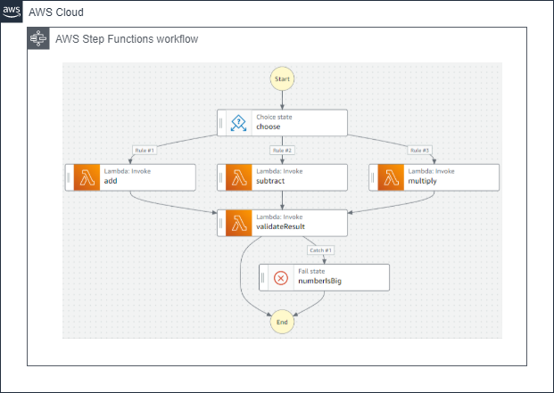
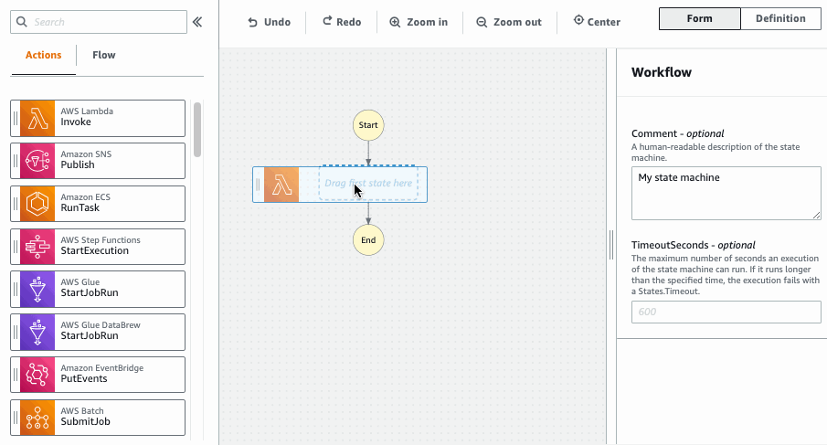

# 🚀 **AWS Step Functions: Orchestrate Your Serverless Workflows with Ease**

AWS Step Functions is a **fully managed serverless service** designed to simplify the coordination of components within distributed applications and microservices through intuitive visual workflows. Whether you're building complex workflows or orchestrating simple tasks, Step Functions provides the tools you need to manage and monitor your processes seamlessly.

---

## 🔍 **What Are AWS Step Functions?**

AWS Step Functions allows you to **coordinate multiple AWS services** into serverless workflows, enabling you to build and update applications quickly. By visualizing the flow of your application, you can easily track the progress and handle errors efficiently.

### 🖼️ **Workflow Overview**

---

## 🛠️ **How AWS Step Functions Work**

Understanding the mechanics of Step Functions is crucial for effectively integrating it into your architecture. Here's a breakdown of its core functionalities:

### 🔄 **Workflow Execution**

- **State Machine:** AWS Step Functions uses a **state machine** to define your workflow. This state machine is written in **Amazon States Language (JSON)**, which outlines each step and their transitions.

- **Visual Workflow:** The service provides a **visual representation** of your workflow, highlighting the real-time status of each step. This makes it easier to monitor and debug your processes.

### 📈 **Tracking and Managing Status**

- **Real-Time Monitoring:** Track the execution status of each step in real-time, allowing for quick identification and resolution of issues.

- **Error Handling:** Step Functions can **automatically retry** failed steps and manage error states, ensuring your workflow remains resilient and reliable.

- **Execution Order:** Maintains the **order of execution**, ensuring that each step runs in the correct sequence.

---

## 📝 **Key Features of AWS Step Functions**

### 🧩 **Flexible Workflow Management**

- **Add/Remove Steps Easily:** Modify your workflows by adding or removing steps **without writing additional code**, providing flexibility as your application evolves.

- **Integration with API Gateway:** Use **API Gateway** to **start Step Functions state machines**, enabling seamless integration with your APIs and external triggers.

### 🔒 **Secure and Managed**

- **Fully Managed Service:** AWS handles the underlying infrastructure, allowing you to focus on designing and implementing your workflows without worrying about server management.

- **Serverless Architecture:** Benefit from the **scalability and reliability** of serverless computing, ensuring your workflows can handle varying loads efficiently.

---

## 📊 **Why Choose AWS Step Functions?**

AWS Step Functions offers numerous advantages that make it an excellent choice for orchestrating serverless workflows:

- **Visual Clarity:** The visual workflow provides an intuitive interface to design, visualize, and monitor your application’s processes.

- **Reliability:** Built-in error handling and retry mechanisms ensure your workflows are robust and can recover gracefully from failures.

- **Flexibility:** Easily integrate with a wide range of AWS services and external APIs, allowing you to build complex, multi-step workflows tailored to your needs.

- **Efficiency:** Automate repetitive tasks and streamline processes, reducing manual intervention and increasing operational efficiency.

---

## 🛣️ **Use Cases for AWS Step Functions**

AWS Step Functions can be applied to various scenarios, enhancing the functionality and reliability of your applications:

### 1. **Data Processing Pipelines**

- **ETL Operations:** Extract, transform, and load data across different AWS services.
- **Real-Time Data Processing:** Handle streaming data with integrated steps for processing and storage.

### 2. **Microservices Orchestration**

- **Service Coordination:** Manage interactions between microservices, ensuring seamless communication and data flow.
- **API Integration:** Combine multiple APIs into a cohesive workflow for comprehensive functionality.

### 3. **Automated Workflows**

- **CI/CD Pipelines:** Automate build, test, and deployment processes for faster and more reliable software releases.
- **Business Process Automation:** Streamline business operations such as order processing, user onboarding, and more.

### 4. **Machine Learning Workflows**

- **Model Training and Deployment:** Coordinate the steps involved in training machine learning models and deploying them to production environments.
- **Data Preparation:** Automate the preprocessing and cleaning of data required for machine learning tasks.

---

## 🔗 **Integration with Other AWS Services**

AWS Step Functions seamlessly integrates with a wide array of AWS services, enhancing its capabilities and extending its functionality:

- **AWS Lambda:** Execute serverless functions as steps within your workflow.
- **Amazon S3:** Manage data storage and retrieval processes.
- **Amazon DynamoDB:** Handle database operations within your workflows.
- **Amazon SNS/SQS:** Incorporate messaging services for communication between steps.
- **AWS API Gateway:** Trigger workflows through API calls.

---

## 📚 **Additional Resources**

To deepen your understanding of AWS Step Functions and explore advanced topics, consider the following resources:

- **AWS Step Functions Documentation:** [AWS Step Functions Docs](https://docs.aws.amazon.com/step-functions/index.html)
- **Tutorials and Guides:** Explore step-by-step tutorials to build and deploy your workflows.
- **Serverless Guru Blog:** [Serverless Orchestration Workflows with AWS Step Functions](https://www.serverlessguru.com/blog/serverless-orchestration-workflows-with-aws-step-functions)
- **AWS Training and Certification:** Enhance your skills with AWS-certified training programs.
