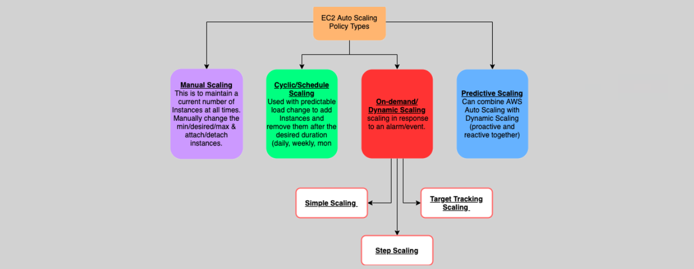

# **Auto Scaling Policies 🔄**

Auto Scaling allows your AWS environment to dynamically adjust based on traffic patterns, ensuring that you have the right number of instances running to meet demand, while optimizing costs. There are various types of Auto Scaling policies that help automate this process. Here's a breakdown of these policies and how they work.

---

## **1. Auto Scaling Policy Types 🏷️**

Auto Scaling policies help you control how your instances are scaled. The key types of scaling policies are:

1. **Manual Scaling**:

   - This is when you manually set the desired capacity of your Auto Scaling group, without any automated intervention.

2. **Cyclic or Scheduled Scaling 📅**:

   - Used when you know your application has predictable traffic patterns, such as business hours. You schedule scaling actions based on time.
   - Example: Scale out at 9 AM and scale in at 5 PM.

3. **On-Demand or Dynamic Scaling ⚡**:

   - This is when scaling occurs in response to changing demand, usually triggered by CloudWatch alarms.

   **Dynamic scaling includes**:

   - **Simple Scaling**: A single action to either scale up or down when the alarm condition is met.
   - **Step Scaling**: Multiple scaling actions are taken depending on different alarm thresholds.
   - **Target Tracking Scaling**: AWS automatically adjusts the scaling based on a set target metric (e.g., CPU utilization, network I/O). This is AWS's recommended approach for most use cases.

4. **Predictive Scaling 🔮**:
   - Combines proactive and reactive scaling by using machine learning to predict future traffic based on past usage patterns.
   - Ideal for applications with cyclical, recurring traffic or those that take longer to start up. This ensures you're always prepared ahead of time.
   - Predictive scaling requires 24 hours of historical data to generate forecasts and works best when all instances in the group are the same.

---

## **2. Dynamic / On-Demand Scaling 🌐**

Dynamic scaling is triggered by CloudWatch alarms, which monitor metrics such as CPU utilization, memory, or network traffic. When a metric exceeds or drops below a defined threshold, the Auto Scaling group responds by adding or removing instances.

### **Dynamic Scaling Types:**

#### **2.1. Simple Scaling 🔼🔽**

- This policy makes a **single adjustment** (scale up or scale down) when an alarm condition is met. It is the simplest form of dynamic scaling.
- **Example**: If CPU utilization goes over 70%, add one more instance.

#### **2.2. Step Scaling 🔢**

- Multiple scaling actions are triggered based on different alarm thresholds. This allows for more granular control over scaling behavior.
- **Example**:
  - If CPU utilization exceeds 70%, scale out by 1 instance.
  - If CPU exceeds 80%, scale out by 2 more instances.
  - If CPU utilization drops below 40%, scale in by 1 instance.

#### **2.3. Target Tracking Scaling 🎯**

- AWS automatically adjusts the desired capacity based on a target metric (e.g., CPU utilization). It works like a thermostat to keep a metric at a constant level.
- **Example**: Maintain an average CPU utilization of 50%. If the CPU goes higher, the Auto Scaling group adds instances; if it drops lower, it removes instances.

---

## **3. Predictive Scaling 📊**

Predictive Scaling uses machine learning to forecast the future capacity required based on historical data collected by CloudWatch. It predicts when more instances will be needed, helping to scale ahead of traffic spikes.

### **Benefits of Predictive Scaling:**

- **Proactive Scaling**: Predictive scaling takes action before demand spikes, reducing delays and ensuring optimal resource availability.
- **Perfect for Cyclic Traffic**: It’s especially useful for applications with **cyclic** or **on/off** traffic patterns, such as ecommerce sites or apps that have peak usage during holidays or business hours.
- **Improved Accuracy**: By learning from historical data, it makes more accurate predictions about future needs, saving you time in creating scaling schedules.

**Example**:

- If you have a website that sees traffic spikes on weekends, predictive scaling can scale out ahead of time based on past traffic patterns, ensuring that you have the right capacity in place when the traffic comes.

---

## **4. Example Use Case 📝**

Let’s consider a **web application** running on EC2 instances behind an **Auto Scaling group**. The app experiences a **cyclical traffic pattern**, where usage spikes during **business hours**.

### **Step 1: Manual Scaling (Initial Setup)**

- **Desired Capacity**: 2 instances
- **Scaling Limits**: Minimum 2 instances, Maximum 10 instances

### **Step 2: Set up Target Tracking Scaling**

- **Metric**: Average CPU Utilization
- **Target Value**: 50%
  - If CPU utilization exceeds 50%, add one instance.
  - If CPU utilization falls below 50%, remove one instance.

### **Step 3: Implement Predictive Scaling**

- **Traffic Pattern**: Traffic is higher on weekdays, with spikes at 9 AM and 5 PM.
- **Predictive Scaling** is enabled, and it uses the past 24 hours of data to predict and prepare the app for these spikes in demand.

### **Step 4: Monitoring and Alerts**

- **CloudWatch Alarms** monitor CPU utilization and trigger scaling policies when thresholds are breached.
- **Instance Warm-Up**: Set a warm-up period of 5 minutes to prevent unnecessary scaling actions when new instances are launched.

---

## **5. Conclusion 🎯**

Auto Scaling ensures your application has the right number of instances to handle the load, while also reducing costs by scaling down when traffic is low. By utilizing different scaling policies like **simple scaling**, **step scaling**, **target tracking**, and **predictive scaling**, you can ensure your application runs efficiently and cost-effectively while adapting to changes in demand.
