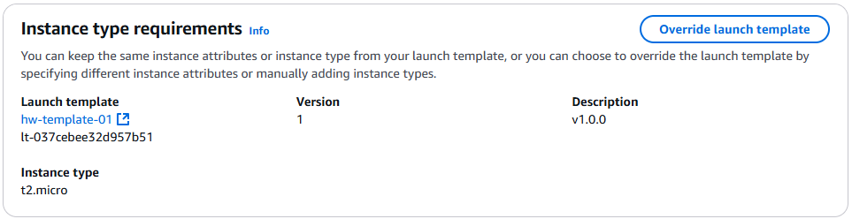
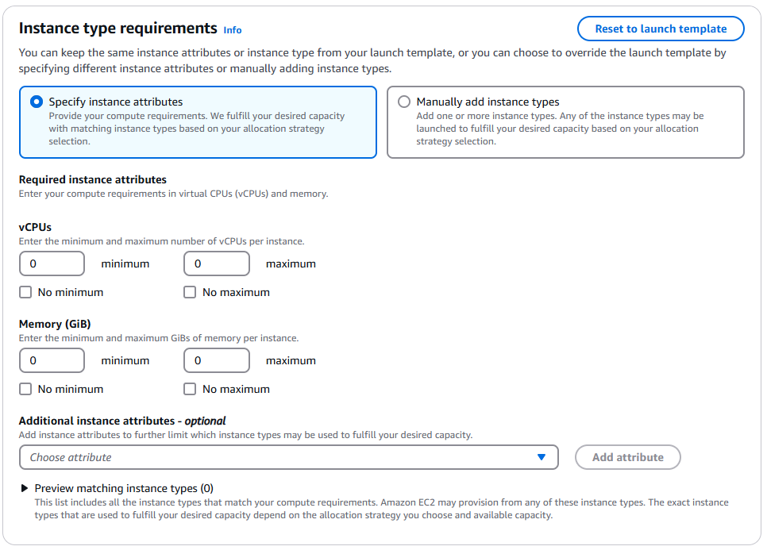
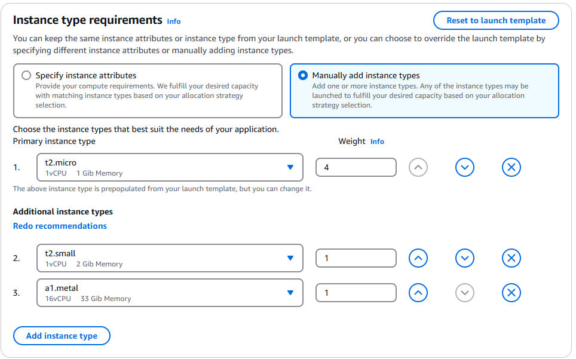
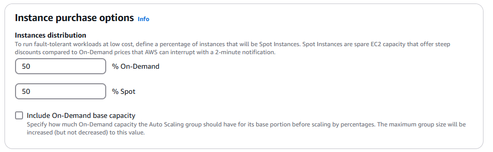
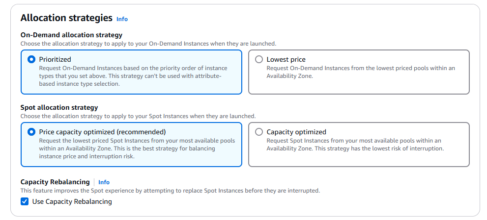
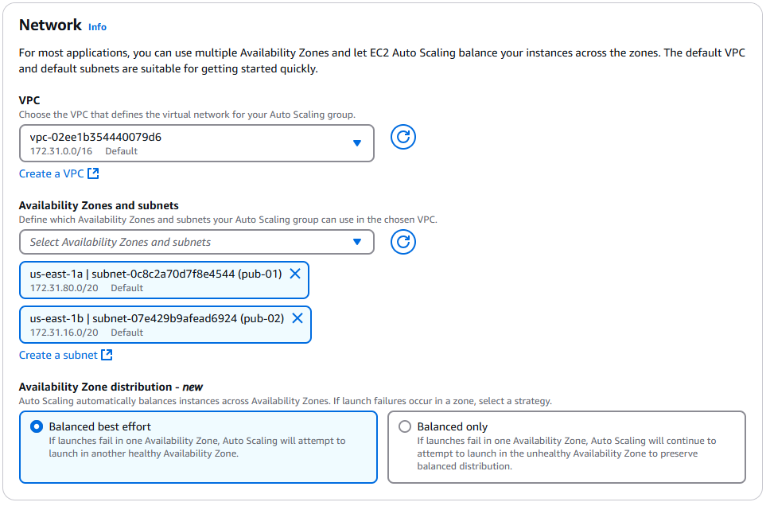

# **Choose instance launch options**

## Override launch template

it give an option for

### **a. Instance type requirements**

#### **1. Specify instance attributes**

Provide your compute requirements (in virtual CPUs (vCPUs) and memory). We fulfill your desired capacity with matching instance types based on your allocation strategy selection.

#### **2. Manually add instance types**

Add one or more instance types. Any of the instance types may be launched to fulfill your desired capacity based on your allocation strategy selection.

### **b. Instance purchase options**

To run fault-tolerant workloads at low cost, define a percentage of instances that will be Spot Instances. Spot Instances are spare EC2 capacity that offer steep discounts compared to On-Demand prices that AWS can interrupt with a 2-minute notification.

### **c. Allocation strategies**

1. **On-Demand allocation strategy:** Choose the allocation strategy to apply to your On-Demand Instances when they are launched.
1. **Spot allocation strategy:** Choose the allocation strategy to apply to your Spot Instances when they are launched.

## Networking

For most applications, you can use multiple Availability Zones and let EC2 Auto Scaling balance your instances across the zones. The default VPC and default subnets are suitable for getting started quickly.

### **a. VPC**

Choose the VPC that defines the virtual network for your Auto Scaling group.

### **b. Availability Zones and subnets**

Define which Availability Zones and subnets your Auto Scaling group can use in the chosen VPC.

### **c. Availability Zone distribution - new**

Auto Scaling automatically balances instances across Availability Zones. If launch failures occur in a zone, select a strategy.

- **Balanced best effort:** If launches fail in one Availability Zone, Auto Scaling will attempt to launch in another healthy Availability Zone.

- **Balanced only:** If launches fail in one Availability Zone, Auto Scaling will continue to attempt to launch in the unhealthy Availability Zone to preserve balanced distribution.
