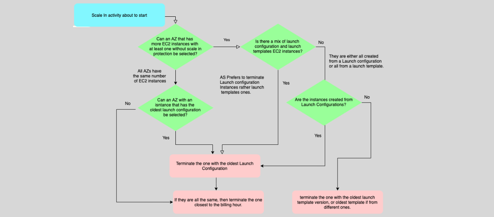

# **EC2 Auto Scaling – Timers & Termination Policy ⏲️**

EC2 Auto Scaling helps maintain application availability by automatically adjusting the number of EC2 instances in response to changes in traffic patterns. To ensure scaling activities are efficient, there are several important timers and policies that control the scaling behavior of Auto Scaling groups (ASGs). These include cooldown periods, instance warm-up periods, scale-in termination protection, and termination policies.

---

## **Cooldown and Warm-up Periods 🕒**

### **1. Cooldown Period**

A **Cooldown period** is the amount of time Auto Scaling waits after a **scale-out** or **scale-in** activity before another scaling action can be triggered.

- **Purpose**: It allows the system to observe the impact of the scaling activity before deciding if further scaling is necessary.
- **Applicable to**: This period is especially important with **simple scaling policies** but is **not recommended** for most use cases since it can be too rigid and slow in reacting to changes.

**Example**: If Auto Scaling triggers a scale-out activity, the cooldown period will prevent any further scale-in or scale-out activity for a defined time. This prevents over-scaling or under-scaling too quickly.

### **2. Instance Default Warm-up Period**

The **Instance Default Warm-up Period** is the time that should pass before a newly launched instance (due to a scale-out) contributes to the **Auto Scaling group’s CloudWatch metrics**.

- **Purpose**: This ensures that the newly launched instance has fully initialized and stabilized before being considered in metrics like CPU utilization or network traffic.
- **Recommended**: It’s highly recommended to use a warm-up period, as this helps avoid scaling activities based on unreliable data during the initial boot-up phase.

**Example**: After launching an instance, CloudWatch metrics will not be counted until the warm-up period has expired, allowing the instance to stabilize.

---

## **Scale-in Termination Protection 🔒**

**Scale-in Termination Protection** prevents instances from being automatically terminated during scale-in activities. This ensures that critical instances are not accidentally terminated when reducing the number of running instances.

### **Limitations:**

- **Does not protect** from:

  - Manual termination
  - Replacement due to health issues
  - Spot instance interruptions

This feature can be configured on a per-instance basis at the Auto Scaling Group (ASG) level, making it a flexible option to protect critical workloads during scaling events.

---

## **Termination Policy ⚖️**

The **Termination Policy** defines how Auto Scaling decides which instances to terminate when scaling in. This policy helps control the instance lifecycle based on specific priorities.

### **Termination Selection Criteria:**

1. **Availability Zone**: The Availability Zone (AZ) with the **largest number of running EC2 instances** is selected first for termination.
2. **Launch Configuration vs. Launch Template**: Instances created from **Launch Configuration** are terminated first, followed by those created with **Launch Templates**.
3. **Instance Age**: If instances are using the same launch configuration or template, the instance with the **oldest launch configuration** is terminated first.
4. **Billing Hour**: If all instances are identical, the one closest to the **end of the billing hour** is terminated first.

**Example**: If your ASG spans two AZs and one AZ has more instances than the other, Auto Scaling will prioritize terminating instances in the AZ with the larger number to maintain balance.

---

## **General Notes 📌**

- **Attaching Instances**: You can attach a running instance to an Auto Scaling Group at any time.
- **Detaching Instances**: You can also detach instances from an Auto Scaling Group when needed.
- **Standby State**: Instances can be placed into **Standby** mode, allowing you to troubleshoot or make changes without them being counted in the ASG's required capacity.

  - Instances in standby mode are still managed by the Auto Scaling group but do not affect the available capacity for scaling.

---

## **Policy Recommendations 📝**

- **Target Tracking Scaling**: Best suited for **unknown traffic patterns**, where you want Auto Scaling to automatically adjust based on a selected metric (e.g., CPU utilization). AWS recommends this for most applications as it automatically adjusts to changing conditions.
- **Predictive Scaling**: Ideal for applications with **known traffic patterns** (e.g., e-commerce sites with predictable high traffic during sales). It uses machine learning to predict the right scaling adjustments in advance.
- **Step Scaling**: Recommended over **Simple Scaling** for more **granular control** based on multiple alarms and thresholds.

**Key Takeaway**: Use **Target Tracking** for simple, efficient scaling, **Predictive Scaling** for known traffic patterns, and **Step Scaling** for more complex scenarios.

---

## **Conclusion 🎯**

By configuring **Timers** and **Termination Policies**, you can fine-tune your Auto Scaling behavior to meet your application’s specific needs. Whether you're scaling out to handle high demand or scaling in to save costs, these settings ensure that your Auto Scaling group operates efficiently, keeps your application available, and helps you manage costs effectively.
