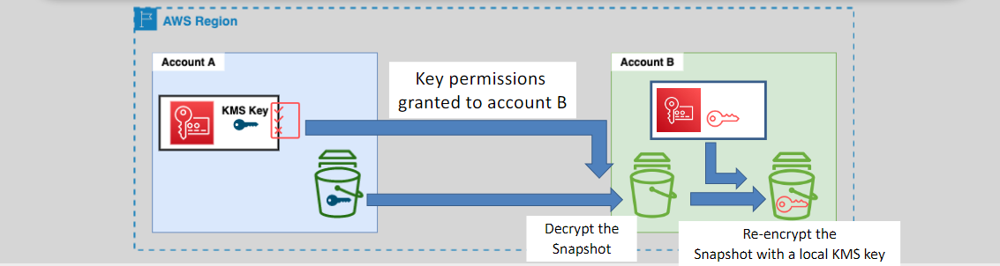

# **Sharing EBS Snapshots 🔄**

Sharing EBS snapshots is a useful way to distribute data or backup copies between AWS accounts. Whether you're collaborating with another AWS user or transferring data across different regions or accounts, EBS snapshot sharing allows for flexible data management. However, there are important distinctions between sharing unencrypted and encrypted snapshots, and specific permissions and steps need to be followed.

## **Sharing Unencrypted EBS Snapshots 🌐**

- **Public Sharing**: You can modify the snapshot permissions to make it **public**, allowing anyone in the AWS community to access it.

  - This is useful when you need to share data with a wide range of users.

- **Private Sharing with Specific Accounts**: Unencrypted snapshots can also be shared **privately** with specific AWS accounts by adjusting the snapshot permissions.
  - You specify the AWS account IDs of the recipients to control who has access to the snapshot.

## **Sharing Encrypted EBS Snapshots 🔐**

Encrypted snapshots have stricter sharing rules to maintain data security. These snapshots cannot be shared publicly, but can only be shared with **specific AWS accounts** under the following conditions:

- **Permissions on KMS Key**: For an encrypted snapshot to be shared, the **receiving account must be granted permissions** to access the **KMS key** used for encryption.
- **Default KMS Key**: Encrypted snapshots that are encrypted with the **default KMS key** (AWS-managed key) **cannot be shared**. You must use a custom KMS key for sharing.

### **Steps for Sharing an Encrypted Snapshot** 🔑

1. **Grant KMS Key Access**: You must grant the receiving AWS account permission to use the KMS key that encrypted the snapshot.

   - This can be done by modifying the KMS key policy or using IAM permissions to allow access to the key.

2. **Share the Snapshot**: Modify the snapshot permissions to share the encrypted snapshot with the specific AWS account.

   - You can select **private** sharing and specify the account IDs of the recipients.

3. **Copying the Snapshot**: After the receiving account gains access, it's important to instruct them to **copy the snapshot** to their own account and re-encrypt it with their own KMS key.

   - This ensures that the snapshot remains secure and the sharing permissions are revoked once you remove access to the original KMS key.

4. **Remove Access to the KMS Key**: Once the snapshot is copied and re-encrypted by the receiving account, you should **remove their access** to your KMS key.
   - This ensures that no further access is granted to your encryption key.

### **Example of Sharing an Encrypted Snapshot** 🔄

1. **Step 1**: Grant the receiving account permissions on the KMS key used to encrypt the snapshot.
2. **Step 2**: Share the snapshot privately with the account.
3. **Step 3**: Instruct the receiving account to copy the snapshot and re-encrypt it with their own KMS key.
4. **Step 4**: Remove the receiving account's access to your KMS key.

## **Considerations for Snapshot Sharing** 🧐

- **Data Security**: Always ensure that the permissions on your KMS keys are strictly managed to prevent unauthorized access to sensitive data.
- **Copying to Other Regions**: If you want to copy a snapshot to a different region, it must be done manually after sharing the snapshot between accounts.
- **Snapshot Expiry**: If the receiving account does not copy the snapshot within a reasonable time, access to the snapshot may be revoked when you remove their KMS key permissions.

## **Conclusion 🏁**

Sharing EBS snapshots allows for efficient data transfer between AWS accounts, whether for backup purposes, collaboration, or migration. When dealing with encrypted snapshots, it's important to manage KMS permissions carefully to maintain security. By following the proper steps, including granting KMS key access and instructing the receiving account to re-encrypt the snapshot, you can securely share your data while maintaining control over your encryption keys.
