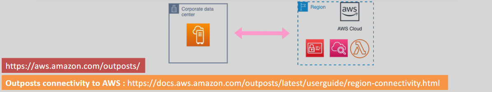

# **AWS Outposts 🌐**

AWS Outposts is a fully managed service that extends AWS infrastructure, services, APIs, and tools to your on-premises location. With AWS Outposts, you can build and run applications on-premises using the same AWS APIs as AWS regions, while leveraging local compute and storage resources for low-latency and local data processing needs.

## **Key Features**

- **Seamless Integration 🔄**: Extends your AWS environment to on-premises for a unified hybrid cloud experience.
- **Fully Managed 🔧**: AWS handles the operations, monitoring, and management of the infrastructure.
- **Local Data Processing ⚡**: Local compute and storage resources for low-latency applications.
- **Consistent Experience 🌐**: Use the same AWS tools and APIs across on-premises and cloud environments.

## **How It Works**

- **Deployment Options 🖥️**: Outposts can be deployed as 1U, 2U servers or multiple racks based on your infrastructure needs.
- **Supported Services 📦**: EC2, ECS, EKS, RDS, EBS, Snapshots, S3, ElastiCache, EMR, ALB, CloudEndure, and VMware Cloud.
- **Network Connectivity 🌍**: Offers fast connectivity options like 1Gbps, 10Gbps, 40Gbps, and 100Gbps to the local AWS region.

## **Use Cases**

- **Hybrid Applications 🔄**: For applications requiring both on-premises and AWS cloud services.
- **Data Residency 🏛️**: Ideal for industries with data residency or compliance needs.
- **Low-Latency Applications 📊**: Applications requiring real-time data processing.

## **Conclusion 🎯**

AWS Outposts brings the power of AWS to your on-premises environment, giving you the flexibility of the cloud with the performance and local data processing benefits of on-premises infrastructure. It's a great solution for hybrid applications, data compliance, and low-latency needs.
