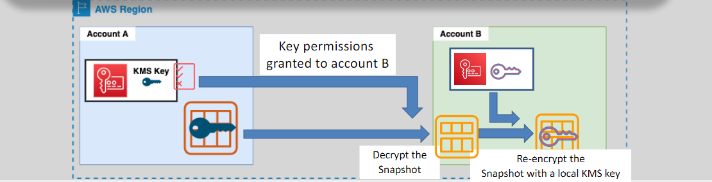

# **EC2 AMIs (Amazon Machine Images) 📦**

Amazon EC2 AMIs (Amazon Machine Images) are critical in creating customized environments that can be replicated and scaled efficiently. By using AMIs, you can automate the creation of EC2 instances, apply consistent configurations across your environment, and manage your infrastructure more effectively. Here's an organized guide to understanding, creating, sharing, and copying EC2 AMIs.

## **What is an EC2 AMI?** 🔍

An AMI is a pre-configured template that contains the software, configuration settings, and required environment to launch EC2 instances. It includes:

- **Operating system** (Linux, Windows)
- **Software packages** (e.g., security patches, applications)
- **Configuration settings**
- **EBS snapshots** for storing root volume and attached volumes

Creating a custom AMI allows you to capture an EC2 instance's configuration and replicate it for consistent environments across multiple instances.

## **Creating an AMI From an EBS-Backed EC2 Instance 🖥️**

### **Steps to Create an AMI:**

1. **Launch and Customize**: Launch an EC2 instance, install necessary software (like security agents or monitoring tools), and configure it as needed.
2. **Prepare for Snapshot**: To ensure data integrity and consistency, it is recommended to **reboot** the instance before creating the AMI. This helps to flush data from memory to the root volume and prevents inconsistencies.
3. **Create AMI**: When you create an AMI, AWS will automatically create snapshots of the instance's root volume (and any additional EBS volumes attached).
4. **AMI Registration**: AWS automatically registers the AMI after creation, making it available for future use.

### **What’s Included in the AMI?**

- **Root Volume**: Snapshot of the root EBS volume
- **Additional EBS Volumes**: If additional EBS volumes are attached, those are also included in the AMI
- **Customization**: All installed software and configurations are captured within the AMI for reuse

### **Creating AMIs from EBS-backed Instances:**

- **Reboot Before Creation**: To ensure data consistency, AWS recommends rebooting the instance before initiating the AMI creation process.
- **AWS Automated Process**: AWS automatically registers and manages the AMI once it’s created, streamlining the process for you.

## **Sharing EC2 AMIs with Other AWS Accounts 🔄**

Sharing AMIs allows you to collaborate with other AWS accounts, share pre-configured instances, or move configurations across different regions. Here’s how to share your AMI:

1. **Grant Permissions on KMS Key**: If the snapshot is encrypted, you must grant access to the **KMS key** that encrypted the snapshot.
2. **Share the AMI**: Set the sharing permissions to **private** and share with the desired AWS account.
3. **Copy and Re-encrypt the AMI**: The receiving account should copy the shared AMI to their region and re-encrypt it using their own KMS key.
4. **Remove Permissions**: Once the recipient has copied and re-encrypted the AMI, remove your permissions on the KMS key to secure your encryption key.

### **Key Notes:**

- **Sharing Limitations**: If an AMI contains an encrypted volume, sharing it requires providing access to the KMS key. Additionally, an AMI from a different region must first be copied to that region before sharing.
- **Ownership**: Sharing an AMI does not transfer ownership, meaning the original account remains responsible for the AMI storage charges.

## **Copying an EC2 AMI 🧳**

You can copy EC2 AMIs either within the same account or across different AWS regions. This is helpful when you want to use the same AMI in multiple regions or accounts.

### **Copying Within the Same Region:**

- **Easily Copy AMIs**: You can copy AMIs within the same region to create backups or to replicate an environment for scalability.

### **Copying to Different Regions:**

- **Encryption Handling**: When copying an encrypted AMI across regions, AWS enforces that the encryption key is replaced with a key from the destination region. This process ensures that the data remains secure during transit.
- **Marketplace & Windows Limitations**: AMIs from the AWS Marketplace or with billing product codes, as well as Windows-based AMIs, cannot be copied between accounts.

### **Workaround for Marketplace/Windows AMIs:**

- Launch an instance from the original AMI.
- Create a new AMI from this launched instance, and then share it as a new AMI.

## **Conclusion 🎯**

Amazon EC2 AMIs offer a convenient way to capture, customize, and replicate your EC2 instances across multiple regions and accounts. By leveraging AMIs, you can ensure consistency in your infrastructure, simplify management, and streamline the deployment of applications. Understanding how to create, share, and copy AMIs is essential for effective AWS management, especially when dealing with multiple environments or teams.

- **AMIs**: Simplify instance replication
- **Snapshots**: Capture and store EC2 configurations
- **Sharing & Copying**: Expand your infrastructure across AWS accounts and regions efficiently
