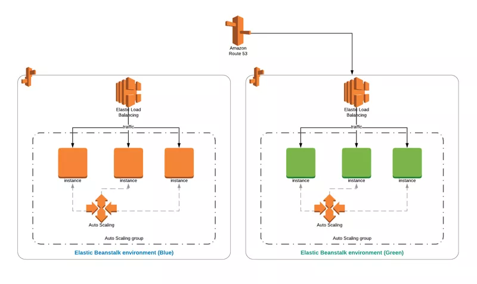

# Elastic Beanstalk: Simplified Application Deployment 🌱

AWS Elastic Beanstalk is a **fully managed service** that simplifies the **deployment**, **management**, and **scaling** of applications. Designed to automate the infrastructure required to run web applications, Elastic Beanstalk lets developers focus on **writing code** rather than managing infrastructure.

  

---

## ✨ **Why Use Elastic Beanstalk?**

Elastic Beanstalk is ideal for a variety of use cases:

- **Rapid Application Launch**: Quickly deploy scalable web applications without infrastructure concerns.
- **API Backend Development**: Build mobile API backends using your preferred programming language, while Elastic Beanstalk manages updates and patches.
- **Replatforming Legacy Applications**: Migrate stateful applications from legacy infrastructure to Elastic Beanstalk with ease.

---

## 🛠 **Core Features**

- **Ease of Use**: Upload your code, configure a few settings, and Elastic Beanstalk takes care of the rest.
- **Platform Support**: Offers pre-configured platforms for languages like **Go**, **Ruby**, **Python**, **Java**, **Node.js**, **.NET**, and **PHP**. Custom platforms are also supported.
- **Cost Efficiency**: Elastic Beanstalk itself is free; you only pay for the underlying AWS services.
- **Automation**: Leverages AWS CloudFormation to handle infrastructure provisioning and management.

---

## 📚 **Key Concepts**

- **Application**: A logical collection of Elastic Beanstalk environments, versions, and configurations.
- **Application Version**: A specific iteration of your application code. Use lifecycle policies to manage old versions.
- **Environment**: A collection of AWS resources running a specific application version.
- **Environment Tier**: Specifies the application type—either a **web environment tier** (for web applications) or a **worker environment tier** (for background tasks).
- **Platform**: Combines the OS, programming language runtime, and server.

---

## 🏗 **Environment Types**

Elastic Beanstalk supports different environment types to meet varying requirements:

- **Single Instance**: Ideal for development or testing environments to save costs.
- **Load-Balanced and Auto-Scaled**: Perfect for production environments that require high availability and scalability.
- **Auto-Scaled Only**: Designed for worker environments handling background tasks.

Elastic Beanstalk environments can integrate with API Gateway to provide HTTP APIs.  

---

## 🐳 **Elastic Beanstalk and Docker Containers**

Elastic Beanstalk supports containerized applications using Docker.

- **Single Container Configuration**: Deploys one container per instance.
- **Multi-Container Configuration**: Supports running multiple containers per instance.

Elastic Beanstalk also offers **pre-configured Docker containers** that include ready-to-use Dockerfiles. However, these pre-configured containers cannot be customized with your own Dockerfiles.

---

## 🩺 **Health Monitoring**

Elastic Beanstalk ensures application health using the **health agent**, which:

- Runs as a daemon process (or service on Windows) on each EC2 instance in the environment.
- Monitors operating system and application-level health metrics.
- Reports issues to Elastic Beanstalk for visibility.

---

## 🔗 **Integration with AWS Services**

Elastic Beanstalk integrates seamlessly with other AWS services:

- **Amazon CloudFront**: Acts as an origin for faster content delivery.
- **API Gateway**: Serves as a backend for APIs.
- **CloudWatch Logs**: Streams application health logs for monitoring.
- **Amazon RDS**: Creates databases for your application.
- **Amazon EFS**: Provides shared file directories.
- **EventBridge**: Monitors events and triggers actions.

---

## 🤔 **When to Use Elastic Beanstalk?**

Elastic Beanstalk is best suited for:

- **Quick Deployments**: Testing applications without provisioning AWS resources.
- **Limited AWS Knowledge**: Teams with minimal experience in infrastructure management.
- **Simplified Migration**: Containerize and migrate applications to AWS.
- **Low Configuration Overhead**: When customers don't need granular control over infrastructure.

---

> ⚠️ **Note**:  
> For complete control over infrastructure configuration, consider using **AWS CloudFormation** instead. However, CloudFormation provides minimal visibility into application and code management compared to Elastic Beanstalk.
