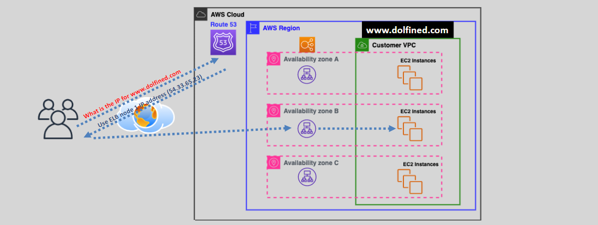
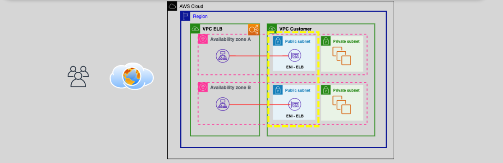

# **ELB Under the Hood 🔧**

Elastic Load Balancing (ELB) is one of the core components of AWS that ensures applications can scale and remain highly available by distributing traffic across multiple targets. Let’s dive deep into how ELB works under the hood, its internal components, and the communication process that ensures reliable and seamless traffic routing.

## **What is ELB? 🌍**

Elastic Load Balancer (ELB) is a fully managed service that automatically distributes incoming application traffic across multiple targets, such as Amazon EC2 instances, containers, and IP addresses. It supports dynamic workloads and enhances the fault tolerance of applications by balancing traffic across instances in multiple Availability Zones (AZs) within a region.

- **Types of ELBs:**
  - **Classic Load Balancer (CLB)**
  - **Application Load Balancer (ALB)**
  - **Network Load Balancer (NLB)**
  - **Gateway Load Balancer (GWLB)**

ELBs provide a central point to manage and monitor traffic and automatically scale based on demand.

## **How to Create an ELB 🛠️**

Creating an ELB involves several steps. Let’s walk through the process:

### **1. Choose Load Balancer Type**:

- **Application Load Balancer (ALB)**: Best for HTTP/HTTPS traffic.
- **Network Load Balancer (NLB)**: Best for TCP/UDP traffic.
- **Classic Load Balancer (CLB)**: For legacy applications.

### **2. Select Availability Zones (AZs)**:

- You need to choose at least **two Availability Zones** for high availability. AWS automatically distributes your ELB nodes across the selected AZs.

### **3. Assign Subnets and Security Groups**:

- **Internet-facing ELB**: Deployed in **public subnets** with public IP addresses to handle incoming external traffic.
- **Internal ELB**: Deployed in **private subnets** for internal VPC traffic routing.

### **4. Configure Listeners**:

- **Listeners** receive incoming traffic and forward it to target groups (e.g., HTTP, HTTPS for ALB or TCP for NLB).

### **5. Create Target Groups**:

- Target groups contain EC2 instances or services that the ELB will route traffic to. ELB performs **health checks** to ensure only healthy targets receive traffic.

### **6. DNS Resolution by Route 53**:

- AWS automatically generates a **DNS name** for the ELB (e.g., `my-elb-1234567890.us-west-2.elb.amazonaws.com`), which can be mapped to your domain via **Route 53**.

## **Components of ELB**

When you create an ELB, AWS automatically creates several underlying components to manage traffic distribution and health checks effectively.

### **1. ELB Nodes 🖥️**

- **ELB nodes** are essentially EC2 instances running load balancing software, managed by AWS. They are deployed across the **Availability Zones** you selected during the ELB setup.
- **ELB nodes** handle the traffic and forward it to the EC2 instances in the target group.
- Each **ELB** has its own **public IP** (from the **ENI** in your subnet).

### **2. Elastic Network Interface (ENI) 📇**

- **ENIs** are created within your **VPC** and **subnet** to act as a communication interface between the **ELB nodes** and your **EC2 instances** in the target group.
- The **ENI** provides the **public IP** for **internet-facing ELBs**, enabling external communication.

### **3. ELB DNS Name 🌐**

- AWS automatically creates a **DNS name** for your ELB (e.g., `my-elb-1234567890.us-west-2.elb.amazonaws.com`) configured in **Route 53**.
- **Route 53** resolves this DNS name to one of the **public IPs** of the **ELB nodes** distributed across the AZs.
- **Route 53** intelligently routes the traffic across the ELB nodes using **round-robin DNS** and health check statuses.

## **Step-by-Step Flow: From DNS to Target EC2 Instance 🪜**

Now, let’s go through the detailed flow of how a request moves from DNS resolution all the way to the target EC2 instance.

### **1. DNS Resolution 🧭**

- When a user sends a request (e.g., `www.yourapp.com`), **Route 53** resolves the DNS to the **DNS name of the ELB** (e.g., `my-elb-1234567890.us-west-2.elb.amazonaws.com`).
- **Route 53** resolves the DNS to multiple **public IPs** corresponding to each **ELB node** in the selected **AZs**.
- For example:
  - ELB DNS resolves to:
    - **ELB Node 1**: `24.2.4.6`
    - **ELB Node 2**: `24.2.4.7`
    - **ELB Node 3**: `24.2.4.8`
  - **Route 53** uses **DNS round-robin** to distribute traffic across these nodes.

### **2. Traffic Routing 🎯**

Once the DNS resolves to the ELB, here’s how the traffic is processed:

#### **1. ELB Node Creation:**

- **AWS automatically creates ELB nodes** when you set up the ELB. These nodes are essentially EC2 instances running the load balancing software, but you **cannot see or interact with them directly**.
- These **ELB nodes** are deployed in your **VPC** and across the **selected AZs**.

#### **2. Elastic Network Interface (ENI):**

- **AWS creates an ENI** in each AZ for the ELB. The **ENI** in **public subnets** is assigned a **public IP** to handle external traffic.
- The **ENI** acts as a bridge to expose the **public IP** for the **ELB node**, allowing it to handle requests from external sources.

#### **3. Communication with EC2 Instances:**

- When the traffic reaches the **public IP** of the **ENI**, it is routed to the **ELB node**.
- The **ELB node** then communicates with the **EC2 instances** or other targets in your **target group** using **private IPs** via a **private link** within the VPC.

## **How AWS Ensures ELB Reliability 💪**

AWS ensures high availability and fault tolerance for ELB with these strategies:

- **Redundancy Across AZs 🏘️**: ELB is designed for high availability. If an instance in one AZ becomes unhealthy, traffic is rerouted to healthy instances in other AZs (if Cross-Zone Load Balancing is enabled).
- **Health Checks 🩺**: ELB performs health checks to ensure traffic is only sent to healthy instances. If a target becomes unhealthy, it stops routing traffic to it.
- **Elastic IPs (EIPs)**: ELB nodes are assigned **Elastic IPs** in each AZ to allow for external communication.
- **Auto Scaling**: ELB integrates with **Auto Scaling** to adjust the number of instances based on traffic demand.

## **Conclusion 🎯**

Understanding how ELB works under the hood is key to optimizing your application’s availability, performance, and fault tolerance. AWS manages traffic distribution, load balancing, and failure recovery across multiple AZs, ensuring minimal downtime. By choosing the right ELB type (ALB, NLB, CLB), configuring health checks, and integrating with Auto Scaling, you can ensure that your application is scalable, reliable, and highly available.
