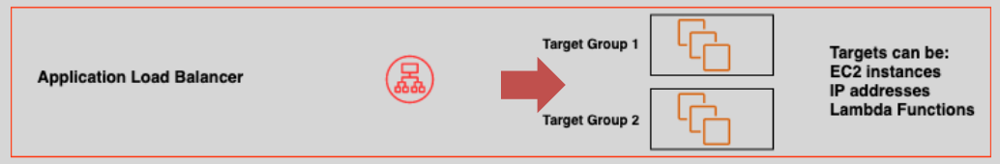
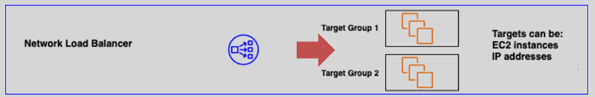

# **ELB Types and Their Key Differences 🔄**

Elastic Load Balancing (ELB) offers multiple types of load balancers, each suited for different use cases. Let's explore each type and highlight their key differences.

## **1. Classic Load Balancer (CLB) 🌐**

- Classic Load Balancer
- **Targets**: EC2 instances directly.
- **Protocol Support**: HTTP/HTTPS (Layer 7) and TCP (Layer 4) traffic.
- **Best Use Case**: Ideal for legacy applications that were built to work with traditional load balancers.
- **Features**:

  - Basic load balancing capabilities.
  - Limited routing features compared to newer ELB types.
  - No support for container-based workloads.
  - No native integration with AWS Auto Scaling or EC2 Container Service (ECS).

## **2. Application Load Balancer (ALB) 🔥**

- Application Load Balancer
- **Targets**: Target groups, which can consist of EC2 instances, containers, or IP addresses.
- **Protocol Support**: HTTP/HTTPS (Layer 7).
- **Best Use Case**: Ideal for modern web applications, microservices, and containerized environments.
- **Features**:

  - Provides **content-based routing**, meaning you can route requests based on URL paths or host names.
  - Supports WebSocket and HTTP/2 for improved performance.
  - Native support for containerized applications via ECS.
  - Enhanced routing capabilities such as path-based routing, host-based routing, and query string-based routing.

## **3. Network Load Balancer (NLB) ⚡**

- Networking Load Balancer 
- **Targets**: Target groups (e.g., EC2 instances, IP addresses, Lambda functions).
- **Protocol Support**: TCP/UDP (Layer 4).
- **Best Use Case**: Ideal for high-performance, low-latency applications and handling millions of requests per second.
- **Features**:

  - Extremely **low latency** and high throughput.
  - **Static IP support**, making it ideal for applications that require a fixed IP address.
  - Supports **TLS termination**, allowing for secure communication between clients and your application.
  - Ideal for applications that require high availability and need to handle volatile traffic patterns.

## **4. Gateway Load Balancer (GWLB) 🔒**

- Gateway Load Balancer
- **Targets**: Security appliances (e.g., firewalls, intrusion detection systems, etc.).
- **Protocol Support**: Generic traffic forwarding (Layer 3 and 4).
- **Best Use Case**: Ideal for deploying, managing, and scaling third-party security devices.
- **Features**:

  - Allows seamless integration of third-party security appliances for network traffic inspection.
  - Supports **automatic scaling** based on traffic requirements.
  - Commonly used to support **hybrid cloud architectures** and **secure network traffic**.

## **Key Differences at a Glance**

| Feature/ELB Type     | Classic Load Balancer (CLB) | Application Load Balancer (ALB)      | Network Load Balancer (NLB)    | Gateway Load Balancer (GWLB) |
| -------------------- | --------------------------- | ------------------------------------ | ------------------------------ | ---------------------------- |
| **Target Type**      | EC2 Instances               | Target Groups (EC2, Containers, IPs) | Target Groups (EC2, IPs)       | Security Appliances          |
| **Protocol Support** | HTTP/HTTPS, TCP             | HTTP/HTTPS (Layer 7)                 | TCP/UDP (Layer 4)              | Generic Traffic (Layer 3/4)  |
| **Best For**         | Legacy Applications         | Modern Web Apps, Microservices       | High Throughput, Low Latency   | Security Appliances          |
| **Routing Type**     | Basic Routing               | Content-based Routing                | Static IP, TLS Termination     | Traffic Inspection           |
| **Scaling Support**  | Limited                     | Supports ECS, Auto Scaling           | High Availability, Low Latency | Supports Third-Party Scaling |

## **Pricing 💰**

### **Free Tier:**

- **Application Load Balancer (ALB)**:
  - 750 hours per month.
  - 15 Load Balancer Capacity Units (LCUs) used.

### **Charges:**

- **Application Load Balancer (ALB)**:

  - **Per hour or partial hour** while it is running.
  - Charges for the number of **LCUs used** per hour.

- **Network Load Balancer (NLB)**:

  - **Per hour or partial hour** while it is running.
  - Charges for the number of **Network Load Balancer Capacity Units (NLCUs)** used.

- **Gateway Load Balancer (GWLB)**:
  - **Per hour or partial hour** while it is running.
  - Charges for the number of **GWLB Capacity Units** used.
