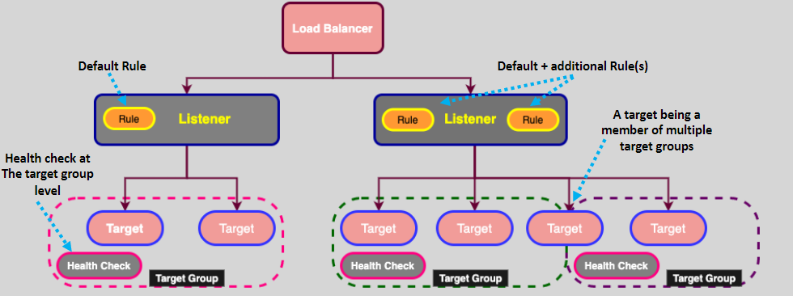
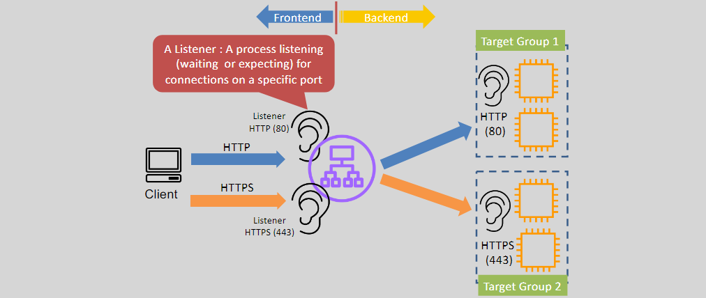

# **ELB Core Components 🧰**

Elastic Load Balancing (ELB) is a vital AWS service for distributing traffic to applications across multiple targets, ensuring high availability and fault tolerance. ELB uses several core components to manage the flow of traffic efficiently. Let's dive into each core component and explain how they work together to ensure smooth traffic routing.

## **1. Target Group 🎯**

A **target group** is a logical grouping of targets (e.g., EC2 instances, ECS services, or IP addresses) that the Elastic Load Balancer (ALB or NLB) routes traffic to.

### **Key Features**

- **Targets**: These are the resources that receive traffic from the load balancer (e.g., EC2 instances, ECS containers, or IP addresses).
- **Target Group Registration**: Targets can be registered multiple times within a target group, each time with a different port.
- **Regional Construct**: A target group is specific to a region and contains the targets that ELB routes traffic to.
- **Multiple Target Groups**: ALB and NLB can route traffic to multiple target groups depending on the rules set in the listener.

### **Example**

- **Target Group A**: EC2 instances 1 and 2 (port 80 for backend service).
- **Target Group B**: ECS Service (port 443 for secure content).

### **Usage**

The ELB can forward requests to different target groups based on path or host conditions, making it a flexible and scalable solution.

## **2. ELB Listeners 🎧**

An **ELB Listener** is the process that listens for incoming connection requests and forwards them to the appropriate target groups.

### **Key Features**

- **Multiple Listeners**: ELB can support multiple listeners on different ports (e.g., HTTP on port 80, HTTPS on port 443).
- **Port Configuration**: Listeners are configured to handle specific types of traffic and forward it to target groups.
- **Forwarding Traffic**: Once a request reaches the listener, it is forwarded to a target group, based on the listener's rules.

### **Example**

- **Listener 1**: Configured for HTTP on port 80, forwards requests to **Target Group A**.
- **Listener 2**: Configured for HTTPS on port 443, forwards requests to **Target Group B**.

### **Listener Workflow**

The listener evaluates incoming requests and forwards them to the appropriate target group based on predefined rules.

## **3. Health Checks 🩺**

Health checks monitor the health of the targets within a target group. ELB uses health checks to ensure traffic is only routed to healthy instances.

### **Key Features**

- **Monitoring Health**: ELB constantly checks the health of targets based on configurable health check parameters such as port and path.
- **Failover Mechanism**: If a target fails its health check, ELB stops routing traffic to it and directs traffic to healthy targets.
- **Customizable Thresholds**: You can define how many successful health checks are required for a target to be considered healthy.

### **Example**

- **EC2 Instance A**: Passes health checks (200 OK).
- **EC2 Instance B**: Fails health checks (500 error).
- Traffic is routed only to **EC2 Instance A**.

### **Usage**

Health checks allow ELB to provide fault tolerance by ensuring traffic is directed only to healthy instances. If an instance becomes unhealthy, the load balancer reroutes traffic to other healthy targets.

## **4. Listener Rules 🔄**

**Listener rules** define how traffic should be routed from the frontend listener to the backend target groups based on conditions such as URL paths, hostnames, etc.

### **Key Features**

- **Conditions**: Listener rules can be based on:
  - **Host condition**: For example, route traffic based on a domain name.
  - **Path condition**: Route traffic based on the URL path (e.g., `/api`, `/images`).
- **Actions**: A rule can have multiple actions such as forwarding traffic to a target group, returning a fixed response, or redirecting the user.
- **Prioritization**: Listener rules are evaluated in order of priority. The first matching rule is applied, and traffic is routed accordingly.
- **Default Rule**: If no rule matches, the default action is taken.

### **Example**

- **Rule 1**: If the URL path is `/admin`, forward traffic to **Target Group A** (secure backend).
- **Rule 2**: If the URL path is `/images`, forward traffic to **Target Group B** (static content).

### **Usage**

Listener rules allow fine-grained control over how traffic is routed. They are ideal for routing based on URL paths, hostnames, and other request conditions.

## **5. Actions 🔄**

**Actions** define what happens when a listener rule matches a request. Each rule must include at least one action.

### **Key Features**

- **Forwarding**: The most common action, which forwards traffic to a target group.
- **Fixed Response**: Returns a fixed response, such as an HTTP 404 error or a custom message.
- **Redirection**: Redirects traffic to another URL (useful for HTTPS redirection).
- **Advanced Actions**: ALB listeners support advanced actions like **OIDC Authentication** and **Cognito Authentication**.
- **Default Action**: If no other rule matches, the default action is applied.

### **Example**

- **Rule 1**: If the path is `/admin`, forward traffic to **Target Group A**.
- **Rule 2**: If the path is `/error`, return a fixed response with a 404 error.

### **Usage**

Actions define how traffic is processed when specific conditions are met. This includes routing, returning error pages, or redirecting to other URLs.

## **ELB Core Workflow 🌐**

Understanding the flow of traffic is key to understanding how ELB works. Here's how the components work together:

### **Step-by-Step Flow**

1. **DNS Resolution**: Route 53 resolves the DNS name to the ELB's DNS name (e.g., `my-elb-1234567890.elb.amazonaws.com`).
2. **Listener Check**: The listener checks the incoming request against its rules to determine the target group to route traffic to.
3. **Health Check**: ELB ensures that only healthy targets receive traffic. If a target fails the health check, traffic is rerouted.
4. **Traffic Forwarding**: The request is forwarded to the selected target group, and the backend EC2 instances or services process the request.

## **Conclusion 🎯**

ELB core components such as **Target Groups**, **Listeners**, **Health Checks**, **Listener Rules**, and **Actions** work together to intelligently route traffic based on real-time conditions. By understanding how each component functions, you can configure your ELB setup to ensure high availability, fault tolerance, and scalability for your applications.

With this knowledge, you can confidently design and optimize your applications using AWS ELB to meet your specific needs.
