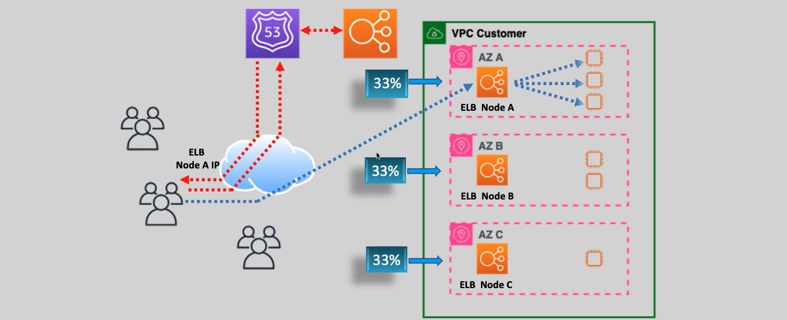
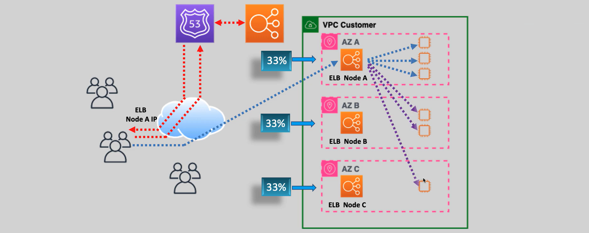

# **Cross-Zone Load Balancing 🌍**

Cross-zone load balancing ensures that traffic is distributed evenly across multiple availability zones (AZs) within a region, optimizing resource utilization and improving the overall performance and reliability of your application. Let's explore how cross-zone load balancing works for different types of AWS load balancers and how it can help in traffic distribution.

## **What is Cross-Zone Load Balancing? 🤔**

**Cross-zone load balancing** is a feature that determines how incoming traffic is distributed across targets in multiple availability zones. This ensures that traffic is evenly distributed to all healthy targets, regardless of which availability zone they are located in.

- **ALB** (Application Load Balancer): Cross-zone load balancing is **always enabled**.
- **NLB** (Network Load Balancer): Cross-zone load balancing is **disabled by default** but can be enabled manually. When enabled, **regional data transfer charges** apply for cross-zone traffic.

## **Why Use Cross-Zone Load Balancing? ⚖️**

Without cross-zone load balancing, traffic may be unevenly distributed across availability zones. This can lead to scenarios where one availability zone might experience high traffic load while others are underutilized.

### **Benefits of Enabling Cross-Zone Load Balancing:**

- **Even Traffic Distribution**: Ensures traffic is distributed across all healthy targets in all availability zones.
- **Optimal Utilization**: Helps utilize resources in all availability zones, preventing any zone from becoming overwhelmed.
- **Improved Availability**: Reduces the risk of overloading any single zone, improving application availability and fault tolerance.
- **No DNS Caching Issues**: Prevents issues caused by clients caching DNS information, which could otherwise direct traffic unevenly to one zone.

## **How Does Cross-Zone Load Balancing Work? 🌐**

### **1. Without Cross-Zone Load Balancing 🚫**

- **Traffic Distribution**: Without cross-zone load balancing, each availability zone handles traffic only for targets within its own zone.
- **Unbalanced Traffic**: If a client caches DNS information, traffic may get directed to only one zone, leading to unbalanced distribution and resource inefficiency.

### **2. With Cross-Zone Load Balancing ✅**

- **Even Distribution**: When enabled, the load balancer distributes incoming traffic evenly across all healthy targets, regardless of the availability zone.
- **Scalable Traffic Routing**: This guarantees that all healthy targets in each zone receive an equal share of traffic, leading to more efficient resource usage and improved load balancing.

## **Deregistration Delay (Connection Draining) ⏳**

When a backend instance or a target is deregistered from a target group or ELB, **deregistration delay** gives in-flight sessions time to finish before the ELB stops sending traffic to the instance.

### **How it Works:**

- **Deregistration Delay**: After deregistration, the ELB waits for a default delay (300 seconds) before completely removing the target from the load balancing rotation. During this delay, the ELB allows existing sessions to complete.
- **Prevents Service Interruptions**: This feature ensures that there is no disruption to ongoing sessions or traffic until the target has fully stopped handling requests.

### **Example**:

- If a server is being decommissioned, the deregistration delay ensures that active requests continue to be processed, even as the instance is no longer actively receiving new traffic.

## **When to Enable Cross-Zone Load Balancing 🌍**

Cross-zone load balancing is particularly useful when:

- You have **multiple availability zones** and want to ensure traffic is evenly distributed to all targets.
- You want to **avoid overloading** any single availability zone while ensuring that all targets across multiple zones are equally utilized.
- You are running **high-traffic applications** where efficient traffic distribution is crucial for maintaining application performance and uptime.

### **Example Scenario:**

If your web application is deployed across three availability zones (AZ-A, AZ-B, AZ-C), enabling cross-zone load balancing ensures that the traffic is evenly distributed across all instances, even if some clients cache the DNS or some zones are slower than others.

## **Pricing Considerations 💸**

Enabling **cross-zone load balancing** can incur additional costs depending on the type of ELB:
