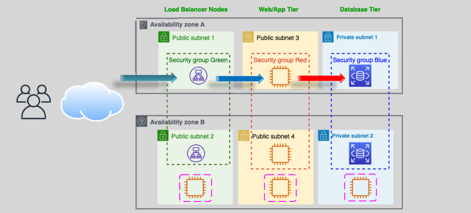

# **ELB Security Groups 🔒**

Elastic Load Balancing (ELB) plays a crucial role in distributing incoming traffic to multiple targets (e.g., EC2 instances, containers, IP addresses) for high availability and fault tolerance. The security of these components is essential to ensure only valid traffic is allowed and routed correctly. ELB uses **Security Groups** and **Network Access Control Lists (NACLs)** for traffic control. In this section, we will cover the security configurations for **ALB (Application Load Balancer)**, **NLB (Network Load Balancer)**, and their interaction with target instances.

## **1. ALB Security Group Configuration 🔐**

**Application Load Balancer (ALB)** is used for HTTP/HTTPS traffic, and its security group configuration is crucial for controlling access.

### **ALB**

The ALB Security Group controls the inbound and outbound traffic to the ALB itself. Since Security Groups are **stateful**, responses to allowed inbound traffic are automatically permitted outbound, and vice versa. Therefore, explicit outbound rules for return traffic are generally unnecessary.

#### **SG: Inbound Rules to ALB:**

| **Rule**     | **Protocol** | **Port Range** | **Source**         | **Description**                    |
| ------------ | ------------ | -------------- | ------------------ | ---------------------------------- |
| HTTP Access  | TCP          | 80             | 0.0.0.0/0          | Allow incoming HTTP traffic        |
| HTTPS Access | TCP          | 443            | 0.0.0.0/0          | Allow incoming HTTPS traffic       |
| Health Check | TCP          | 8080           | ALB Security Group | Allow ALB to perform health checks |

_Note:_ Replace `0.0.0.0/0` with more restrictive IP ranges as per your security requirements.

#### **SG: Outbound Rules from ALB:**

Since Security Groups are stateful, there's no need to define outbound rules for traffic responses to inbound requests. However, you do need outbound rules for initiating new connections, such as sending traffic to backend instances.

| **Rule**                | **Protocol** | **Port Range** | **Destination** | **Description**                                              |
| ----------------------- | ------------ | -------------- | --------------- | ------------------------------------------------------------ |
| HTTP to Backend         | TCP          | 80             | Backend SG      | Allow ALB to send HTTP traffic to backend instances          |
| HTTPS to Backend        | TCP          | 443            | Backend SG      | Allow ALB to send HTTPS traffic to backend instances         |
| Health Check to Backend | TCP          | 8080           | Backend SG      | Allow ALB to send health check requests to backend instances |

### **Backend**

The backend instances' security group controls the traffic received from the ALB and the traffic sent back. Due to the stateful nature of Security Groups, explicit outbound rules for responses to inbound traffic from the ALB are unnecessary.

#### **SG: Inbound Rules to Backend:**

| **Rule**              | **Protocol** | **Port Range** | **Source**         | **Description**                       |
| --------------------- | ------------ | -------------- | ------------------ | ------------------------------------- |
| HTTP from ALB         | TCP          | 80             | ALB Security Group | Allow incoming HTTP traffic from ALB  |
| HTTPS from ALB        | TCP          | 443            | ALB Security Group | Allow incoming HTTPS traffic from ALB |
| Health Check from ALB | TCP          | 8080           | ALB Security Group | Allow health check requests from ALB  |

#### **SG: Outbound Rules from Backend:**

Explicit outbound rules are generally not required for responses to inbound traffic due to the stateful nature of Security Groups. However, if backend instances need to initiate new connections, appropriate outbound rules should be defined.

| **Rule**   | **Protocol** | **Port Range** | **Destination** | **Description**                           |
| ---------- | ------------ | -------------- | --------------- | ----------------------------------------- |
| (Optional) | (As needed)  | (As needed)    | (As needed)     | Initiate outbound connections if required |

## **2. NLB Security Group Configuration 🔐**

**Network Load Balancer (NLB)** is designed for high-performance, low-latency traffic, and typically handles TCP traffic. Unlike ALB, NLBs do not use Security Groups; instead, they rely on **Network ACLs (NACLs)** for controlling traffic. NACLs are **stateless**, meaning that both inbound and outbound rules must be explicitly defined to allow bidirectional traffic.

### **NLB**

Since NLB operates at the network layer, security is managed using NACLs rather than Security Groups.

#### **NACL: Inbound Rules to NLB:**

| **Rule Number** | **Type**     | **Protocol** | **Port Range** | **Source**   | **Allow/Deny** | **Description**              |
| --------------- | ------------ | ------------ | -------------- | ------------ | -------------- | ---------------------------- |
| 100             | HTTP         | TCP          | 80             | 0.0.0.0/0    | ALLOW          | Allow incoming HTTP traffic  |
| 110             | HTTPS        | TCP          | 443            | 0.0.0.0/0    | ALLOW          | Allow incoming HTTPS traffic |
| 120             | Health Check | TCP          | 8080           | NLB IP Range | ALLOW          | Allow health check traffic   |
| _..._           | _..._        | _..._        | _..._          | _..._        | _..._          | _..._                        |

_Note:_ Adjust rule numbers and IP ranges as needed.

#### **NACL: Outbound Rules from NLB:**

Because NACLs are stateless, you must explicitly allow outbound traffic that corresponds to inbound requests.

| **Rule Number** | **Type**     | **Protocol** | **Port Range** | **Destination** | **Allow/Deny** | **Description**                                              |
| --------------- | ------------ | ------------ | -------------- | --------------- | -------------- | ------------------------------------------------------------ |
| 100             | HTTP         | TCP          | 80             | Backend Subnet  | ALLOW          | Allow NLB to send HTTP traffic to backend instances          |
| 110             | HTTPS        | TCP          | 443            | Backend Subnet  | ALLOW          | Allow NLB to send HTTPS traffic to backend instances         |
| 120             | Health Check | TCP          | 8080           | Backend Subnet  | ALLOW          | Allow NLB to send health check requests to backend instances |
| _..._           | _..._        | _..._        | _..._          | _..._           | _..._          | _..._                                                        |

### **Backend**

Backend instances behind an NLB are secured using NACLs to control traffic.

#### **NACL: Inbound Rules to Backend:**

| **Rule Number** | **Type**     | **Protocol** | **Port Range** | **Source** | **Allow/Deny** | **Description**                       |
| --------------- | ------------ | ------------ | -------------- | ---------- | -------------- | ------------------------------------- |
| 100             | HTTP         | TCP          | 80             | NLB Subnet | ALLOW          | Allow incoming HTTP traffic from NLB  |
| 110             | HTTPS        | TCP          | 443            | NLB Subnet | ALLOW          | Allow incoming HTTPS traffic from NLB |
| 120             | Health Check | TCP          | 8080           | NLB Subnet | ALLOW          | Allow health check requests from NLB  |
| _..._           | _..._        | _..._        | _..._          | _..._      | _..._          | _..._                                 |

#### **NACL: Outbound Rules from Backend:**

Explicit outbound rules are required to allow responses back to the NLB since NACLs are stateless.

| **Rule Number** | **Type**     | **Protocol** | **Port Range** | **Destination** | **Allow/Deny** | **Description**                                     |
| --------------- | ------------ | ------------ | -------------- | --------------- | -------------- | --------------------------------------------------- |
| 100             | HTTP         | TCP          | 80             | NLB Subnet      | ALLOW          | Allow backend instances to respond via HTTP         |
| 110             | HTTPS        | TCP          | 443            | NLB Subnet      | ALLOW          | Allow backend instances to respond via HTTPS        |
| 120             | Health Check | TCP          | 8080           | NLB Subnet      | ALLOW          | Allow backend instances to respond to health checks |
| _..._           | _..._        | _..._        | _..._          | _..._           | _..._          | _..._                                               |

## **3. Example Architecture with ALB and NLB Integration ⚙️**

Let’s consider a typical **three-tier architecture** with **Web/App**, **Database**, and **Load Balancer** tiers.

### **Design:**

1. **Web/App Tier** (Private Subnet): EC2 instances running your web application.
2. **Database Tier** (Private Subnet): EC2 instances hosting the database (e.g., MySQL).
3. **Load Balancer** (Public Subnet): ALB handles web traffic, and NLB handles database traffic.

### **Solution:**

- **ALB Configuration:**

  - **Inbound:** Allows HTTP (80) and HTTPS (443) traffic from the internet.
  - **Outbound:** Routes traffic to the Web/App tier on ports 80 and 443, and performs health checks on port 8080.

- **NLB Configuration:**

  - **Inbound:** Accepts TCP traffic on ports 80 and 443 for database access.
  - **Outbound:** Routes traffic to the Database tier on the specified ports and performs health checks on port 8080.

- **Security Groups & NACLs:**
  - **ALB Security Group:** Restricts incoming traffic to necessary ports and allows outbound traffic only to the Web/App tier.
  - **NLB NACLs:** Controls network-level access, ensuring only permitted traffic flows between the NLB and Database tier.
  - **Backend Security Groups:** Ensure that backend instances only accept traffic from the respective load balancer and restrict outbound traffic as needed.

This setup ensures that your application is scalable, highly available, and secure, with clear traffic flow and strict access controls between each tier.

## **Conclusion 🎯**

**ELB Security Groups** and **NACLs** are essential components of securing your AWS infrastructure, ensuring that traffic flows only between allowed services. By configuring **ALB** and **NLB** properly, you ensure that your web and database tiers remain secure, scalable, and fault-tolerant.

- **ALB**: Best for handling HTTP/HTTPS traffic, with detailed control over application-level security.
- **NLB**: Best for high-performance, low-latency traffic, with network-level security using **NACLs**.
