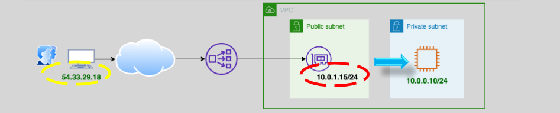
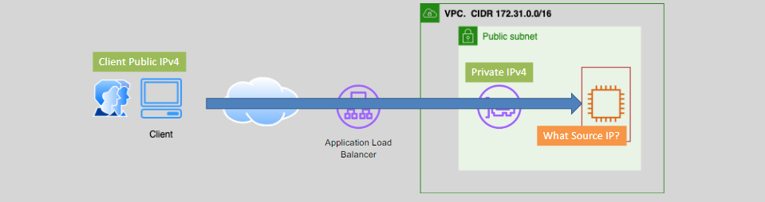

# **ELB Client IP Management 🌐📍**

Understanding how Elastic Load Balancers (ELBs) handle client IP addresses is essential for maintaining accurate client information, enabling logging, security measures, and personalized user experiences. This section outlines how both **Application Load Balancers (ALB)** and **Network Load Balancers (NLB)** manage client IP addresses and provides guidance on best practices and use cases.

## **1. Understanding ELB Client IP 📜**

When a client sends a request to your application through an ELB, the load balancer forwards the request to one of the backend instances. Managing the client’s IP address accurately ensures that backend services can log, authenticate, and apply security rules based on the true origin of the request.

### **Key Points:**

- **Source IP Preservation:** ELB nodes use their assigned IPv4 addresses (Elastic Network Interface [ENI] addresses from the customer VPC subnets) as the source IP address in the packets they forward to backend instances.
- **Client IP Retrieval:** Both ALB and NLB provide mechanisms to retrieve the original client IP, albeit in different ways suited to their respective layers of operation.

## **2. Handling Client IP in Application Load Balancer (ALB) 🖥️🔍**

ALBs operate at Layer 7 (Application Layer) and inherently support HTTP headers to pass client information to backend instances.

### **Mechanism: X-Forwarded-For Header**

- **Default Behavior:** ALBs automatically add the `X-Forwarded-For` HTTP header to incoming requests, which includes the client’s original IP address.
- **Usage:**
  - **Backend Processing:** Backend applications can parse the `X-Forwarded-For` header to retrieve the client’s IP.
  - **Logging and Security:** Enables accurate logging of client IPs and application of IP-based security rules.

### **Use Cases:**

- **Web Applications:** Personalized content delivery based on client location or IP.
- **Security Auditing:** Tracking and monitoring client access for compliance and security purposes.

## **3. Handling Client IP in Network Load Balancer (NLB) ⚙️🔍**

NLBs operate at Layer 4 (Transport Layer) and offer different methods for preserving and accessing client IP information.

### **Mechanisms:**

#### **a. Native Client IP Preservation**

- **Automatic Preservation:** NLBs automatically preserve the client’s IP address in the packets forwarded to backend instances.
- **Configuration:**
  - **Default Setting:** Client IP preservation is enabled by default and works regardless of how targets are registered.
  - **Optional Disabling:** This feature can be disabled through target group settings if needed.

#### **b. Proxy Protocol (Layer 4)**

- **Definition:** An extension to the TCP protocol that forwards client connection information, including the original IP address, within the payload.
- **Usage:**
  - **Enable Proxy Protocol:** Configure NLB to use Proxy Protocol to pass client IP information to backend instances.
  - **Backend Support:** Ensure that backend applications or services are configured to parse the Proxy Protocol headers to extract client IPs.

### **Use Cases:**

- **High-Performance Applications:** Scenarios requiring minimal latency and direct access to client IPs for processing.
- **Network Security:** Implementing IP-based access controls and threat detection at the backend.

## **4. Best Practices for Managing Client IP 📈✅**

### **For ALB:**

- **Enable and Utilize `X-Forwarded-For`:** Ensure your backend applications are configured to read and utilize the `X-Forwarded-For` header for accurate client IP information.
- **Secure Headers:** Validate and sanitize `X-Forwarded-For` headers to prevent header spoofing and ensure data integrity.

### **For NLB:**

- **Leverage Native IP Preservation:** Utilize the automatic client IP preservation feature for straightforward access to client IPs without additional configuration.
- **Implement Proxy Protocol When Needed:** Use Proxy Protocol for applications that require detailed client connection information beyond just the IP address.

## **5. Conclusion 🎯**

Effective management of client IP addresses in ELBs is vital for maintaining accurate client data, enhancing security, and optimizing application performance.

- **ALB:** Utilize the `X-Forwarded-For` header for easy access to client IPs in application-layer operations.
- **NLB:** Take advantage of native client IP preservation or implement Proxy Protocol for transport-layer scenarios requiring detailed client information.
