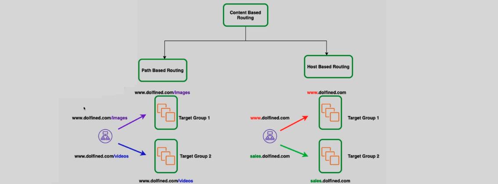

# **Application Load Balancer (ALB) Overview 🔄**

An **Application Load Balancer (ALB)** is a highly scalable load balancing solution designed for routing HTTP/HTTPS traffic to backend services. It operates at the **Application Layer** (Layer 7) and supports advanced routing features, making it ideal for web applications, microservices, and containerized environments.

## **Key Features of ALB ⚡**

- **Supported Protocols**:

  - **HTTP, HTTPS, HTTP/2**: Optimized for web traffic with support for multiplexing and reduced latency.
  - **gRPC**: Efficient for microservices communication, allowing faster APIs compared to traditional REST.
  - **WebSockets**: Enables full-duplex, bidirectional communication over a single TCP connection.

- **Web Application Firewall (WAF)**:

  - **Integrated WAF** for enhanced security, protecting web applications from common attacks like SQL injection and XSS.

- **IPv4 and DualStack Support**:

  - Supports both **IPv4** and **IPv6** (for Internet-facing ALB), allowing global scalability.

- **Routing Algorithms**:

  - **Round-robin** (default) and **Least Outstanding Requests** for optimal traffic distribution.

- **Delete Protection**:
  - **Prevents accidental deletion** of the ALB, ensuring high availability.

## **Advanced Routing Features 📍**

ALB enables sophisticated routing based on several conditions to direct traffic efficiently to backend services:

1. **Host-based Routing**:

   - Routes traffic based on **subdomains**.
   - Example: Route traffic from `sales.dolfined.com` to one target group and `www.dolfined.com` to another.

2. **Path-based Routing**:

   - Routes traffic based on specific URL paths.
   - Example: Traffic to `www.dolfined.com/images` goes to an image-serving target group.

3. **HTTP Header-based Routing**:

   - Routes traffic based on **HTTP headers**.
   - Example: Routes based on the `User-Agent` header to determine the client device type (mobile or desktop).

4. **HTTP Request Method**:

   - Routes traffic based on **HTTP methods** such as GET, POST, or HEAD.
   - Example: Different backend services can handle `GET` and `POST` requests differently.

5. **Query String Routing**:

   - Routes based on **query strings** in the URL.
   - Example: Traffic with `key=value` in the query string can be directed to either a production or development target group.

6. **Source IP Address Routing**:
   - Routes based on the **source IP address** of the request.
   - Example: Routes traffic from specific geographic locations or IP ranges to specialized backend services.

## **Traffic Routing Based on URL Headers 🌐**

ALB supports routing traffic based on:

- **HTTP Path Header**: Routes traffic based on the URL path (e.g., `/images`).
- **HTTP Hostname Header**: Routes traffic based on the domain name (e.g., `www.dolfined.com`).

This allows fine-grained control over how traffic is distributed across your application.

## **Conclusion 🎯**

**ALB** provides flexible, scalable, and secure traffic management, making it ideal for handling dynamic web application traffic. With its advanced routing capabilities like host-based, path-based, and header-based routing, it supports complex application architectures, including microservices and containerized environments. The integration of **WAF** and **Delete Protection** further enhances security and reliability.
