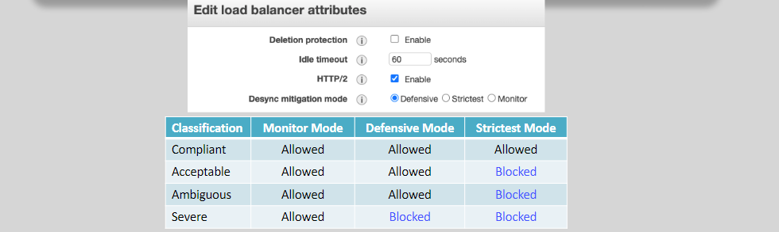

# **ALB Advanced Features 🚀**

An **Application Load Balancer (ALB)** offers several advanced features that help you optimize application traffic, enhance security, and ensure high availability. These features give you more control over how requests are handled and routed to your backend services. Let's explore these features in detail to understand how they work and how to use them effectively.

## **1. Redirect Action 🔄**

**Redirect actions** allow you to redirect incoming traffic from one URL to another, which can be useful for enforcing HTTPS, changing domain names, or modifying URL paths.

### **Key Points**:

- ALB supports both **temporary redirects** (HTTP 302) and **permanent redirects** (HTTP 301).
- You can change various parts of the URL:
  - **Protocol**: Switch from HTTP to HTTPS.
  - **Hostname**: Change the domain (e.g., from `aws.com` to `dolfined.com`).
  - **Port**: Change the port number (e.g., from 443 to 40443).
  - **Path**: Redirect from one path to another (e.g., `/images` to `/objects/photos`).

### **Example**:

Redirect all HTTP traffic to HTTPS:

```json
[
  {
    "Type": "redirect",
    "RedirectConfig": {
      "Protocol": "HTTPS",
      "Port": "443",
      "Host": "#{host}",
      "Path": "/#{path}",
      "Query": "#{query}",
      "StatusCode": "HTTP_301"
    }
  }
]
```

This redirect rule ensures that any request to HTTP will be automatically redirected to HTTPS with the same path and query string.

## **2. Authenticating Users (HTTPS Requests) 🔐**

ALB can manage user authentication for your backend applications, ensuring secure login processes.


### **Supported Authentication Methods**:

- **OIDC (OpenID Connect)**: ALB can authenticate users using identity providers that support OIDC.
- **Social IdPs**: Use **Amazon Cognito** User Pools to authenticate users from social identity providers such as **Amazon, Facebook, and Google**.
- **SAML, LDAP, MS AD**: Authenticate users using enterprise identity providers through **Amazon Cognito**.

This feature simplifies authentication by integrating with **Cognito** and reduces the need for custom authentication solutions.

## **3. Slow Start Mode 🐢**

**Slow Start Mode** allows you to gradually increase the traffic load to a target after it becomes healthy. This prevents new targets from being overwhelmed immediately upon becoming healthy.

### **Key Points**:

- **Default**: The slow start duration is 0 seconds (meaning no gradual ramp-up).
- **Maximum**: The slow start duration can be set to **900 seconds** (15 minutes).
- **Target Group Level Configuration**: This feature is configurable at the target group level.

### **Why Use Slow Start?**:

When new targets are registered or re-registered, they may not be able to handle the full load of requests immediately. Slow Start Mode helps prevent overloading the target by gradually ramping up the request rate, allowing it time to warm up.

## **4. Desynchronization (Desync) and HTTP Smuggling Attacks 🚨**

**Desync attacks** occur when there is a mismatch in how different systems (e.g., ALB and backend services) interpret parts of an HTTP request, leading to security vulnerabilities. These attacks can allow attackers to manipulate HTTP sessions and bypass application-level security.


### **How Desync Attacks Happen**:

- Desync attacks are typically caused by differences in how proxies/load balancers and backend targets interpret **HTTP headers** like `Content-Length` and `Transfer-Encoding`.
- This misinterpretation can lead to tampered requests reaching the backend, which can bypass security checks.

### **Desync Mitigation Mode 🛡️**:

To mitigate these attacks, ALB has a **Desync Mitigation Mode** that ensures compliance with HTTP standards and defends against such attacks.

- **Modes**:
  - **Defensive**: ALB will try to mitigate desync attacks based on RFC7230 compliance.
  - **Strictest**: The strictest mode, which applies the most aggressive protections.
  - **Monitor**: A less strict mode, used for monitoring and logging potential desync threats without enforcing strict actions.
    

### **Why It's Important**:

Desync attacks are serious threats to your applications. By enabling Desync Mitigation Mode, you ensure that only compliant HTTP requests are forwarded to your backend, minimizing the risk of attack.

## **Conclusion 🎯**

ALB offers several **advanced features** that help optimize your application’s traffic routing, security, and performance. These features are especially useful for applications that require **fine-grained control** over routing decisions and **secure user authentication**. By leveraging **Redirect Actions**, **Slow Start Mode**, and **Desync Mitigation**, you can ensure that your application is resilient, secure, and operates smoothly at scale.

- **Redirect Actions**: Ideal for redirecting traffic based on specific URL rules.
- **Authentication**: Simplifies the authentication process with **Cognito** and third-party IdPs.
- **Slow Start Mode**: Gradually ramps up traffic to new targets to prevent overload.
- **Desync Mitigation**: Protects your application from HTTP desynchronization and smuggling attacks.
