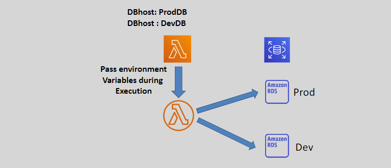

# ✨ **AWS Lambda Additional Features: Enhancing Functionality and Management**

AWS Lambda offers a suite of additional features that extend its capabilities, making it easier to manage, secure, and optimize your serverless applications. This guide provides a concise overview of these features, including Function URLs, Dead Letter Queues (DLQs), Environment Variables, Monitoring tools, and other advanced functionalities.

---

## 🔗 **1. Function URL**

A **Function URL** is a dedicated HTTP(S) endpoint for your Lambda function, allowing direct invocation without additional services.

### 📌 **Key Points:**

- **Endpoint Format:**
  ```plaintext
  https://<url-id>.lambda-url.<region>.on.aws
  ```
- **Dual Stack Support:**
  - Supports both **IPv4** and **IPv6**.
- **Authentication Options:**
  - **AWS_IAM:** Restricts access to authenticated AWS identities.
  - **NONE:** Makes the function public, allowing unauthenticated access.
- **Invocation Methods:**
  - Can be invoked using web browsers, `curl`, Postman, or any HTTP client.
- **Access Control:**
  - Assign **resource-based policies** for fine-grained access management.
- **CORS Support:**
  - Supports **Cross-Origin Resource Sharing (CORS)** for web applications.

---

## 📮 **2. Dead Letter Queues (DLQs)**

**Dead Letter Queues** capture failed asynchronous invocations, aiding in logging and troubleshooting.


### 📌 **Key Points:**

- **Supported DLQ Targets:**
  - **Amazon SQS:** Queues failed events for later processing.
  - **Amazon SNS:** Topics to notify stakeholders of failures.
  - **Amazon EventBridge:** Events for further automated handling.
- **Failure Scenarios:**
  - Invocations that **timeout** or **do not execute successfully**.
- **Event Handling:**
  - Lambda sends the **content of the failed event** to the configured DLQ.
- **Benefits:**
  - **Logging:** Keep records of failed events.
  - **Troubleshooting:** Analyze failed invocations to identify issues.

---

## 🌱 **3. Environment Variables**

**Environment Variables** allow you to pass configuration data to your Lambda functions without modifying the code.



### 📌 **Key Points:**

- **Structure:**
  - Stored as **key-value pairs** in the function's configuration.
- **Usage:**
  - Store **configuration information** and **environment-specific settings**.
  - Adjust function behavior **without updating the codebase**.
- **Security:**
  - Variables are **encrypted at rest** by AWS Lambda, ensuring secure storage.
- **Flexibility:**
  - Easily switch configurations between **development**, **staging**, and **production** environments.

---

## 📊 **4. Monitoring**

AWS Lambda integrates with various monitoring tools to help you track performance, debug issues, and optimize functions.

### 📌 **Key Monitoring Tools:**

- **Amazon CloudWatch Logs:**
  - Automatically captures logs generated by your Lambda functions.
- **AWS CloudTrail:**
  - Records API calls and events related to Lambda for auditing purposes.
- **AWS X-Ray:**
  - **Performance Optimization:**
    - Detects, analyzes, and optimizes Lambda function performance.
  - **Service Graph:**
    - Collects metadata from Lambda and other components to generate detailed service maps.

---

## 🚀 **5. Other Advanced Features**

AWS Lambda offers several additional features to enhance functionality and integration with other services.

### 📌 **Key Features:**

- **Container Images:**
  - **Support:** Define functions as container images, enabling use of languages or dependencies not natively supported by Lambda.
- **Code Signing:**
  - **Security:** Ensure the integrity of your function code by verifying it hasn't been altered from what developers created.
- **Lambda Extensions:**
  - **Monitoring:** Integrate third-party monitoring and management tools directly into the Lambda execution environment.
- **AWS Database Proxy:**
  - **Database Access:** Securely connect Lambda functions to databases using AWS Database Proxy, enhancing scalability and security.
- **Amazon EFS (Elastic File System):**
  - **File System Access:** Mount an EFS file system to a local directory within the Lambda function, enabling access to persistent storage.

---

## 🏁 **Conclusion**

AWS Lambda's additional features significantly enhance the flexibility, security, and manageability of your serverless applications. From dedicated Function URLs and robust Dead Letter Queues to versatile Environment Variables and comprehensive Monitoring tools, these features empower you to build resilient and efficient applications tailored to your specific needs. Leveraging these advanced functionalities ensures that your Lambda functions operate smoothly, securely, and optimally within your AWS environment.
