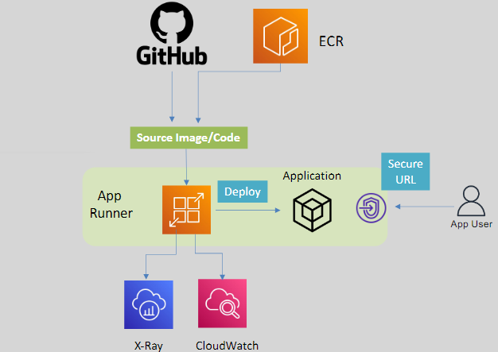
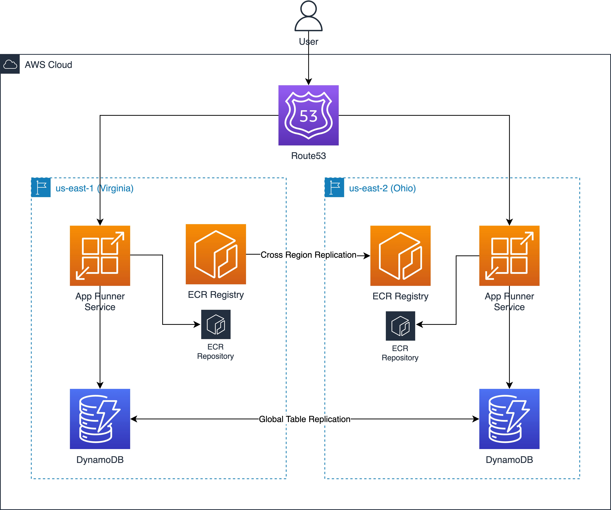

# 🚤 AWS App Runner

AWS App Runner is a fully managed service designed to help developers and businesses quickly build, deploy, and scale web applications and APIs directly from source code or container images. It abstracts the complexities of infrastructure management, enabling focus on application development.

---

    

---

## 🌟 Key Features

### 🛠️ Fully Managed Service

- Handles provisioning, scaling, and managing underlying infrastructure automatically.
- No prior container or infrastructure expertise required.

### ⚙️ Integration with Source Code and Images

- Deploy applications directly from **GitHub repositories** or **container registries** (e.g., Amazon ECR).

### 📊 Built-In Scaling

- Automatically scales applications based on traffic demands.
- Supports both horizontal and vertical scaling.

### 🔒 Security

- Supports **end-to-end encryption** with HTTPS by default.
- Seamless integration with **AWS IAM** for access control.

---

## 🎯 Use Cases

1. **Web Application Deployment:**

   - Deploy modern web applications without managing underlying infrastructure.

2. **API Hosting:**

   - Host RESTful APIs quickly and securely.

3. **Rapid Prototyping:**

   - Quickly deploy prototypes to test ideas without infrastructure overhead.

4. **Microservices:**
   - Ideal for small to medium-sized microservices that don’t require complex orchestration.

---

## 🔄 How AWS App Runner Works

1. **Source Code or Container:**
   - Connect your repository (GitHub) or specify an image from Amazon ECR.
2. **Deployment Pipeline:**
   - App Runner automatically builds and deploys the application.
3. **Scaling and Traffic Management:**
   - The service scales the application based on traffic without manual intervention.

---

## ⚖️ AWS App Runner vs ECS Fargate

| **Feature**           | **AWS App Runner**                           | **ECS Fargate**                              |
| --------------------- | -------------------------------------------- | -------------------------------------------- |
| **Purpose**           | Simplified web app deployment                | General-purpose container orchestration      |
| **Ease of Use**       | Abstracts all infrastructure management      | Requires knowledge of ECS tasks and services |
| **Deployment Target** | Directly from source code or container image | Containerized applications only              |
| **Scaling**           | Fully automatic scaling                      | Requires configuring scaling policies        |
| **Use Case**          | Web apps and APIs                            | Any containerized workload                   |
| **Flexibility**       | Limited control over infrastructure          | Full control over underlying infrastructure  |

---

## ⚖️ AWS App Runner vs Elastic Beanstalk

| **Feature**           | **AWS App Runner**                          | **Elastic Beanstalk**                                     |
| --------------------- | ------------------------------------------- | --------------------------------------------------------- |
| **Purpose**           | Simplified containerized web app deployment | Managed PaaS for web apps and services                    |
| **Ease of Use**       | Simple, focuses on containers               | Simple, supports code and container deployment            |
| **Deployment Target** | Source code or container images             | Source code or prebuilt applications                      |
| **Scaling**           | Fully automatic scaling                     | Auto scaling with custom rules                            |
| **Customization**     | Limited infrastructure control              | Provides more options to configure infrastructure         |
| **Use Case**          | Lightweight containerized workloads         | Broader range of web apps and services                    |
| **Platform Options**  | Supports containers natively                | Supports multiple platforms (e.g., Java, Python, Node.js) |

---

## ✅ When to Use AWS App Runner

- **Simplified Deployment:**
  - If you prefer quick deployment from source code or container images without configuring infrastructure.
- **Web and API Applications:**
  - For hosting web applications and RESTful APIs with minimal configuration.
- **No Container Expertise:**
  - Ideal for developers with no prior experience in container orchestration or AWS services.
- **Auto Scaling Focus:**
  - When your application needs to scale automatically based on traffic without manual setup.

## ✅ When to Use ECS Fargate

- **Complex Workloads:**
  - If your application requires fine-grained control over tasks, services, and networking.
- **Orchestration Needs:**
  - When deploying multi-container applications with complex dependencies.
- **Custom Scaling Policies:**
  - For applications requiring specific scaling rules.

## ✅ When to Use Elastic Beanstalk

- **Broad Application Support:**
  - Suitable for applications in a variety of platforms like Java, Python, PHP, and .NET.
- **Code-First Deployment:**
  - Ideal for developers who prefer to deploy directly from source code.
- **Infrastructure Flexibility:**
  - Allows more control over the underlying environment, such as instance types and load balancers.
- **Legacy Applications:**
  - Great for migrating existing applications without containerizing them.

---

AWS App Runner provides an effortless way to deploy and manage web applications and APIs, abstracting infrastructure complexities. For developers seeking more control or handling complex workloads, ECS Fargate is the better choice. Both services complement each other and cater to different use cases within the AWS ecosystem.

    

