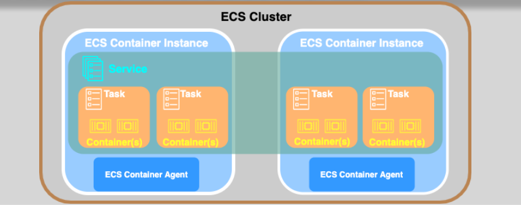
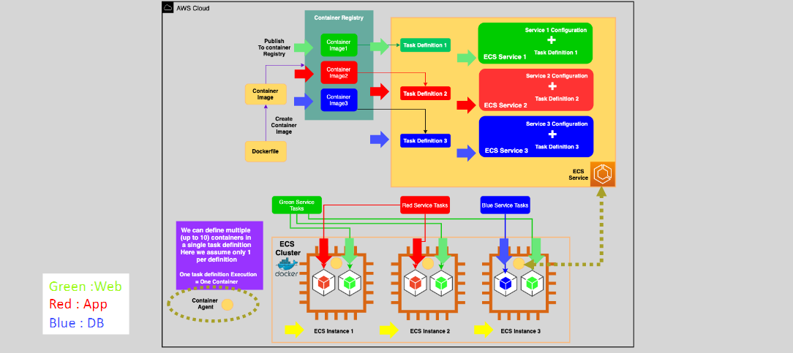

# 🎛️ Amazon ECS

Amazon Elastic Container Service (ECS) is a highly scalable and fully managed container orchestration service. It enables developers to easily run, stop, and manage Docker containers in a secure and efficient manner. ECS supports various deployment models, making it suitable for diverse application needs.

---

  

---

## 🌟 Key Features

### 🧠 **Intelligent Orchestration**

- Automatically schedules containers based on resource requirements.
- Manages container lifecycle for consistent performance.

### 🔄 **Integration with AWS Services**

- Works seamlessly with services like **CloudWatch**, **IAM**, **Load Balancers**, and **Cloud Map**.

### ⚙️ **Flexible Deployment Models**

- **Fargate:** Serverless model for minimal infrastructure management.
- **EC2:** Full control over container host infrastructure.
- **ECS Anywhere:** Extend ECS to on-premises environments.

---

## 🛠️ Key Components of ECS

  

### 1️⃣ **Cluster**

- Logical grouping of tasks or services.
- think of a cluster as a container orchestration space where you deploy and manage your applications running in Docker containers.

### 2️⃣ **ECS Instance (For EC2 Launch Type)**

- **Definition:** ECS instance = EC2 instance + Container Agent.
- **How It Works:**
  - When an ECS instance is launched, it creates an **Elastic Network Interface (ENI)** in the associated VPC to enable networking.
  - The instance runs the **ECS Container Agent**, which communicates with the ECS service to execute tasks as instructed.
  - The ECS agent handles container lifecycle management, including starting, stopping, and monitoring containers.

### 3️⃣ **Task Definition**

- A blueprint that defines container configurations.
- Specifies:
  - Docker image.
  - CPU and memory allocation.
  - Networking and storage options.

### 4️⃣ **Task**

- A running instance of a task definition.
- Often used for batch jobs or one-time processes.

### 5️⃣ **Service**

- Ensures that the specified number of tasks are always running.
- Features:
  - Auto-scaling based on metrics.
  - Integration with load balancers for traffic distribution.

---

## 🌐 Deployment Options

### 🔧 **Fargate (Serverless)**

- No need to manage infrastructure.
- Ideal for:
  - Short-lived workloads.
  - Applications with variable demand.

### 🖥️ **EC2 (Server-Based)**

- Full control over the underlying EC2 instances.
- Recommended for:
  - Workloads requiring persistent storage.
  - High CPU or memory-intensive applications.

### 🏢 **ECS Anywhere**

- Run containers on on-premises servers or other cloud environments.
- Suitable for hybrid cloud strategies.

---

## 🎯 When to Use ECS

1. **Microservices:** Orchestrate distributed applications efficiently.
2. **Batch Jobs:** Automate ETL processes and other data workflows.
3. **CI/CD Pipelines:** Streamline deployment workflows.
4. **On-Premises Migration:** Transition legacy apps to modern containerized infrastructure.

---

## ⚖️ ECS vs Lambda: Choosing the Right Tool

| **Feature**                   | **Amazon ECS**                 | **AWS Lambda**                         |
| ----------------------------- | ------------------------------ | -------------------------------------- |
| **Use Case**                  | Long-running workflows         | Event-driven, short-lived tasks        |
| **Infrastructure Management** | Required (for EC2)             | Fully managed                          |
| **Execution Time**            | Unlimited                      | Limited to 900 seconds                 |
| **Scaling**                   | Task-level scaling             | Automatic scaling based on invocations |
| **Cost Efficiency**           | Ideal for consistent workloads | Expensive for long-running workflows   |

---

Amazon ECS is a versatile solution for containerized workloads, offering robust scaling, seamless AWS integration, and flexible deployment options. Whether managing microservices or automating workflows, ECS provides the tools to build efficient and scalable applications.
