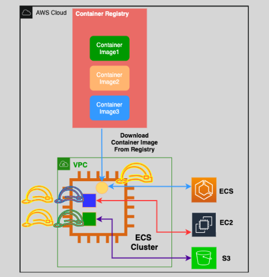

# 👩‍⚖️ Task IAM Roles in Amazon ECS

Tasks (ecs containers) in Amazon ECS can inherit IAM permissions from two sources:

- **EC2 Instance Roles**: These roles apply to all tasks running on a specific EC2 instance.
- **Task-Specific IAM Roles**: These roles are unique to each task, granting specific permissions only to that task.

---

<div style="text-align: center">
  
</div>

---

## 🔒 Task-Specific IAM Roles

**Task-Specific IAM Roles** are also known as Task Roles. They allow each ECS task to have its own IAM role, granting only the permissions it needs.

### 🛡️ Benefits

- **Least Privilege Access**: Only the necessary permissions are granted, enhancing security.
- **Granularity**: Different tasks can have different permissions.
- **Isolation**: Limits the impact if a task is compromised.

---

## ⚙️ How to Configure Task-Specific IAM Roles

### Step-by-Step Guide

1. **Create an IAM Role**:

   - Open the IAM Console.
   - Click on **Roles** and then **Create role**.
   - Choose **AWS service** and select **Elastic Container Service** -> **Elastic Container Service Task**.
   - Attach the necessary policies (permissions).

2. **Update Task Definition**:

   - Go to the ECS Console.
   - Create or edit a task definition.
   - In the **Task Role** section, select the IAM role you created.

3. **Run the Task**:
   - When you run the task, it will use the IAM role you specified and have the appropriate permissions.

### Example IAM Role Policy

Here’s a policy that allows an ECS task to read from an S3 bucket:

```json
{
  "Version": "2012-10-17",
  "Statement": [
    {
      "Effect": "Allow",
      "Action": ["s3:GetObject"],
      "Resource": ["arn:aws:s3:::your-bucket-name/*"]
    }
  ]
}
```
