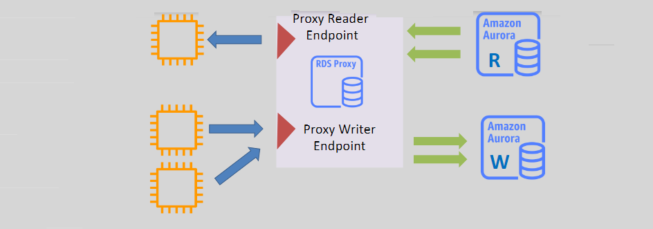

# **Amazon Aurora RDS Proxy 🛡️**

**Amazon Aurora RDS Proxy** is a fully managed, highly available database proxy that improves the scalability and availability of Amazon Aurora databases. It allows you to manage database connections more efficiently, especially for applications that require high database connection concurrency. Here's an easy-to-understand breakdown of RDS Proxy with Amazon Aurora.

## **What is RDS Proxy? 🔄**

RDS Proxy is designed to pool and share existing database connections, helping to improve the performance of applications while reducing database load. It is particularly useful for applications that make frequent database requests.

- **Connection Pooling** 🔄: Instead of creating a new connection for every database request, RDS Proxy maintains a pool of established connections and reuses them, reducing the overhead and load on the Aurora DB instance.
- **Highly Available** 🔒: RDS Proxy is deployed across multiple Availability Zones to ensure high availability and fault tolerance. It also supports automatic failover in case of a DB instance failure.

## **RDS Proxy with Aurora 📝**

RDS Proxy can be used with Amazon Aurora clusters to handle database connections more efficiently, whether you're using **writer endpoints**, **reader endpoints**, or **cross-VPC endpoints**.

### **Supported Endpoints** 🖥️

1. **Writer Endpoint** ✍️:

   - Connects to the primary Aurora instance for read and write operations.
   - RDS Proxy ensures that connections to the primary DB instance are efficiently managed.

2. **Reader Endpoint** 👀:

   - Connects to one or more read replicas, helping to distribute read traffic and reduce load on the primary instance.
   - RDS Proxy balances connections across multiple Aurora replicas.

3. **Cross-VPC Endpoints 🌐**:
   - RDS Proxy can be used to provide access to an Aurora DB cluster or RDS instance from resources in another VPC.
   - This is especially useful in multi-VPC architectures or when managing large distributed applications.

## **Benefits of Using RDS Proxy with Aurora 🌟**

1. **Improved Connection Management** 💡:

   - RDS Proxy pools database connections and reduces the number of open connections, leading to better resource utilization.

2. **Reduced Latency ⚡**:

   - By reusing existing connections, RDS Proxy reduces the latency caused by establishing new connections every time an application interacts with the database.

3. **Enhanced Availability 🚀**:

   - RDS Proxy provides automatic failover, ensuring that your application experiences minimal downtime in case of database issues or failover events.

4. **Scalability 📈**:

   - Applications that experience spikes in traffic can benefit from RDS Proxy, as it helps manage and scale connections efficiently.

5. **Better Security 🔐**:
   - RDS Proxy supports **IAM authentication**, which eliminates the need to store and manage passwords for database access.
   - It integrates with **AWS Secrets Manager** to securely store and manage database credentials.

## **How to Use RDS Proxy with Aurora 🛠️**

1. **Create an Aurora Cluster** 💻:

   - Start by creating an Amazon Aurora cluster with MySQL or PostgreSQL as the database engine.

2. **Set Up RDS Proxy** ⚙️:

   - In the AWS Management Console, create a new RDS Proxy and associate it with your Aurora cluster.
   - Choose the type of endpoint (writer or reader) you want to connect through.

3. **Configure IAM Authentication** 🔑:

   - If you want to use IAM authentication, make sure that IAM roles and policies are set up to allow access to the Aurora DB cluster through RDS Proxy.

4. **Connect via RDS Proxy** 🖥️:
   - Once RDS Proxy is set up, modify your application to connect to the **RDS Proxy endpoint** instead of connecting directly to the Aurora instance. This ensures that all connections are efficiently pooled and managed by RDS Proxy.

## **Summary 🌟**

Amazon Aurora RDS Proxy helps to manage connections efficiently, improves application performance by reducing latency, and ensures high availability for applications that rely on Amazon Aurora. Whether you're handling **read-heavy workloads** with the **reader endpoint** or using **cross-VPC endpoints**, RDS Proxy can scale with your needs and provide seamless database access across different VPCs.
