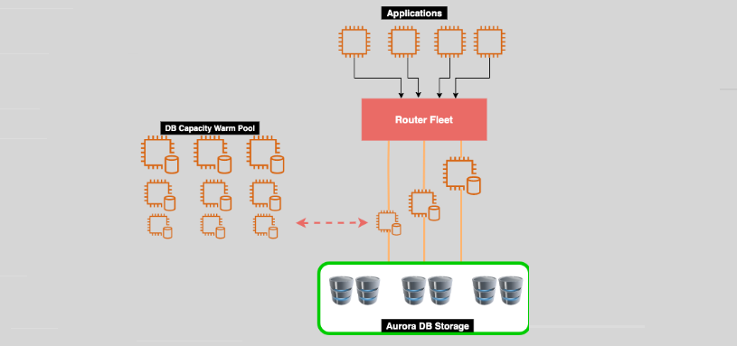

# **Amazon Aurora Serverless Version 2 🚀**

Amazon Aurora Serverless Version 2 is an on-demand, autoscaling configuration of Amazon Aurora, offering the flexibility and scalability needed for unpredictable or infrequent workloads. It is designed to simplify database management by automatically scaling compute resources based on application demands, providing the benefits of Aurora's powerful relational database services with the added flexibility of a serverless environment.

---

## **Key Features 🌟**

- **Auto-Scaling Compute Capacity 📈**  
  Aurora Serverless V2 automatically scales the compute resources based on your application’s needs, adjusting quickly to accommodate variable workloads. This means that you only pay for the compute capacity that you actually use.

- **Support for MySQL and PostgreSQL 🔧**  
  Aurora Serverless V2 supports both **MySQL** and **PostgreSQL** database engines, allowing you to run applications on the same architecture as provisioned Aurora clusters, but with automatic scaling.

- **TLS/SSL Encryption 🔐**  
  Aurora Serverless supports TLS/SSL encryption for DB connections, ensuring that all data transferred between the application and database is secure.

- **Cluster Volume Encryption 🔒**  
  The database cluster volume can be encrypted, ensuring that your data is secure both at rest and in transit. Encryption is always enabled by default in Aurora Serverless V2.

- **Cost Efficiency 💰**  
  When the Aurora Serverless DB cluster scales down to zero (during periods of inactivity), customers are only charged for the storage they use, saving costs when the database is not in active use.

- **Automatic Scaling and Warm Pool 🌡️**  
  The warm pool of database resources allows Aurora Serverless to scale up and down based on the application’s usage without unnecessary delays.

---

## **Use Cases 🛠️**

Amazon Aurora Serverless is ideal for various workloads where traditional provisioned instances might not be necessary or cost-effective. Some common use cases include:

- **Infrequently Used Applications**:  
  Suitable for low-volume sites that don't need a fully provisioned database running all the time.

- **New Applications with Unknown DB Instance Sizes**:  
  Ideal for development and testing environments where the required database size is not known upfront.

- **Highly Variable Workloads**:  
  For environments where workload demands fluctuate greatly, such as seasonal or unpredictable traffic patterns.

- **Dev and Test Databases**:  
  Perfect for creating cost-effective, temporary databases used for development, testing, and QA purposes.

- **Multi-Tenant Applications**:  
  Useful for applications serving multiple tenants where each tenant has its own database and usage varies.

- **Distributed Databases**:  
  For applications that require distributed database services across different locations.

---

## **Serverless v1 vs Serverless v2 ⚙️**

### **Serverless v1 Limitations ❌**

- Aurora Global Databases are not supported.
- Multi-Master clusters are not supported.
- Aurora Replicas are not supported.
- Backtracking is not supported.
- Exporting snapshots to Amazon S3 is not supported.
- Multi-AZ clusters are not supported.
- RDS Proxy is not supported.

### **Serverless v2 Enhancements ✔️**

- **Feature Parity with Provisioned Clusters**:  
  Serverless v2 now supports the same features as provisioned Aurora clusters, including global databases, Aurora replicas, and IAM DB authentication.

- **Faster Scaling**:  
  Aurora Serverless v2 scales much faster than v1, handling up to **100s of thousands of transactions per second** with rapid scaling, making it suitable for mission-critical applications and SaaS workloads.

- **Support for Multi-AZ Clusters**:  
  It now supports Multi-AZ deployment for higher availability and fault tolerance.

- **RDS Proxy Support**:  
  Serverless v2 integrates with **RDS Proxy**, allowing for connection pooling and improving application performance.

- **Global Databases**:  
  Aurora Global Databases are now supported, providing low-latency global reads and disaster recovery capabilities.

---

## **Capacity Range 📊**

Aurora Serverless is defined using **Aurora Capacity Units (ACUs)**, where:

- **1 ACU = 2 GiB of memory**, with corresponding CPU and networking resources.
- **Scaling from 0.5 to 128 ACUs**, allowing for fine-grained control over the compute resources used by the database.

---

## **Conclusion 🏁**

Amazon Aurora Serverless Version 2 brings enhanced features, faster scaling, and greater flexibility, making it an ideal choice for unpredictable workloads and applications that require both high performance and cost efficiency. With support for MySQL and PostgreSQL, integration with **RDS Proxy**, and **Multi-AZ deployment** options, Aurora Serverless V2 provides the reliability and scalability that modern applications demand, while eliminating the need for manual database management.
