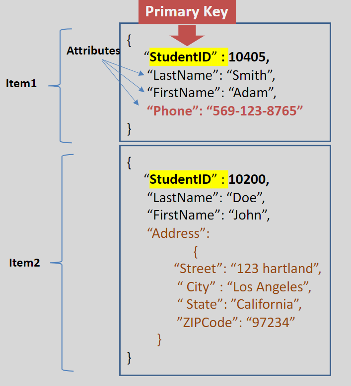

# AWS DynamoDB 🚀

Amazon DynamoDB is a **fully managed NoSQL database** that delivers **fast**, **predictable performance** with seamless scalability. It is designed to handle high-scale applications with minimal operational overhead.

---

## 🌟 **Key Features of DynamoDB**

1. **Flexible Data Models**:

   - Supports **key-value** and **document** data models.
   - Schema-less (flexible schema) design adapts to changing business requirements.

2. **Fast and Scalable**:

   - Provides **single-digit millisecond latency** at any scale.
   - Scales horizontally without downtime or performance degradation.

3. **Durable and Highly Available**:

   - Automatically replicates data across multiple **Availability Zones** (AZs) in a region.
   - Features built-in **backup and restore**, ensuring data durability.

4. **Security and Efficiency**:
   - Uses **HTTPS** for transport and **JSON** for serialization.
   - Optimizes data storage on **SSD** drives for high performance.

---

## 🔑 **Core Components**

  

### 1️⃣ **Tables and Items**

- **Table**: A collection of data items, similar to a table in a relational database.
- **Item**: Represents a single data entity in the table (analogous to a row).
  - Each table can store **unlimited items**, with each item having a size limit of **400 KB**.
- **Attribute**: The basic data element of DynamoDB, functioning like columns in a relational database.
  - Attributes are stored as **key-value pairs**.

---

### 2️⃣ **Primary Key**

- Used to uniquely identify each item in a table.
- Defined at the time of table creation.
- Two types of primary keys:
  - **Partition Key (Hash Key)**: A single attribute that uniquely identifies an item.
  - **Composite Key (Partition Key + Sort Key)**: Combines two attributes for more complex use cases.

---

## 🤔 **What Makes DynamoDB Special?**

1. **Highly Durable and Consistent**:

   - Data is replicated across multiple AZs for durability and availability.

2. **Optimized for Performance**:

   - Data is stored on SSDs and partitioned across servers based on read/write capacity.

3. **OLTP (Online Transaction Processing)**:

   - Ideal for applications requiring real-time, high-speed transactions.

4. **Multi-Region Support**:

  
  
  

---

## 🚀 **Common Use Cases**

DynamoDB is versatile and widely used in:

- **Mobile and Web Applications**:
  - Session state management and user profiles.
- **Retail and E-commerce**:
  - Catalogs, inventory management, and real-time pricing.
- **Banking and Financial Services**:
  - Fraud detection and transaction logging.
- **Gaming**:
  - Storing player scores and game states.
- **Ad-Tech**:
  - Real-time bidding and user activity tracking.

---

## ❌ **Limitations to Consider**

- **No Complex Queries**:
  - DynamoDB does not support complex joins or SQL-style queries.
  - Data can only be queried in limited ways.
- **Item Size Limit**:
  - Each item is restricted to **400 KB** in size.

---

## ✅ **Conclusion**

AWS DynamoDB is a powerful NoSQL database tailored for high-performance, scalable applications. With its flexible schema, durability, and real-time capabilities, DynamoDB is an excellent choice for modern applications that demand low-latency data access and seamless scalability.
