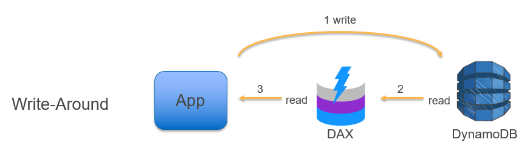
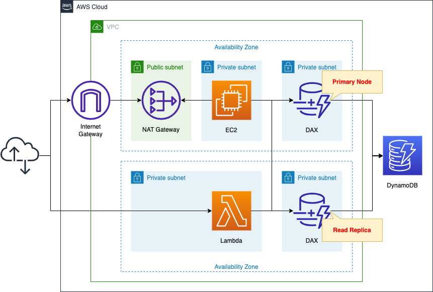

# AWS DynamoDB DAX: Supercharging DynamoDB Performance ⚡

AWS DynamoDB DAX (DynamoDB Accelerator) is a **caching service** that works exclusively with DynamoDB. It improves the speed of reading data from DynamoDB by providing **microsecond latency**, making it perfect for applications that need **fast response times**.

---

## 🌟 **What is DynamoDB DAX?**

DAX is a **cache** for DynamoDB that:

- Makes **reads faster** by storing frequently accessed data closer to your application.
- Works with **eventually consistent reads** (not for strongly consistent reads).
- Requires **no changes** to your application logic—just use the **DAX client**, and it handles everything.

---

## 🔑 **Key Features of DAX**

1. **Microsecond Latency**:

   - Speeds up reads by storing data in a cache for quick access.

2. **Integrated with DynamoDB**:

   - Works only with DynamoDB and supports its API calls.

3. **Highly Available**:

   - DAX runs as a **Multi-AZ cluster** in your VPC, ensuring fault tolerance.

4. **Scalable**:
   - Can handle **millions of requests per second**, making it ideal for high-traffic applications.

---

## 🛠 **How DAX Works**

1. **DAX Cluster**:

   - A cluster consists of one **primary node** and multiple **read replicas**.
   - The cluster is deployed inside your **VPC**.

2. **DAX Client**:
   - The application uses a **DAX client**, which routes all DynamoDB API calls to the DAX cluster.
   - If the data is in the cache, DAX serves it instantly.
   - If the data is not in the cache or a **strongly consistent read** is required, the request is sent directly to DynamoDB.

---

  

---

## 🔄 **How DAX Handles Requests**

- **Cache Hit**: If the data is in the cache, DAX responds immediately.
- **Cache Miss**: If the data is not in the cache, DAX fetches it from DynamoDB and stores it in the cache for future requests.
- **Strongly Consistent Reads**: These bypass the cache and go directly to DynamoDB.

---

## 🏢 **DAX Cluster Setup**

- **Nodes**: At least one primary node and multiple read replicas.
- **Multi-AZ**: AWS recommends deploying the cluster across **three Availability Zones** for fault tolerance.
- **Regional Resource**: The DAX cluster and the DynamoDB table must be in the same AWS region.

---

  

---

## 🔄 **How Data is Updated in DAX**

1. **Write Operations**:

   - All write operations (like `PutItem`, `UpdateItem`, or `DeleteItem`) go directly to **DynamoDB**.
   - DAX does **not cache write operations**. This ensures the data in DynamoDB is always up to date.

2. **Cache Invalidation**:

   - After a write operation, DAX **invalidates the relevant cache entry**.
   - This prevents outdated or stale data from being served from the cache.

3. **Subsequent Reads**:
   - If a subsequent read request is made for the updated data, DAX fetches the latest data from DynamoDB and updates the cache with the new value.

### **Example Workflow**

1. An application writes new data to DynamoDB.
2. DAX automatically invalidates any corresponding data in its cache.
3. When the application reads the updated data:
   - If the cache was invalidated, DAX retrieves the updated data from DynamoDB and stores it back in the cache.

---

## 🤔 **Why Use DAX?**

1. **Speed**:

   - Reduces read latency from milliseconds (DynamoDB) to **microseconds**.

2. **No Application Changes**:

   - No need to modify your application logic—just use the DAX client.

3. **Scalability**:

   - Handles high-traffic workloads effortlessly.

4. **Cost-Effective**:
   - Reduces the cost of repeated reads by caching frequently accessed data.

---

## ⚠️ **Limitations**

- **Only for DynamoDB**:
  - DAX does not work with other databases.
- **Eventual Consistency**:
  - DAX supports **eventually consistent reads** only, not strongly consistent reads.
- **Regional Restriction**:
  - The DAX cluster must be in the same region as the DynamoDB table.

---

## ✅ **Conclusion**

AWS DynamoDB DAX is a powerful tool for accelerating read-heavy workloads in DynamoDB. With its **microsecond latency**, **high availability**, and seamless integration, DAX is ideal for applications requiring fast, scalable, and cost-efficient data retrieval. While write operations bypass the cache to ensure data accuracy, DAX handles caching and cache invalidation intelligently, ensuring your application always serves up-to-date data.
