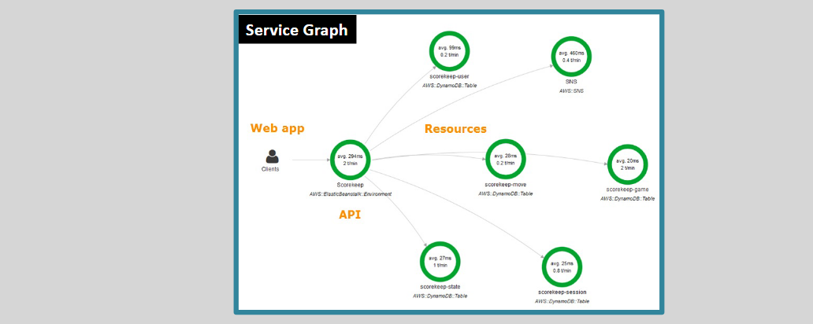

# 🔍 **AWS X-Ray: Comprehensive Application Tracing and Analysis**

AWS X-Ray is a powerful tool designed to help developers analyze and debug distributed applications. By providing deep insights into application performance and underlying services, X-Ray enables efficient troubleshooting and optimization of your applications.

---

## 🌟 **What is AWS X-Ray?**

**AWS X-Ray** is a tracing service that collects data about requests that your application serves, and provides tools you can use to view, filter, and gain insights into that data. This helps you understand how your application and its underlying services are performing to identify and troubleshoot the root causes of performance issues and errors.

### 📌 **Key Features:**

- **Service Graphs:** Visual representations of your application's components and their interactions.
- **Performance Insights:** Detailed metrics on latency, error rates, and request volumes.
- **Error Identification:** Pinpoint errors and bugs within your application flow.
- **Custom Analysis:** Utilize query APIs to build bespoke analysis and visualization tools.
- **Secure Data Handling:** Encrypts all traces and related data at rest using AWS Key Management Service (KMS) keys.
- **Integration:** Seamlessly integrates with AWS services like EC2, ECS, Lambda, Elastic Beanstalk, API Gateway, and ELB (requires an X-Ray daemon).
- **Configuration Tracking:** Works with AWS Config to monitor changes in X-Ray’s encryption settings.

---

## 📈 **Benefits of AWS X-Ray**

### 1. **Creates a Service Map**

- **Visualization:** Automatically generates a detailed service map that shows the interactions between your application's components.
- **Insight:** Helps you understand the flow of requests and identify bottlenecks or inefficient paths.

### 2. **Identifies Errors and Bugs**

- **Error Detection:** Locates where errors occur within your application, making it easier to debug and fix issues.
- **Root Cause Analysis:** Facilitates the identification of underlying problems affecting performance and reliability.

### 3. **Custom Analysis and Visualization**

- **Query APIs:** Provides a set of APIs that allow you to create custom analysis and visualization applications tailored to your specific needs.
- **Flexibility:** Enables the creation of dashboards and reports that focus on the metrics most important to your business.

### 4. **Secure Data Management**

- **Encryption:** Ensures that all trace data is encrypted at rest using KMS keys, maintaining the security and integrity of your data.
- **Compliance:** Helps meet security and compliance requirements by protecting sensitive trace information.

### 5. **Seamless Integration with AWS Services**

- **Wide Compatibility:** Integrates with a variety of AWS services, enhancing its ability to provide comprehensive insights across your entire AWS environment.
- **Enhanced Monitoring:** Works alongside services like CloudWatch and CloudTrail to offer a unified monitoring and logging solution.

---

## 🔄 **How AWS X-Ray Works**

1. **Data Collection:**

   - AWS X-Ray collects data from your application’s requests as they travel through your services.
   - Instrument your code or use AWS SDKs to send trace data to X-Ray.

2. **Trace Processing:**

   - X-Ray processes the collected data to generate detailed service maps and performance metrics.
   - It analyzes request paths, latency, and error rates to provide actionable insights.

3. **Visualization and Analysis:**
   - Access the AWS X-Ray console to view service maps, traces, and detailed performance data.
   - Use filtering and grouping to focus on specific aspects of your application’s performance.

---

## 🛡️ **Security and Compliance**

- **Data Encryption:** All trace data is encrypted at rest using AWS KMS, ensuring that sensitive information remains secure.
- **Access Control:** Utilize IAM roles and policies to control who can access and manage X-Ray data.
- **Integration with AWS Config:** Monitor and track changes in X-Ray’s encryption configurations to maintain compliance and security standards.

---

## 🏁 **Conclusion**

AWS X-Ray is an essential tool for developers looking to gain deep insights into their application's performance and behavior. By providing detailed service maps, error identification, and seamless integration with other AWS services, X-Ray empowers you to optimize your applications, troubleshoot effectively, and ensure a robust and reliable user experience. Embracing AWS X-Ray in your monitoring strategy can significantly enhance your ability to deliver high-performing and secure applications.
