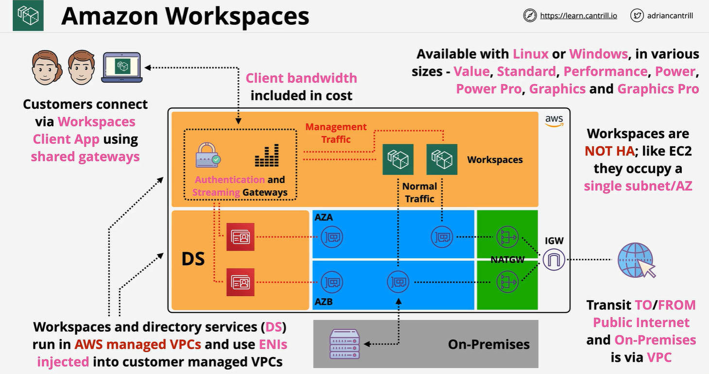
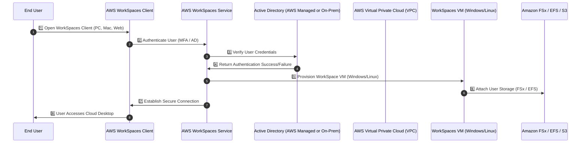

# 🖥️ **AWS WorkSpaces: A Complete Guide**

AWS WorkSpaces is a **fully managed Desktop-as-a-Service (DaaS) solution** that enables businesses to provide **secure, cloud-based virtual desktops**. It helps organizations eliminate the complexity of **managing on-premises Virtual Desktop Infrastructure (VDI)** while improving **scalability, security, and cost efficiency**.

With AWS WorkSpaces, organizations can:  
✅ **Provision virtual desktops on-demand**  
✅ **Securely access desktops from anywhere**  
✅ **Reduce costs** compared to traditional desktop management  
✅ **Enable remote work & BYOD**

---

   

---

## 🔹 **Key Features of AWS WorkSpaces**

### **🚀 Cloud-Based Virtual Desktops**

- Fully managed **Windows or Linux virtual desktops**
- Securely hosted on **AWS Cloud**
- Users can connect from **PC, Mac, iPad, Android, Chrome OS, Web**

### **🔑 Secure and Compliant**

- Encrypted **data at rest & in transit**
- **No data stored locally on devices**
- **Integration with AWS IAM, Active Directory (AD), MFA**

### **📈 Scalable and Cost-Effective**

- Pay **only for what you use** (Hourly or Monthly billing)
- Easily **add/remove desktops** as needed
- No upfront **hardware investment**

### **⚙️ Integration with AWS Services**

- Supports **Amazon WorkDocs** for file collaboration
- **AWS Directory Service** for user management
- **Amazon FSx & EFS** for shared storage

---

## 🏗️ **AWS WorkSpaces Architecture & How It Works**

AWS WorkSpaces operates in a **Virtual Private Cloud (VPC)**, allowing organizations to deploy desktops securely in AWS.

### **Mermaid Diagram: AWS WorkSpaces Architecture**

---

## 🛠️ **How to Set Up AWS WorkSpaces**

## **1️⃣ Configure AWS Directory Service**

AWS WorkSpaces `requires` **AWS Directory Service** to manage user authentication.

### **🔹 Choose a Directory Type**

- ✔ **AWS Managed Microsoft AD** (Recommended)  
- ✔ **Simple AD** (For basic environments)  
- ✔ **AD Connector** (Integrate with on-premises AD)

### **🔹 Steps to Set Up Directory**

1. Navigate to **AWS WorkSpaces Console** → **Directories**.
2. Choose **"Set up Directory"** → Select **AWS Managed AD**.
3. Configure **VPC, Subnet, and Admin Credentials**.
4. **Create Users in AWS Managed AD** or **sync with existing AD**.
5. **Enable MFA for added security**.

---

## **2️⃣ Launch AWS WorkSpaces**

### **🔹 Steps to Deploy WorkSpaces**

1. **Go to AWS WorkSpaces Console** → Click **"Launch WorkSpaces"**.
2. **Select Directory** (AWS Managed AD or AD Connector).
3. **Choose Operating System**:
   - **Windows 10 or 11**
   - **Amazon Linux 2 or Ubuntu**
4. **Select WorkSpaces Bundle**:
   - Standard **(2 vCPUs, 4GB RAM)**
   - Performance **(4 vCPUs, 16GB RAM)**
   - Power User **(8 vCPUs, 32GB RAM)**
5. **Enable Root Volume Encryption (Optional)**.
6. **Assign WorkSpaces to Users**.
7. **Click "Launch WorkSpaces"**.

---

## **3️⃣ Connect to AWS WorkSpaces**

Users can connect to WorkSpaces using:

🔹 **AWS WorkSpaces Client (Windows, Mac, Linux, iOS, Android)**  
🔹 **Web Browser (Chrome, Firefox, Edge)**

### **🔹 Steps to Connect**

1. **Install AWS WorkSpaces Client** or open **Web Login**.
2. **Enter WorkSpaces Registration Code** (Sent via email).
3. **Authenticate using Username/Password (MFA if enabled)**.
4. **Start using the virtual desktop!**

---

## ⚙️ **AWS WorkSpaces Storage & Data Management**

## **🔹 Persistent User Storage**

AWS WorkSpaces provides **persistent, encrypted storage** for users:  
✔ **Amazon WorkDocs** – File collaboration & storage  
✔ **Amazon FSx / EFS** – Network drive support  
✔ **Amazon S3** – Backups & archiving

## **🔹 Backup & Restore**

AWS WorkSpaces **automatically backs up desktops** every **12 hours**.  
Admins can **restore snapshots** or **rebuild WorkSpaces** if needed.

---

## 💰 **AWS WorkSpaces Pricing & Cost Optimization**

AWS WorkSpaces offers **two pricing models**:

| **Pricing Model**   | **Use Case**                                     |
| ------------------- | ------------------------------------------------ |
| **Hourly Billing**  | Ideal for part-time users, remote workers        |
| **Monthly Billing** | Best for full-time employees needing 24/7 access |

### **🔹 Optimize Costs**

✅ **Use AutoStop WorkSpaces** – Shut down inactive WorkSpaces to save costs  
✅ **Choose the right WorkSpaces bundle** – Avoid over-provisioning RAM/CPU  
✅ **Leverage AWS Free Tier** – 50 hours free for first 3 months

---

## 🔐 **Security & Compliance in AWS WorkSpaces**

### **✅ Key Security Features**

🔹 **No Local Data Storage** – Everything runs in AWS Cloud  
🔹 **Data Encrypted In-Transit & At-Rest** (AES-256 Encryption)  
🔹 **Secure Multi-Factor Authentication (MFA) Support**  
🔹 **Integration with AWS Identity & Access Management (IAM)**  
🔹 **Automated Backups & Snapshot Recovery**

### **✅ Compliance & Certifications**

AWS WorkSpaces meets **major compliance standards**:  
✔ **HIPAA** (Healthcare)  
✔ **PCI DSS** (Payment Processing)  
✔ **SOC 2, ISO 27001, FedRAMP** (Enterprise & Government)

---

## 📌 **Use Cases for AWS WorkSpaces**

### **🔹 Remote Work & Hybrid Teams**

- Employees can securely **work from anywhere** without corporate-issued laptops.

### **🔹 BYOD (Bring Your Own Device)**

- Users can **access their corporate desktop** from **any device** (Laptop, Tablet, Web Browser).

### **🔹 Secure Developer Environments**

- Developers can use **pre-configured WorkSpaces** for coding without exposing local devices.

### **🔹 Call Centers & Temporary Staff**

- Scale **virtual desktops up/down instantly** for **short-term projects**.

### **🔹 Highly Regulated Industries**

- **Healthcare, Finance, Government** benefit from **secure cloud desktops** with **no local data storage**.

---

## 🚀 **AWS WorkSpaces vs Traditional VDI**

| Feature             | AWS WorkSpaces           | On-Premises VDI       |
| ------------------- | ------------------------ | --------------------- |
| **Deployment Time** | Minutes                  | Days/Weeks            |
| **Upfront Cost**    | None                     | Expensive hardware    |
| **Scalability**     | Auto-scale               | Requires manual setup |
| **Security**        | AWS IAM, MFA, Encryption | Firewall-based        |
| **Management**      | Fully managed by AWS     | IT Admins required    |

🚀 **AWS WorkSpaces eliminates hardware, simplifies IT, and provides secure access to desktops from anywhere!**

---

## 🏆 **Final Thoughts**

AWS WorkSpaces is a **game-changer for remote work, security, and cost savings**.

✔ **Secure, scalable, fully managed virtual desktops**  
✔ **Lower IT costs & eliminate hardware management**  
✔ **Work from anywhere with AWS’s global cloud infrastructure**

If you're looking for a **cost-effective, secure, and scalable desktop solution**, AWS WorkSpaces is **the best choice**! 🚀
