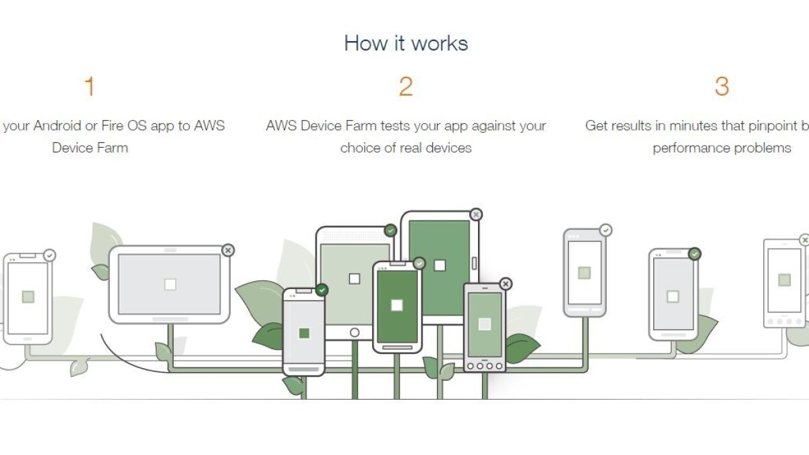
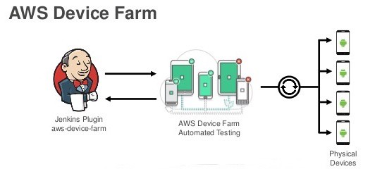
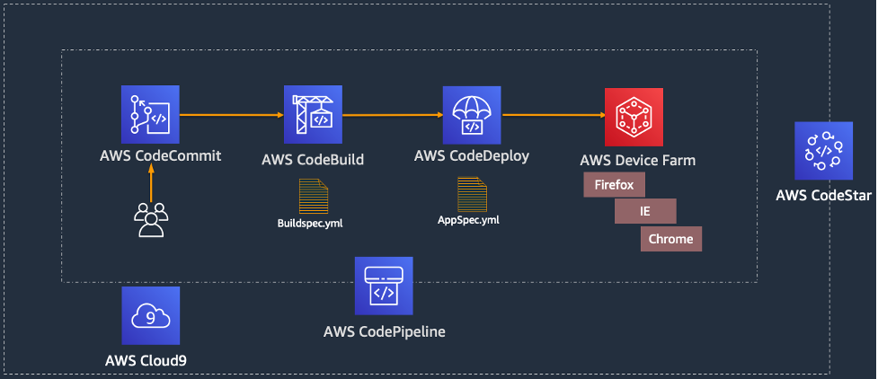

# 📱 AWS Device Farm: Simplified App Testing

AWS Device Farm is your one-stop solution for testing iOS, Android, and Fire OS apps on **real devices** hosted in the AWS cloud. Forget about managing hardware or juggling emulators—this service lets you focus on building quality apps while AWS handles the heavy lifting.

---

    

---

## 🌟 Key Highlights

### 📱 Real Device Access

- Test your app on an extensive range of **real smartphones and tablets**.
- Devices are maintained and updated by AWS, ensuring compatibility with popular models and OS versions.

### 🛠️ Versatile Testing Options

- **Built-in Testing:** Run pre-configured, script-free tests with just a few clicks.
- **Custom Scripts:** Use frameworks like Appium or Espresso to tailor the testing process to your needs.

### 🔄 CI/CD Integration

- Plug AWS Device Farm into your existing **Continuous Integration/Continuous Deployment (CI/CD)** workflows.
- Automate testing for each code update to maintain a high-quality app experience.

### 📊 Insightful Reporting

- Get detailed reports with **screenshots, logs**, and **performance metrics**.
- Identify issues at a glance and resolve them faster.

---

## 🎯 Practical Use Cases

### 1️⃣ Automated Testing in CI/CD Pipelines

Boost productivity by integrating AWS Device Farm into your CI/CD tools like **Jenkins**. Every time you push code changes, tests are run automatically to catch bugs early.

    

---

### 2️⃣ Seamless Deployment with AWS CodePipeline

Combine AWS Device Farm with **AWS CodePipeline** to ensure that every build is thoroughly tested before it’s deployed to production.

    

---

## ✅ Benefits at a Glance

- **Cost Savings:** Eliminate the need for maintaining physical devices.
- **Time Efficiency:** Test on multiple devices simultaneously.
- **Scalability:** Support for a variety of devices and OS configurations.
- **Quality Assurance:** Ensure apps work perfectly for end users.

---

AWS Device Farm simplifies app testing with its robust features and integrations. Whether you’re new to app development or a seasoned pro, it’s the perfect tool to ensure your app’s success on every device.
