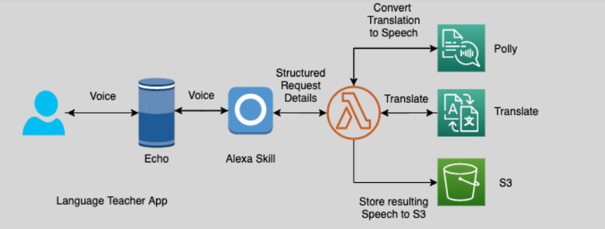

# 🗣️👧 Amazon Alexa: Your Intelligent Voice Assistant

Amazon Alexa is a **cloud-based voice service** that powers smart devices like the **Amazon Echo** and **Amazon Echo Dot**. Alexa enables users to interact with technology using natural language, offering a wide range of features and integrations.

---

    

---

## 🌟 Key Features

### 🎙️ Voice Interaction

- Responds to voice commands for tasks such as:
  - Playing music.
  - Providing weather updates.
  - Managing smart home devices.
  - Setting reminders and timers.

### 🔄 Custom Skills

- Developers can extend Alexa's capabilities by creating **custom skills** using cloud-based services.
- Custom skills accept requests from Alexa, process them, and return tailored responses.

### 📡 Always Connected

- Alexa leverages cloud computing to continuously learn and improve its responses.

---

## 🎯 Use Cases

1. **Smart Home Control:**

   - Manage lights, thermostats, and security systems through voice commands.

2. **Entertainment:**

   - Stream music, audiobooks, or podcasts directly through Alexa-enabled devices.

3. **Productivity:**

   - Schedule meetings, set reminders, or create to-do lists hands-free.

4. **Custom Applications:**
   - Developers can build industry-specific skills, such as customer support bots or educational tools.

---

## 🚀 Why Choose Alexa?

1. **Ease of Use:** Provides intuitive voice interactions.
2. **Customizable:** Developers can enhance Alexa with new capabilities via the Alexa Skills Kit (ASK).
3. **Wide Compatibility:** Works seamlessly with numerous smart devices and applications.
4. **Continuous Improvement:** Regular updates ensure Alexa stays current and relevant.

---

Amazon Alexa empowers users to interact with technology in a natural and intuitive way. Whether for personal use or custom business applications, Alexa is a versatile and ever-evolving platform.
