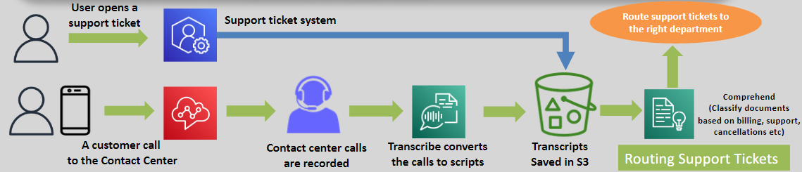
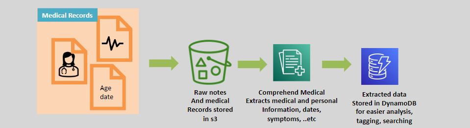

# 🧠 Amazon Comprehend: Unlock Insights from Text

Amazon Comprehend is a fully managed, serverless Natural Language Processing (NLP) service that enables users to derive actionable insights from unstructured text. Whether you are analyzing social media, documents, or customer reviews, Comprehend simplifies the extraction of meaningful information.

---

    

---

## 🌟 Key Features

### 📋 Text Analysis

- Identifies **entities**, **key phrases**, **language**, **locations**, **dates**, and **sentiments** from text.
- Supports **UTF-8 formatted text** files for processing.

### 🚀 Machine Learning Simplified

- Requires **no prior ML expertise**, making it accessible to all users.
- Provides APIs for seamless integration into applications.

### 🔄 Integration

- Works with other AWS services such as **Amazon S3**, **AWS Lambda**, and **Amazon QuickSight** to enhance workflows.

---

## 🎯 Use Cases

1. **Social Media Monitoring:**
   - Analyze feeds for mentions of products and gauge sentiment.
2. **Document Analysis:**
   - Scan repositories for key phrases and relevant data.
3. **Customer Feedback:**
   - Identify trends and sentiment in reviews to improve services.
4. **Content Categorization:**
   - Automatically classify and tag documents based on detected entities and topics.

---

## 🏥 Amazon Comprehend Medical

    

Amazon Comprehend Medical extends the capabilities of Comprehend to handle **clinical text**. It leverages advanced NLP models to extract information specific to the healthcare domain.

### 🩺 Key Features

- Detects entities such as **medical conditions**, **medications**, and **Personal Health Information (PHI)**.
- Processes unstructured clinical data from sources like:
  - Physician notes.
  - Discharge summaries.
  - Test results.
  - Case notes.

### 🎯 Use Cases

1. **Clinical Documentation:**
   - Extract structured data from unstructured medical notes for analytics.
2. **PHI Identification:**
   - Detect and manage sensitive patient data for compliance purposes.
3. **Healthcare Analytics:**
   - Identify trends and patterns in patient records to improve care.

---

## ✅ Why Choose Amazon Comprehend?

1. **Scalability:** Automatically scales to handle large volumes of text.
2. **Accessibility:** No ML expertise required to extract valuable insights.
3. **Versatility:** Works across industries, from healthcare to e-commerce.
4. **Cost-Efficiency:** Pay-as-you-go pricing ensures affordability.

---

Amazon Comprehend and Comprehend Medical empower organizations to transform unstructured text into valuable insights. Whether it’s improving customer experiences or enhancing healthcare analytics, these services make text analysis accessible and impactful.
