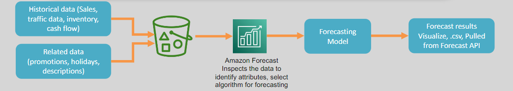

# 🤖 📊 AWS Forecast: Accurate Time-Series Predictions Made Easy

**Amazon Forecast** is a fully managed machine learning service designed to generate highly accurate **time-series forecasts**. By leveraging advanced statistical and deep learning algorithms, AWS Forecast simplifies the process of making predictions **based on historical data**, without requiring prior machine learning expertise.

---

    

---

## 🌟 Key Features

### ✅ User-Friendly

- Requires no prior knowledge of machine learning to start creating forecasts.
- Fully managed, reducing the need for infrastructure management.

### 📂 Data Integration

- Input data is stored in **Amazon S3** for easy integration.
- Forecasts can be accessed directly via the **service API** or exported back to S3 for further use.

### 🌍 Broad Applicability

- Useful across various industries, including:
  - **Retail**: Demand forecasting and inventory management.
  - **Finance**: Predicting market trends and revenue.
  - **Healthcare**: Planning resources and operational metrics.
  - **Logistics**: Supply chain and workforce planning.

---

## 🎯 Use Case Examples

1. **Energy Management:** Forecasting energy consumption to optimize supply and demand.
2. **Weather Predictions:** Predicting monthly rainfall for agriculture or disaster planning.
3. **Inventory Management:** Ensuring optimal stock levels by predicting product demand.
4. **Workforce Planning:** Accurately scheduling and allocating resources.
5. **Operational Metrics:** Tracking and predicting key business performance metrics.

---

## ✅ Why Use Amazon Forecast?

- **Accuracy:** Utilizes machine learning to deliver highly precise predictions.
- **Scalability:** Handles large datasets and complex forecasting scenarios.
- **Ease of Use:** Simplifies forecasting for non-experts.
- **Versatility:** Supports a wide range of use cases and industries.

---

Amazon Forecast democratizes machine learning by making powerful forecasting tools accessible to everyone. Whether you're planning inventory, predicting trends, or optimizing operations, AWS Forecast helps you make data-driven decisions with confidence.
