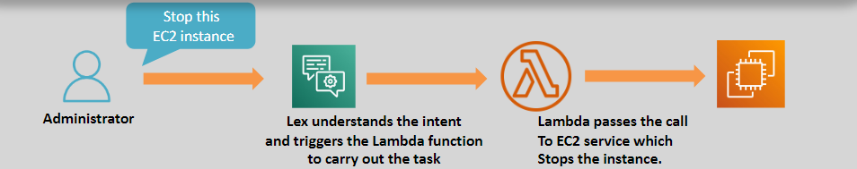

# 🤖 \( 🗣️\> 🧾\) Amazon Lex: Build Conversational Interfaces with Ease

Amazon Lex is a fully managed service that enables developers to create conversational interfaces using **voice** and **text**. With built-in **Natural Language Understanding (NLU)** and **Automatic Speech Recognition (ASR)** capabilities, Lex simplifies the process of building sophisticated chatbots and virtual assistants.

---

    

---

## 🌟 Key Features

### 🤖 Natural Language Understanding (NLU)

- Recognizes the **intent** behind user inputs, enabling intuitive interactions.

### 🎙️ Automatic Speech Recognition (ASR)

- Converts **speech to text** seamlessly for voice-based applications.

### 🔄 AWS Integrations

- Works natively with AWS services, including:
  - **AWS Lambda**: Execute custom logic.
  - **Amazon Polly**: Add text-to-speech capabilities.
  - **Amazon Comprehend**: Analyze sentiment and entity recognition.
  - **Amazon Kendra**: Enable intelligent search.
  - **Amazon Connect**: Enhance customer service solutions.

### 🛠️ Simple Deployment

- Easy to integrate into web, mobile, and contact center applications.
- Scales automatically to handle varying levels of user interactions.

---

## 🎯 Use Cases

1. **Customer Support:** Automate FAQs and provide instant customer assistance.
2. **E-Commerce:** Create virtual shopping assistants for product recommendations.
3. **Healthcare:** Build virtual assistants for appointment scheduling and health inquiries.
4. **Internal Operations:** Automate HR inquiries or IT helpdesk requests.
5. **Education:** Deliver interactive learning experiences with voice or text interfaces.

---

## ✅ Why Choose Amazon Lex?

1. **Advanced AI Capabilities:** Leverages the same AI technology used in Amazon Alexa.
2. **Flexibility:** Supports both voice and text for multi-modal interactions.
3. **Seamless Integration:** Easily connects with AWS services and third-party applications.
4. **Scalable:** Automatically adjusts to support high volumes of requests.
5. **Cost-Effective:** Pay-as-you-go pricing ensures affordability.

---

Amazon Lex empowers developers to create intelligent, conversational applications with minimal effort. Whether you’re enhancing customer experiences or automating workflows, Lex provides the tools needed to build reliable and engaging chatbots and virtual assistants.
