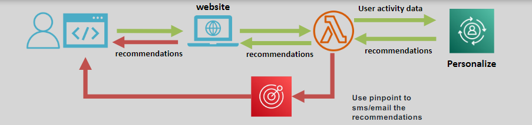

# 🎯 Amazon Personalize: Deliver Tailored User Experiences

**Amazon Personalize** is a fully managed machine learning service that enables developers to create **real-time**, personalized **recommendations** for users. By leveraging **historical user interaction data**, Personalize provides tailored suggestions, improving user engagement and satisfaction.

---

    

---

## 🌟 Key Features

### 🤖 Real-Time Recommendations

- Generates dynamic recommendations based on user behavior and interaction data.
- Continuously adapts to changing user preferences.

### 📂 Data Integration

- Seamlessly integrates with existing applications to analyze **historical interaction data**.
- Supports data sources like **user activity logs**, **item catalogs**, and **demographics**.

### 🛠️ Easy to Use

- Fully managed, requiring no prior machine learning expertise.
- Includes built-in algorithms optimized for personalization tasks.

---

## 🎯 Use Cases

1. **Video Streaming Apps:**

   - Recommend movies or TV shows based on viewing history.

2. **E-Commerce Applications:**

   - Suggest products tailored to user preferences.

3. **Personalized Emails:**

   - Curate email content based on user behavior and interests.

4. **Targeted Marketing Campaigns:**
   - Deliver ads or promotions that resonate with specific audience segments.

---

## ✅ Why Choose Amazon Personalize?

1. **Enhanced Engagement:** Improves user experiences with relevant suggestions.
2. **Fast Deployment:** Quickly implement machine learning-driven recommendations.
3. **Scalability:** Handles data and recommendation workloads for applications of any size.
4. **Cost-Effective:** Pay-as-you-go pricing ensures affordability.
5. **Customizable:** Supports fine-tuning to meet specific business goals.

---

Amazon Personalize helps businesses deliver tailored user experiences, driving engagement and boosting conversion rates. Whether you’re building a streaming platform or an e-commerce site, Personalize enables you to unlock the full potential of your user data.
