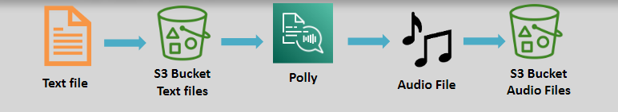

# 🤖 \(🧾 \> 🗣️\) Amazon Polly: Turn Text into Lifelike Speech

Amazon Polly is a **Text-to-Speech (TTS)** cloud service that converts written text into natural, lifelike speech. With support for multiple languages and a wide range of voices, Polly enables developers to create engaging, accessible, and interactive applications.

---

    

---

## 🌟 Key Features

### 🌍 Multilingual Support

- Supports numerous languages and accents, making it ideal for global applications.

### 🎙️ Variety of Voices

- Offers male, female, and child voices for diverse use cases.

### 💬 Real-Time Conversion

- Processes text in real-time, delivering speech instantly for dynamic applications.

---

## 🎯 Use Cases

1. **Mobile Applications:** Enhance newsreader or content apps with audio versions.
2. **Gaming:** Add immersive narration and character dialogues.
3. **E-Learning:** Improve engagement with spoken tutorials and lessons.
4. **Accessibility:** Enable visually impaired users to access textual content.

---

## 🛠️ Advanced Features

### 📜 Speech Synthesis Markup Language (SSML)

- Accepts input as plain text or **SSML** format.
- SSML allows fine-grained control over speech, including:
  - **Pronunciation**
  - **Speech rate, pitch, and volume**
  - **Emphasis on specific sentences**
  - **Whispering and breathing effects**
  - **Bilingual accents**

### 📖 Lexicons

- Customize pronunciation with **lexicons**, tailored to specific needs.
- Lexicons can be stored **per region** for localized control.

**Example:**

- Without lexicon:
  - "G3t sm4rt" is pronounced as "g three t sm four rt."
- With lexicon:
  - Define "G3t" as "get" and "sm4rt" as "smart," resulting in the intended pronunciation.

---

## ✅ Why Choose Amazon Polly?

1. **Natural and Engaging:** Delivers high-quality, lifelike speech.
2. **Global Reach:** Multilingual support for diverse audiences.
3. **Customizable:** Advanced features like SSML and lexicons offer unparalleled control.
4. **Scalable:** Processes text-to-speech for applications of all sizes.

---

Amazon Polly empowers developers to create applications that talk, delivering immersive and accessible experiences across industries. Whether you're building an educational platform or enhancing a game, Polly's advanced text-to-speech capabilities make it the perfect tool for bringing your content to life.
