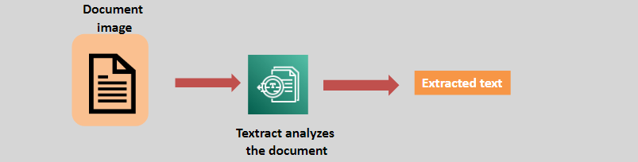
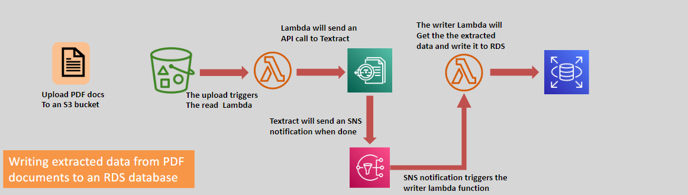

# 📄 Amazon Textract: Intelligent Document Processing

Amazon Textract is a machine learning service that enables automatic extraction of text and structured data from scanned documents, forms, and images. By leveraging deep learning and Natural Language Processing (NLP), Textract simplifies the process of analyzing and digitizing documents.

---

    

---

## 🌟 Key Features

### 📝 Text Detection

- Extracts **typed** and **handwritten** text from scanned documents.
- Identifies **words**, **phrases**, and their spatial relationships.

### 📊 Structured Data Extraction

- Detects and extracts:
  - **Tables**: Understands rows and columns for structured data.
  - **Key-Value Pairs**: Identifies relationships between fields and their corresponding values.

### 🔄 API Integration

- Easily access extracted data using **Textract APIs** for seamless application integration.

### 📈 Scalable and Automated

- Handles large volumes of documents without manual intervention.

---

## 🎯 Use Cases

    

1. **Intelligent Search Index:**

   - Create searchable indexes from document repositories.

2. **Automated Data Capture:**

   - Extract information from invoices, receipts, and forms for processing.

3. **Scalable Document Analysis:**
   - Analyze contracts, reports, and financial statements at scale.

---

## ✅ Why Choose Amazon Textract?

1. **Automation:** Eliminates manual data entry, saving time and reducing errors.
2. **Accuracy:** Uses deep learning to ensure precise extraction of text and data.
3. **Ease of Integration:** Works seamlessly with AWS services like **S3**, **Lambda**, and **Comprehend**.
4. **Cost-Efficient:** Pay-as-you-go pricing makes it accessible for businesses of all sizes.

---

Amazon Textract empowers organizations to digitize and analyze documents efficiently, driving automation and insights. Whether for data capture, intelligent search, or large-scale analysis, Textract provides a powerful, scalable solution.
