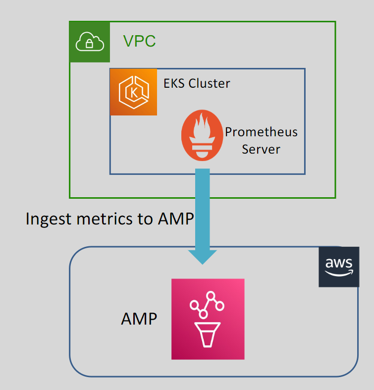
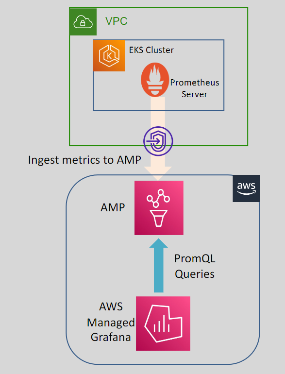

# 🚀 AWS Managed Prometheus (AMP)

## 🤖 What is Prometheus?

**Prometheus** is an **open-source** systems `monitoring` and `alerting` toolkit.

    

- **Data Collection:** Prometheus collects and stores its metrics as time-series data.
- **Query Language:** Features PromQL, a simple query language to filter, aggregate, and create alarms on collected metrics.
- **Kubernetes Monitoring:** Commonly used to monitor Kubernetes containerized environments.
- **Use Cases:** Metric collection, alerting, and visualization.

## 🌐 What is AWS Managed Prometheus (AMP)?

    

- **Serverless Monitoring:** AMP is a serverless, Prometheus-compatible monitoring service for container metrics.
- **Secure and Scalable:** Makes it easier to securely monitor container environments at scale without worrying about infrastructure.
- **Integration:** Requires a Prometheus server in the Kubernetes environment to collect metrics and ingest them into AMP.

---

- **High Availability:** Designed to be highly available across multiple AZs, with data replicated across three AZs.
- **Compatibility:** Works with container clusters on Amazon EKS, EKS Anywhere, and self-managed Kubernetes environments.
- **Data Retention:** Metrics ingested into AMP are stored for 150 days.

---

### 🏠 AMP Inside VPC

    

- **Private Access:** Use VPC endpoints to reach AMP endpoints privately, if needed.
- **Visualization:** AWS Managed Grafana can be used to query AMP metrics using PromQL.
- **Extended Monitoring:** AMP can also monitor EC2 instances and ECS clusters.
