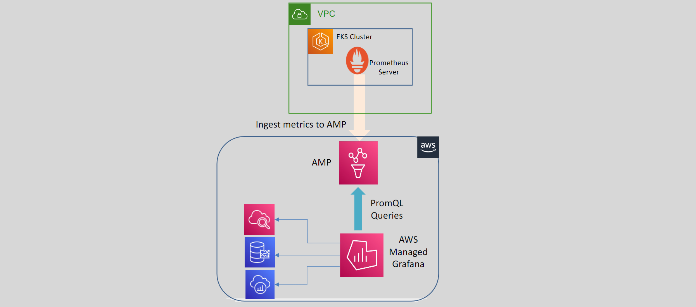

# 📊 AWS Managed Grafana (AMG): Advanced Data Visualization

  

## 🔍 What is Grafana?

Grafana is an open-source analytics and data visualization tool that enables users to query, visualize, alert on, and explore metrics from various data sources.

- **Data Visualization:** Grafana allows you to create visualizations and dashboards to display metric data from sources like Prometheus.
- **Querying:** Users can access data using queries tailored to their needs.
- **Versatile Panels:** Display query results using diverse panels, including graphs, gauges, and tables.
- **Dashboard Creation:** Combine multiple panels into a single comprehensive dashboard for a holistic view of your metrics.

## 🌐 What is AWS Managed Grafana (AMG)?

AWS Managed Grafana (AMG) is a fully managed, secure data visualization service that simplifies the process of querying, correlating, and visualizing operational metrics, traces, and logs from multiple sources.

- **Managed Service:** AMG takes care of setup, provisioning, scaling, and maintenance of Grafana servers, removing the operational burden from users.
- **Multi-Source Integration:** AMG integrates with AWS CloudWatch, X-Ray, Amazon Timestream, Amazon Managed Service for Prometheus, Amazon OpenSearch, and IoT SiteWise as data sources.
- **Access Control:** Integrates with Identity Providers (IdPs), SAML, and AWS IAM Identity Center (AWS SSO) for secure access control.
- **Versatile Visualization:** Allows querying and visualizing data from multiple sources, providing a unified view of operational metrics and logs.

**Benefits of AWS Managed Grafana (AMG):**

- **Secure and Scalable:** Ensures secure data visualization and can scale to meet the needs of large environments.
- **Operational Efficiency:** Reduces the complexity of managing Grafana servers, allowing users to focus on analyzing data and gaining insights.
- **Comprehensive Monitoring:** Enables users to monitor and visualize data from various AWS services and beyond, enhancing operational visibility.
