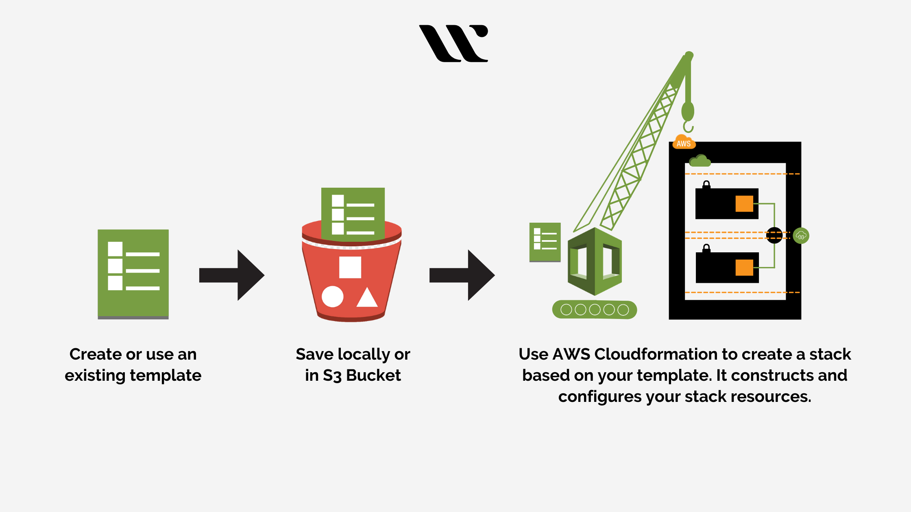
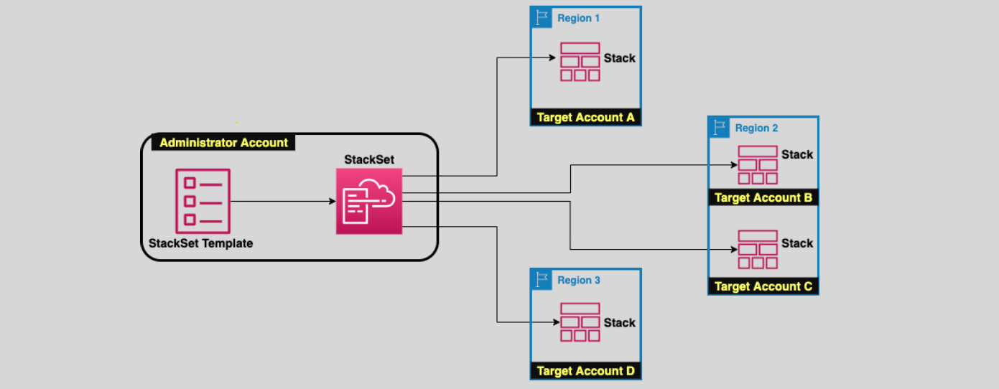
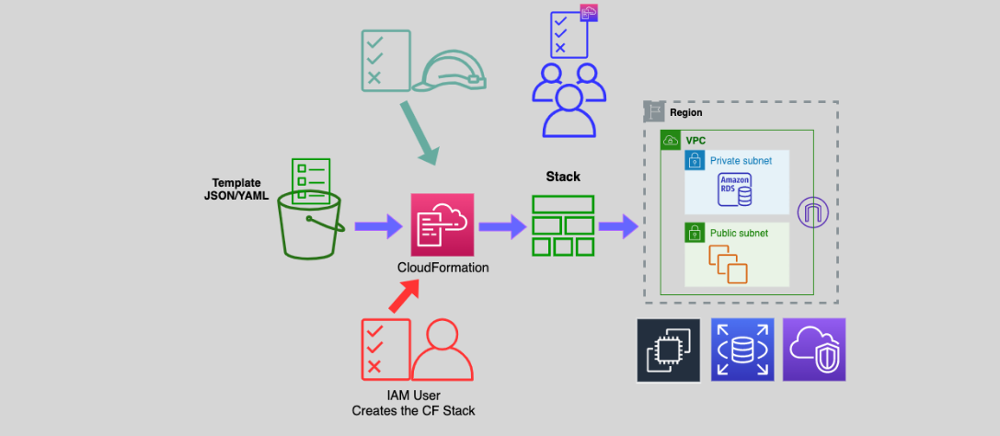

# AWS CloudFormation: A Comprehensive Introduction 📜

AWS CloudFormation is a **powerful Infrastructure as Code (IaC) service** that enables you to automate and manage AWS resources. It provides a streamlined way to model, provision, and maintain your cloud infrastructure using JSON or YAML templates.

<div align="center">
  
</div>

---

## 🚀 **What is AWS CloudFormation?**

AWS CloudFormation simplifies the creation, management, and updating of AWS resources by defining your infrastructure as code.

### **Key Features**

- **Infrastructure as Code (IaC):** Write and manage infrastructure using code, ensuring consistency and reducing errors.
- **Automation:** Automate resource provisioning, updates, and deletions.
- **Multi-Region Support:** Easily replicate and manage infrastructure across multiple AWS regions.
- **Change Management:** Preview updates using **Change Sets** before applying them.

---

## 🔄 **How CloudFormation Works**

The workflow for using CloudFormation typically involves these steps:

1. **Create a Template**: Define your infrastructure in a JSON or YAML file.
2. **Upload to S3**: Store the template in an Amazon S3 bucket.
3. **Deploy a Stack**: CloudFormation provisions AWS resources based on the template, creating a **stack**.
4. **Update Stacks with Change Sets**: Modify the template to update resources safely.
5. **Monitor and Manage**: Use the AWS Management Console, CLI, or SDKs to monitor and manage stacks.

---

## 🏗️ **Core Concepts**

### **1️⃣ Template**

A CloudFormation **template** defines the resources and configurations for your AWS infrastructure. It consists of the following sections:

- **Parameters**: User-defined inputs to customize the stack.
- **Mappings**: Static key-value pairs used as lookup tables.
- **Conditions**: Logic for resource creation based on specific criteria.
- **Resources**: Mandatory section that lists AWS resources to be created.
- **Outputs**: Export key details (like instance IDs) for other stacks or systems.

---

### **2️⃣ Stack**

A **stack** is a collection of resources created and managed as a single unit.

- **Single-Region Deployment**: Stacks are deployed within one AWS region.
- **Rollback on Failure**: If an error occurs, CloudFormation automatically rolls back changes to ensure infrastructure stability.

---

### **3️⃣ StackSets**



**StackSets** extend CloudFormation’s functionality to multiple accounts and regions.

- **Administrator Account**: Manages StackSets and deployments.
- **Target Accounts**: Receive stacks based on trust relationships.
- **Centralized Management**: Updates in the template are propagated to all stacks.

---

### **4️⃣ Change Sets**

Change Sets allow you to preview updates before applying them.

- Modify the template or parameters.
- Review the **proposed changes** in a Change Set.
- Safely apply the updates to minimize disruption.

---

### **5️⃣ Access Control and Permissions**

<div align="center">
  
</div>

CloudFormation uses **IAM roles and policies** to control stack creation and updates.

- **Service Roles**: Define what CloudFormation can do on your behalf.
- **Stack Policies**: JSON policies that restrict updates to specific resources.
- **IAM Conditions**: Limit which templates and resources can be used.

---

## 🔧 **CloudFormation Template Structure**

### Example YAML Template:

```yaml
AWSTemplateFormatVersion: "2010-09-09"
Description: A simple EC2 instance
Resources:
  MyEC2Instance:
    Type: "AWS::EC2::Instance"
    Properties:
      InstanceType: "t2.micro"
      ImageId: "ami-0abcdef1234567890"
      KeyName: "MyKeyPair"
```

### Key Sections:

1. **AWSTemplateFormatVersion**: Specifies the version of the CloudFormation template format.
2. **Description**: A brief explanation of the stack's purpose.
3. **Resources**: The core of the template, listing the AWS resources to be created.

---

## 🩺 **Monitoring and Logging**

- **AWS CloudTrail**: Logs all API requests made by CloudFormation.
- **Amazon CloudWatch**: Monitors resource health and stack events.
- **Stack Events**: Provides a detailed log of each operation performed during stack creation or updates.

---

## 🛡 **Security Best Practices**

1. **Least Privilege Principle**:

   - Use minimal permissions for IAM roles or policies assigned to CloudFormation.

2. **Template Validation**:

   - Use the `cloudformation validate-template` command to verify templates before deploying.

3. **Resource-Specific Policies**:
   - Apply stack policies to prevent accidental updates or deletions.

---

## 💡 **When to Use CloudFormation**

### Ideal Scenarios:

- Automating resource provisioning for **repeatable environments** (e.g., staging, production).
- Deploying infrastructure across **multiple regions or accounts** using StackSets.
- Managing changes to infrastructure with **full visibility and control**.

### Limitations:

- CloudFormation does not provide application-specific management (use **AWS Elastic Beanstalk** for that).
- Resource limits exist; consider splitting complex deployments into multiple stacks.

---

## 📝 **Additional Features**

- **Serverless Applications**:
  - Use AWS SAM (Serverless Application Model) for serverless infrastructure.
- **Cross-Stack References**:
  - Share resources between stacks using **Outputs** and **Exports**.
- **Deletion Policies**:
  - Specify whether to retain, delete, or snapshot resources when deleting stacks.

---

## 📋 **Quick Comparison: CloudFormation vs. Elastic Beanstalk**

| Feature           | CloudFormation                     | Elastic Beanstalk              |
| ----------------- | ---------------------------------- | ------------------------------ |
| **Purpose**       | Manage infrastructure as code      | Manage application deployments |
| **Customization** | High (full control over resources) | Limited                        |
| **Use Case**      | Complex, multi-tier infrastructure | Simplified app management      |

---

## ✅ **Conclusion**

AWS CloudFormation is a cornerstone service for modern cloud infrastructure management. By leveraging IaC, Change Sets, and StackSets, it provides a robust and automated way to manage AWS resources at scale. Whether you're deploying simple environments or orchestrating complex multi-region architectures, CloudFormation empowers you to achieve consistency, efficiency, and control.
