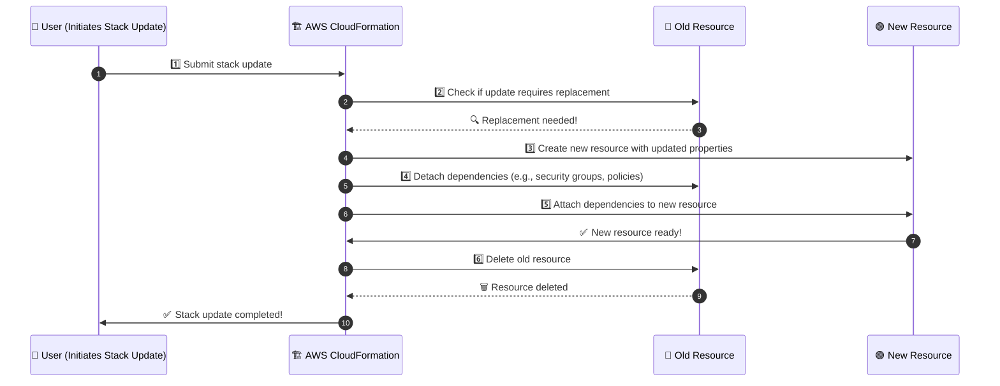

# **🔄 Stack Updates Causing Resource Replacement in AWS CloudFormation**

## **📌 Introduction**

When you update an AWS CloudFormation stack, **not all resources are updated the same way**. CloudFormation **compares** the new template with the existing stack and determines the **update behavior** for each resource.

AWS CloudFormation uses **three update behaviors**:

✅ **No Interruption** → Resource updates without disruption.  
⚠️ **Some Interruption** → Resource updates with brief downtime.  
🔄 **Replacement** → The resource is **recreated**, causing downtime and a new physical ID.

Understanding these behaviors helps you **plan updates to minimize downtime and avoid data loss**.

---

## **🔄 How CloudFormation Handles Stack Updates**

When an update is submitted, AWS CloudFormation:

1. **Compares the new template with the current stack.**
2. **Identifies which resources need to be updated.**
3. **Determines whether updates can happen in-place or require replacement.**
4. **Executes the update process accordingly.**

### **Update Behaviors in Detail**

| **Update Type**          | **Description**                                                                               | **Example Resource Property Change**                    |
| ------------------------ | --------------------------------------------------------------------------------------------- | ------------------------------------------------------- |
| ✅ **No Interruption**   | CloudFormation updates the resource **without downtime** or changing its physical ID.         | Changing `S3 Bucket Versioning` on `AWS::S3::Bucket`.   |
| ⚠️ **Some Interruption** | The resource remains but experiences **temporary downtime**.                                  | Changing `InstanceType` of `AWS::EC2::Instance`.        |
| 🔄 **Replacement**       | CloudFormation **creates a new resource, moves dependencies, then deletes the old resource**. | Changing `AvailabilityZone` of an `AWS::EC2::Instance`. |

---

## **🚨 When Does AWS CloudFormation Replace a Resource?**

CloudFormation **replaces a resource** when a property that **requires replacement** is modified. Some examples:

### **1️⃣ EC2 Instance Replacement**

🔄 **Changing the `AvailabilityZone` requires replacement** because an instance **cannot move across AZs**.

```yaml
Resources:
  MyEC2Instance:
    Type: AWS::EC2::Instance
    Properties:
      InstanceType: t2.micro
      AvailabilityZone: us-east-1a # Changing this triggers replacement
```

---

### **2️⃣ RDS Database Replacement**

🔄 **Changing the `Port` requires replacement** because RDS creates a new database with the new port.

```yaml
Resources:
  MyDatabase:
    Type: AWS::RDS::DBInstance
    Properties:
      Engine: mysql
      Port: 3307 # Changing this replaces the DB instance
```

**📌 Best Practice:** **Take a snapshot** before updating a DB instance.

---

### **3️⃣ IAM Role Replacement**

🔄 **Changing the `RoleName` requires replacement** because IAM roles **cannot be renamed**.

```yaml
Resources:
  MyIAMRole:
    Type: AWS::IAM::Role
    Properties:
      RoleName: MyOldRole # Changing this replaces the IAM role
```

**📌 Best Practice:** **Detach policies from the old role before replacement to avoid policy conflicts.**

---

### **4️⃣ Load Balancer Replacement**

🔄 **Changing `LoadBalancerType` (e.g., from `application` to `network`) triggers replacement.**

```yaml
Resources:
  MyLoadBalancer:
    Type: AWS::ElasticLoadBalancingV2::LoadBalancer
    Properties:
      LoadBalancerType: application # Changing this replaces the load balancer
```

---

## **🛠️ How AWS CloudFormation Replaces Resources**

When CloudFormation replaces a resource, it follows this process:



---

**📌 Key Takeaways from the Process**
✔ **CloudFormation first creates the new resource** before deleting the old one.  
✔ **Dependencies (like security groups) are reassigned to the new resource** before deletion.  
✔ **If a replacement fails, the old resource remains, preventing complete stack failure.**

---

## **📜 How to Identify Properties That Trigger Replacement**

CloudFormation documentation lists properties that **require replacement**.

📌 **Check the AWS Resource Types Reference:**  
🔗 **[AWS CloudFormation Resource Property Guide](https://docs.aws.amazon.com/AWSCloudFormation/latest/UserGuide/aws-template-resource-type-ref.html)**

For each resource type, the **"Update requires"** field tells whether an update causes **No Interruption, Some Interruption, or Replacement**.

Example from the AWS documentation for `AWS::EC2::Instance`:

| **Property**       | **Update Behavior**  |
| ------------------ | -------------------- |
| `InstanceType`     | Some Interruption    |
| `AvailabilityZone` | Requires Replacement |
| `KeyName`          | Requires Replacement |

---

## **⚠️ Potential Risks & How to Mitigate Them**

### **🚨 Downtime Risk**

- **Issue:** If a resource is replaced, applications may experience **downtime**.
- **Solution:** Use **rolling updates** (e.g., `UpdatePolicy` for Auto Scaling Groups).

```yaml
Resources:
  MyAutoScalingGroup:
    Type: AWS::AutoScaling::AutoScalingGroup
    UpdatePolicy:
      AutoScalingRollingUpdate:
        MinInstancesInService: 1
        MaxBatchSize: 1
```

✅ **Ensures at least one instance stays running during the update.**

---

### **🚨 Data Loss Risk**

- **Issue:** Replacing an **RDS Database** or **S3 Bucket** may result in **data loss**.
- **Solution:** Use `DeletionPolicy: Retain` to preserve the resource.

```yaml
Resources:
  MyDatabase:
    Type: AWS::RDS::DBInstance
    Properties:
      Engine: mysql
    DeletionPolicy: Retain # Prevents automatic deletion
```

✅ **Ensures the database is retained even if the stack is deleted.**

---

### **🚨 IP Address Change Risk**

- **Issue:** If an **EC2 instance or Load Balancer** is replaced, the public IP will change.
- **Solution:** Use **Elastic IPs** or **DNS Names**.

```yaml
Resources:
  MyEIP:
    Type: AWS::EC2::EIP

  MyEC2Instance:
    Type: AWS::EC2::Instance
    Properties:
      InstanceType: t2.micro
      NetworkInterfaces:
        - AssociatePublicIpAddress: false
          ElasticIp: !Ref MyEIP
```

✅ **Ensures that the instance retains its public IP after replacement.**

---

## **✅ Best Practices for Safe CloudFormation Updates**

✔ **Always check AWS documentation** to see if a property change requires replacement.  
✔ **Use Change Sets** before applying updates to preview affected resources.  
✔ **Use Update Policies** for Auto Scaling Groups to reduce downtime.  
✔ **Backup data (e.g., take snapshots) before updating RDS or EBS volumes.**  
✔ **Use Elastic IPs and Route 53 DNS instead of static IPs to avoid connectivity issues.**

---

## **🚀 Conclusion**

Updating AWS CloudFormation stacks is **powerful** but requires **careful planning**. Some properties allow **in-place updates**, while others require **full resource replacement**, which can cause **downtime, IP changes, or data loss**.

To minimize disruptions:
✅ **Use AWS documentation** to check which properties trigger replacement.  
✅ **Plan updates carefully** using Change Sets.  
✅ **Implement backup and rollback strategies.**

💡 **Mastering CloudFormation updates ensures seamless infrastructure management with minimal risk!** 🚀
